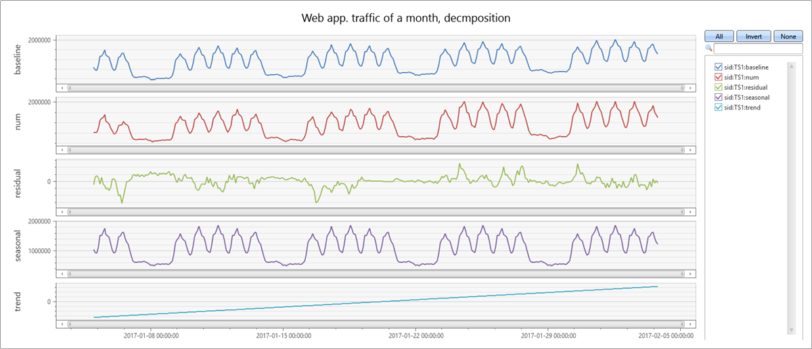
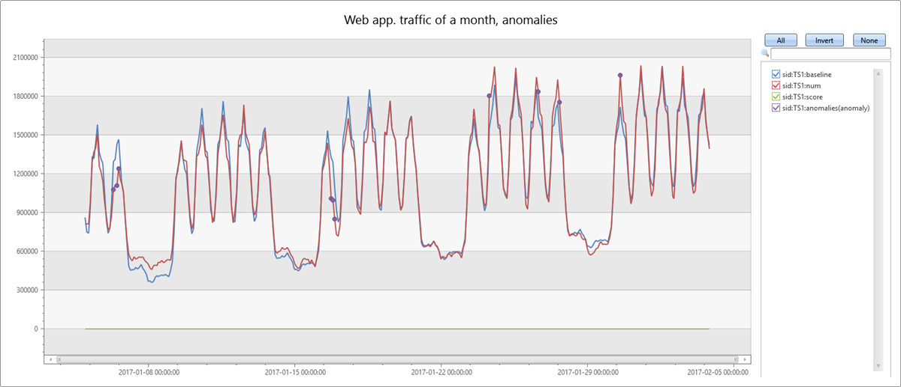
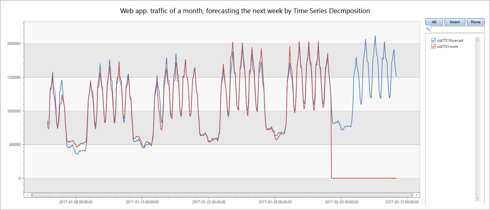
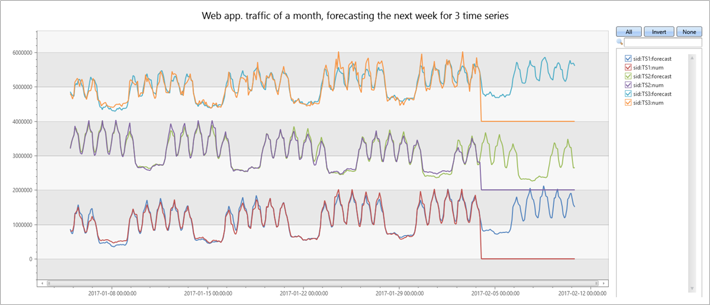

# Anomaly detection and forecasting in Azure Data Explorer

Azure Data Explorer performs on-going collection of telemetry data from cloud services or IoT devices. This data is analyzed for various insights such as monitoring service health, physical production processes, usage trends, load forecast. The analysis is done on time series of selected metrics to locate a deviation pattern of the metric relative to its typical normal baseline pattern. Azure Data Explorer contains native support for creation, manipulation & analysis of multiple time series. It can create and analyze thousands of time series in seconds, enabling near real time monitoring solutions and workflows.

This article details the Azure Data Explorer time series anomaly detection and forecasting capability. The applicable time series functions are based on a robust well-known decomposition model, where each original time series is decomposed into seasonal, trend, and residual components. Anomalies are detected by outliers on the residual component, while forecasting is done by extrapolating the seasonal and trend components (defined as baseline). The Azure Data Explorer implementation significantly enhances the basic decomposition model by automatic detection of seasonality and outliers and vectorized implementation to process thousands of time series in seconds.

## Prerequisites

Read [Time series analysis in Azure Data Explorer](/azure/data-explorer/time-series-analysis) for an overview of time series capabilities in Azure Data Explorer.

## Time series decomposition model

Azure Data Explorer native implementation for time series prediction and anomaly detection uses a well-known decomposition model. It is applied to time series of metrics expected to manifest periodic and trend behavior, such as service traffic, components heart-bits, and IoT periodic measurements to forecast future metric values and detect anomalous ones. The assumption of this regression process is that other than the previously known seasonal and trend behavior, the time series is randomly distributed. You can then forecast future metric values from the seasonal and trend components (ignoring the residual part). You can also detect anomalous values based on outlier detection using only the residual portion.
To create a decomposition model, use the function [`series_decompose()`](/azure/kusto/query/series-decomposefunction). The `series_decompose()` function takes a set of time series and automatically decomposes each time series to its seasonal, trend, residual and baseline components. For example, you can decompose traffic of an internal web service by using the following query:

```kusto
let min_t = datetime(2017-01-05);
let max_t = datetime(2017-02-03 22:00);
let dt = 2h;
demo_make_series2
| make-series num=avg(num) on TimeStamp from min_t to max_t step dt by sid 
| where sid == 'TS1'   //  select a single time series for a cleaner visualization
| extend (baseline, seasonal, trend, residual) = series_decompose(num, -1, 'linefit')  //  decomposition of a set of time series to seasonal, trend, residual, and baseline (seasonal+trend)
| render timechart with(title='Web app. traffic of a month, decomposition', ysplit=panels)
```



* The original time series is labeled **num** (in red). 
* The decomposition function begins by auto detection of the seasonality using the function [`series_periods_detect()`](/azure/kusto/query/series-periods-detectfunction) and extracts the **seasonal** pattern (in purple)
* The decomposition subtracts the seasonal pattern from the original time series and runs a linear regression using the function [`series_fit_line()`](/azure/kusto/query/series-fit-linefunction) to find the **trend** component (in light blue).
* When the function subtracts the trend, the rest is the **residual** component (in green).
* The function adds the seasonal and trend components to generate the **baseline** (in blue).

## Time series anomaly detection

The function [`series_decompose_anomalies()`](/azure/kusto/query/series-decompose-anomaliesfunction), built on `series_decompose()`,  finds anomalous points on a set of time series. This function calls `series_decompose()` to build the decomposition model and then runs [`series_outliers()`](/azure/kusto/query/series-outliersfunction) on the residual component. `series_outliers()` calculates anomaly score for each point of the residual component using Tukey's fence test. Anomaly scores above 1.5 or below -1.5 indicate a mild anomaly rise or decline respectively. Anomaly scores above 3.0 or below -3.0 indicate a strong anomaly. The following query allows you to detect anomalies in internal web service traffic:

```kusto
let min_t = datetime(2017-01-05);
let max_t = datetime(2017-02-03 22:00);
let dt = 2h;
demo_make_series2
| make-series num=avg(num) on TimeStamp from min_t to max_t step dt by sid 
| where sid == 'TS1'   //  select a single time series for a cleaner visualization
| extend (anomalies, score, baseline) = series_decompose_anomalies(num, 1.5, -1, 'linefit')
| render anomalychart with(anomalycolumns=anomalies, title='Web app. traffic of a month, anomalies') //use "| render anomalychart with anomalycolumns=anomalies" to render the anomalies as bold points on the series charts.
```



* The original time series (in red). 
* The baseline (seasonal and trend) component (in blue).
* The anomalous points (in purple) on top of the original time series. You can see that the anomalous points significantly deviate from the expected baseline values.

## Time series forecasting

The function [`series_decompose_forecast()`](/azure/kusto/query/series-decompose-forecastfunction) predicts future values of a set of time series. This function calls `series_decompose()` to build the decomposition model and then, for each time series, extrapolates the baseline component into the future. The following query allows you to predict next week's web service traffic:

```kusto
let min_t = datetime(2017-01-05);
let max_t = datetime(2017-02-03 22:00);
let dt = 2h;
let horizon=7d;
demo_make_series2
| make-series num=avg(num) on TimeStamp from min_t to max_t+horizon step dt by sid 
| where sid == 'TS1'   //  select a single time series for a cleaner visualization
| extend forecast = series_decompose_forecast(num, toint(horizon/dt))
| render timechart with(title='Web app. traffic of a month, forecasting the next week by Time Series Decmposition')
```



* Original metric (in red). Future values are missing, that's why they're set to 0, by default.
* Extrapolate the baseline component (in blue) to predict next week’s values.

## Scalability

Azure Data Explorer query language syntax enables a single call to process a single or multiple time series. Its unique optimized implementation allows for fast performance, which is critical for effective anomaly detection and forecasting when monitoring thousands of counters in near real-time scenarios.
The following query shows the processing of three time series simultaneously:

```kusto
let min_t = datetime(2017-01-05);
let max_t = datetime(2017-02-03 22:00);
let dt = 2h;
let horizon=7d;
demo_make_series2
| make-series num=avg(num) on TimeStamp from min_t to max_t+horizon step dt by sid
| extend offset=case(sid=='TS3', 4000000, sid=='TS2', 2000000, 0)   //  add artificial offset for easy visualization of multiple time series
| extend num=series_add(num, offset)
| extend forecast = series_decompose_forecast(num, toint(horizon/dt))
| render timechart with(title='Web app. traffic of a month, forecasting the next week for 3 time series')
```



## Summary

The time series functions for anomaly detection and forecasting are effectively used for near real-time monitoring scenarios, such as fault detection, predictive maintenance, and forecasting demand and load.

## Next steps

