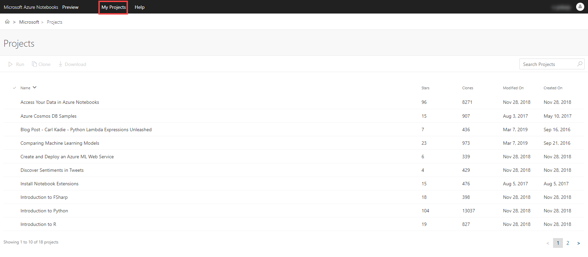
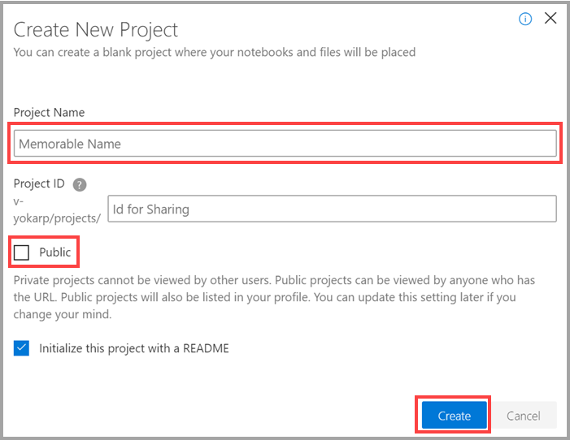
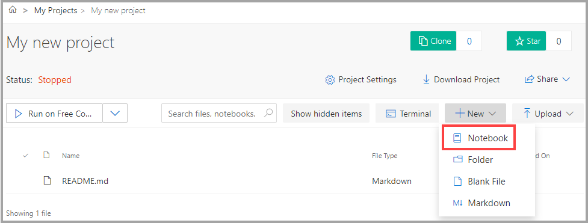
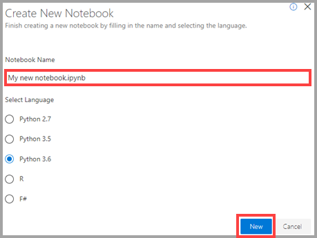
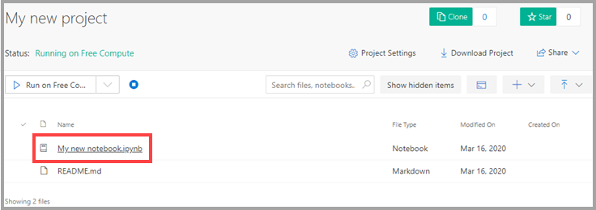
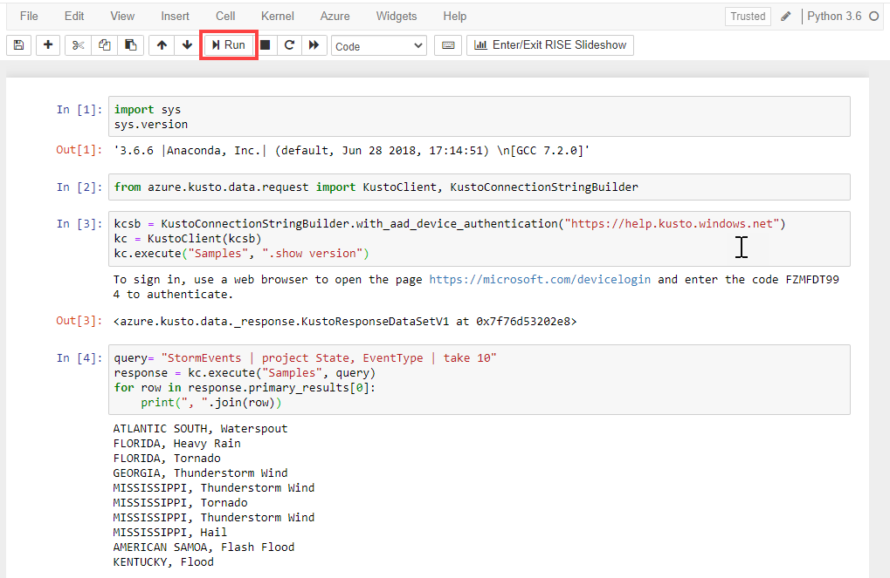

# Use Azure Notebooks to analyze data in Azure Data Explorer

[Azure Notebooks](https://notebooks.azure.com/) is an Azure cloud service that simplifies creating and sharing [Jupyter Notebooks](https://jupyter.org/). Azure Notebooks makes it easy to combine documentation, code, and the results of running the code.

> [!Note]
> * The following procedure uses the Python client in the Azure Notebooks environment to query Azure Data Explorer. However, you can also use [KQLmagic](https://docs.microsoft.com/azure/data-explorer/kqlmagic) to query Azure Data Explorer.
> * Some users reported issues authenticating using Edge; until such issues are resolved,
   use a different browser.

## Create a project

1. Open [Azure Notebooks](https://notebooks.azure.com/) in your browser and sign-in.

1. Select **My Projects** tab in the header. 

    [](media/azurenotebooks/an-myprojects.png#lightbox)

1. Select **+ New Projects**.
    
1. In the **Create New Project** dialog box:
    1. Enter the **Project Name**.
    1. Clear the **Public** checkbox.
    >[!Important]
    > If you don't clear the Public checkbox, your project will be exposed on the open Internet.
    1. Select **Create**.
    
    

    The Project ID is created automatically.

## Create a notebook

1. In your new project, create a notebook. The notebook should use a [supported language](https://github.com/Azure/azure-kusto-python#minimum-requirements).
To create a notebook, select **+ New** and select **Notebook**.

     

1. In the **Create New Notebook** dialog box, enter the notebook name.

1. Select **Python 3.6** and select **New**.
    
     
    
1. In your project, select your new notebook.

    

    Wait until your Python kernel initializes. When the filled circle icon changes to a hollow circle icon, you can proceed.

    

1. To import the system module, enter the following commands and select **Run**:
    ```python
    import sys
    sys.version
    ```

    > [!Note]
    > To run a cell, you can also press Shift+Enter.

1.  To import SDK classes, enter the following commands and select **Run**:
    ```python
    from azure.kusto.data.request import KustoClient, KustoConnectionStringBuilder
    ```

1.  To build the connection string and start the Kusto client, enter the following commands and select **Run**:  
    ```python
    kcsb = KustoConnectionStringBuilder.with_aad_device_authentication("https://help.kusto.windows.net")
    kc = KustoClient(kcsb)
    kc.execute("Samples", ".show version")
    ```
1. At the prompt, open a new browser tab to [https://aka.ms/devicelogin](https://aka.ms/devicelogin). 
   
1. Enter the authorization code, and sign-in your AAD (@microsoft.com) account. The Kusto client `kc` can now authenticate to Azure Data Explorer using your identity.

1. Return to your notebook to see the result of the authentication. 

[](media/azurenotebooks/an-python-commands.png#lightbox)

## Execute a Kusto query

1. Enter your Kusto query and select **Run**. For example:

    ```python
    query= "StormEvents | project State, EventType | take 10"
    response = kc.execute("Samples", query)
    for row in response.primary_results[0]:
        print(", ".join(row))
    ```    

[](media/azurenotebooks/an-commands.png#lightbox)

## Next steps

* [Kusto-python GitHub repo](ttps://github.com/Azure/azure-kusto-python)
