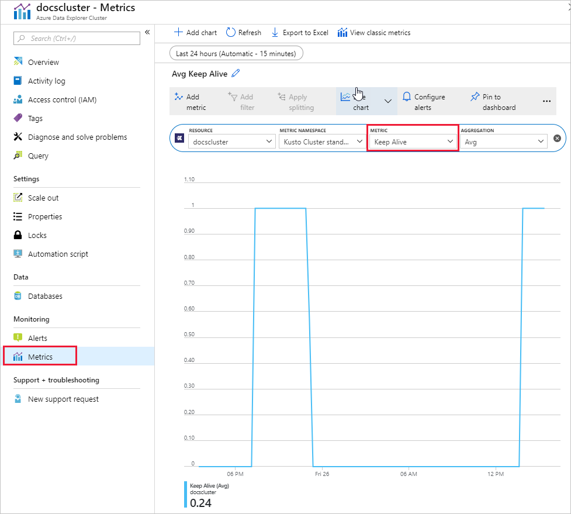

# Title: Is my Kusto cluster healthy? 

There are various factors that impact the health of a Kusto cluster like CPU,
Memory and Disk subsystem. You can follow these basic steps to gauge the health
of your Kusto cluster

1.  Using Kusto Query Explorer connect to your Kusto cluster and run the
    diagnostics command on the cluster as shown below. A return value of 1 (or
    yes) for *IsHealthy* column suggests the cluster is healthy

>>   *.show diagnostics*

>>  *\| project IsHealthy*

|   | IsHealthy |
|---|-----------|
|   | 1         |

>   Output:

>   1 = Healthy

>   0 = Unhealthy

2.  Navigate to your cluster in the [Azure portal](https://ms.portal.azure.com)
    and under the **Monitoring** section select *Metrics* and select Keep Alive
    as shown below. A value of 1 suggests healthy state

    *Further you can also add additional metrics like CPU, Memory Caching etc. to view individual resource utilization for the cluster*

>   Please see following reference clipping

3. In case you need further assistance with your cluster's health, please open a [support request ](<https://ms.portal.azure.com/#>) 