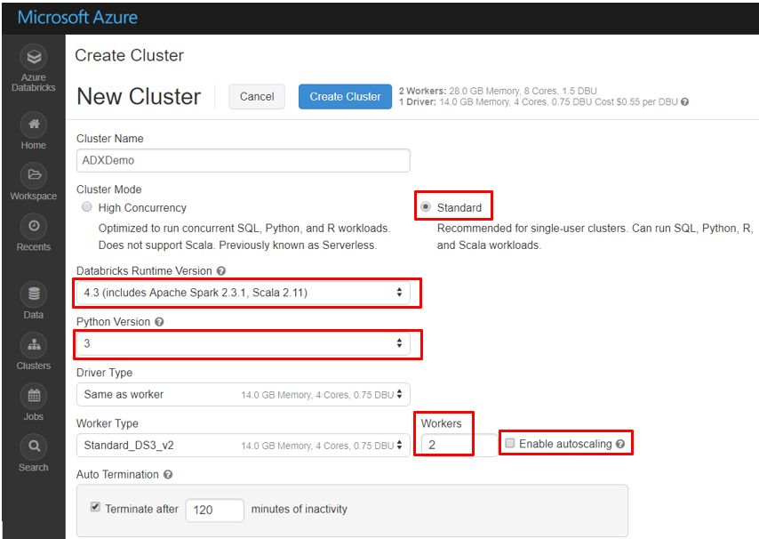

# Connect to Azure Data Explorer from Azure Databricks by using Python

[Azure Databricks](https://docs.microsoft.com/azure/azure-databricks/what-is-azure-databricks) is an Apache Spark-based analytics platform that's optimized for the Microsoft Azure platform. This article shows you how to use a Python library in Azure Databricks to access data from Azure Data Explorer. There are several ways to authenticate with Data Explorer, including a device login and an Azure Active Directory (Azure AD) app.

## Prerequisites

- [Create an Azure Data Explorer cluster and database](/azure/data-explorer/create-cluster-database-portal).
- [Create an Azure Databricks workspace](/azure/azure-databricks/quickstart-create-databricks-workspace-portal#create-an-azure-databricks-workspace). Under **Azure Databricks Service**, in the **Pricing Tier** drop-down list, select **Premium**. This selection enables you to use Azure Databricks secrets to store your credentials and reference them in notebooks and jobs.

- [Create a cluster](https://docs.azuredatabricks.net/user-guide/clusters/create.html) in Azure Databricks with the following specifications (minimum settings needed to run the sample notebooks):

   

## Install the Python library on your Azure Databricks cluster

To install the [Python library](/azure/kusto/api/python/kusto-python-client-library) on your Azure Databricks cluster:

1. Go to your Azure Databricks workspace and [create a library](https://docs.azuredatabricks.net/user-guide/libraries.html#create-a-library).
2. [Upload a Python PyPI package or Python Egg](https://docs.azuredatabricks.net/user-guide/libraries.html#upload-a-python-pypi-package-or-python-egg).
   - Upload, install, and attach the library to your Databricks cluster.
   - Enter the PyPi name: **azure-kusto-data**.

## Connect to Data Explorer by using a device login

[Import a notebook](https://docs.azuredatabricks.net/user-guide/notebooks/notebook-manage.html#import-a-notebook) by using the [Query-ADX-device-login](https://github.com/Azure/azure-kusto-docs-samples/blob/master/Databricks_notebooks/Query-ADX-device-login.ipynb) notebook. You can then connect to Data Explorer by using your credentials.

## Connect to ADX by using an Azure AD app

1. Create Azure AD app by [provisioning an Azure AD application](/azure/kusto/management/access-control/how-to-provision-aad-app).
1. Grant access to your Azure AD app in your Azure Data Explorer database as follows:

    ```kusto
    .set database <DB Name> users ('aadapp=<AAD App ID>;<AAD Tenant ID>') 'AAD App to connect Spark to ADX
    ```
    |   |   |
    | - | - |
    | ```DB Name``` | Your database name |
    | ```AAD App ID``` | Your Azure AD app ID |
    | ```AAD Tenant ID``` | Your Azure AD tenant ID |

### Find your Azure AD tenant ID

To authenticate an application, Azure Data Explorer uses your Azure AD tenant ID. 
To find your tenant ID, use the following URL. Substitute your domain for *YourDomain*.

```
https://login.windows.net/<YourDomain>/.well-known/openid-configuration/
```

For example, if your domain is *contoso.com*, the URL is: [https://login.windows.net/contoso.com/.well-known/openid-configuration/](https://login.windows.net/contoso.com/.well-known/openid-configuration/). Select this URL to see the results. The first line is as follows: 

```
"authorization_endpoint":"https://login.windows.net/6babcaad-604b-40ac-a9d7-9fd97c0b779f/oauth2/authorize"
```

Your tenant ID is `6babcaad-604b-40ac-a9d7-9fd97c0b779f`. 

### Store and secure your Azure AD app ID and key 

Store and secure your Azure AD app ID and key by using Azure Databricks [secrets](https://docs.azuredatabricks.net/user-guide/secrets/index.html#secrets) as follows:
1. [Set up the CLI](https://docs.azuredatabricks.net/user-guide/dev-tools/databricks-cli.html#set-up-the-cli).
1. [Install the CLI](https://docs.azuredatabricks.net/user-guide/dev-tools/databricks-cli.html#install-the-cli). 
1. [Set up authentication](https://docs.azuredatabricks.net/user-guide/dev-tools/databricks-cli.html#set-up-authentication).
1. Configure the [secrets](https://docs.azuredatabricks.net/user-guide/secrets/index.html#secrets) by using the following sample commands:

    ```databricks secrets create-scope --scope adx```

    ```databricks secrets put --scope adx --key myaadappid```

    ```databricks secrets put --scope adx --key myaadappkey```

    ```databricks secrets list --scope adx```

### Import a notebook
[Import a notebook](https://docs.azuredatabricks.net/user-guide/notebooks/notebook-manage.html#import-a-notebook) by using the [Query-ADX-AAD-App](https://github.com/Azure/azure-kusto-docs-samples/blob/master/Databricks_notebooks/Query-ADX-AAD-App.ipynb) notebook to connect to Data Explorer. Update the placeholder values with your cluster name, database name, and Azure AD tenant ID.