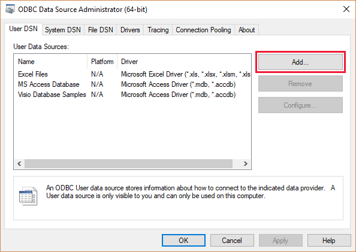
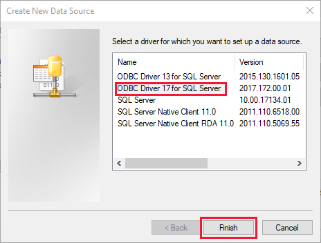
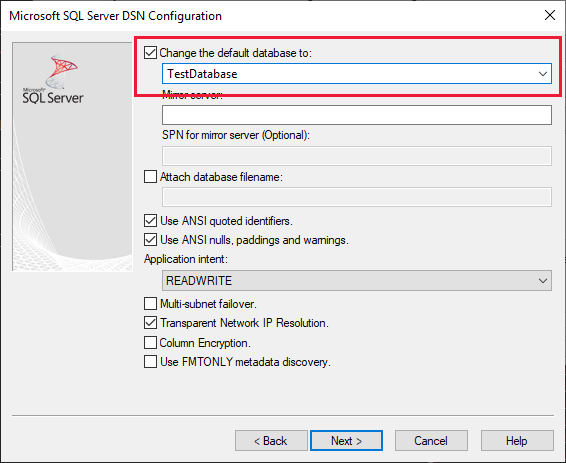
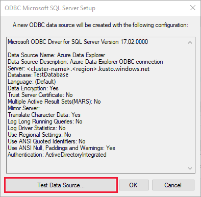

# Connect to Azure Data Explorer with ODBC

Open Database Connectivity ([ODBC](/sql/odbc/reference/odbc-overview)) is a widely accepted application programming interface (API) for database access. Use ODBC to connect to Azure Data Explorer from applications that don't have a dedicated connector.

Behind the scenes, applications call functions in the ODBC interface, which are implemented in database-specific modules called *drivers*. Azure Data Explorer supports a subset of the SQL Server communication protocol ([MS-TDS](kusto/api/tds/index.md)), so it can use the ODBC driver for SQL Server.

Using the following video, you can learn to create an ODBC connection. 

> [!VIDEO https://www.youtube.com/embed/qA5wxhrOwog]

Alternatively, you can [configure the ODBC data source](#configure-the-odbc-data-source) as detailed below. 

In the article, you learn how to use the SQL Server ODBC driver, so you can connect to Azure Data Explorer from any application that supports ODBC. 

## Prerequisites

You need the following:

* [Microsoft ODBC Driver for SQL Server version 17.2.0.1 or later](/sql/connect/odbc/download-odbc-driver-for-sql-server) for your operating system.

## Configure the ODBC data source

Follow these steps to configure an ODBC data source using the ODBC driver for SQL Server.

1. In Windows, search for *ODBC Data Sources*, and open the ODBC Data Sources desktop app.

1. Select **Add**.

    

1. Select **ODBC Driver 17 for SQL Server** then **Finish**.

    

1. Enter a name and description for the connection and the cluster you want to connect to, then select **Next**. The cluster URL should be in the form *\<ClusterName\>.\<Region\>.kusto.windows.net*.

    

1. Select **Active Directory Integrated** then **Next**.

    

1. Select the database with the sample data then **Next**.

    

1. On the next screen, leave all options as defaults then select **Finish**.

1. Select **Test Data Source**.

    

1. Verify that the test succeeded then select **OK**. If the test didn't succeed, check the values that you specified in previous steps, and ensure you have sufficient permissions to connect to the cluster.

    

## Next steps

* [Connect to Azure Data Explorer from Tableau](tableau.md)