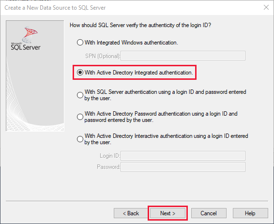

# Visualize data from Azure Data Explorer in Grafana

https://ceapex.visualstudio.com/SRE/_workitems/edit/56706

ODBC is a thing FMI

ADX exposes SQL - FMI /sql/odbc/reference/what-is-odbc TDS: /azure/kusto/api/tds/

In this article, you learn how to configure ODBC so you can connect to ADX from any tool that support ODBC. Then we show you how to connect to ADX from Tableau, and then visualize data from a sample cluster.

## Prerequisites

You need the following to complete this how to:

* AAD

* [Microsoft ODBC Driver for SQL Server version 17.2.0.1 or later](/sql/connect/odbc/download-odbc-driver-for-sql-server) for your operating system

* Tableau Desktop: full or [trial](https://www.tableau.com/products/desktop/download) version

* A cluster that includes the StormEvents sample data. For  more information, see [Quickstart: Create an Azure Data Explorer cluster and database](create-cluster-database-portal.md) and [Ingest sample data into Azure Data Explorer](ingest-sample-data.md).

    [!INCLUDE [data-explorer-storm-events](../../includes/data-explorer-storm-events.md)]

## Configure the ODBC data source

1. In Windows, search for *ODBC Data Sources*, and open the ODBC Data Sources desktop app.

1. Select **Add**.

    

1. Select **ODBC Driver 17 for SQL Server** then **Finish**.

    

1. Enter a name and description for the connection and the cluster you want to connect to, then select **Next**. The cluster URL should be in the form *\<ClusterName\>.\<Region\>.kusto.windows.net*.

    

1. Select **Active Directory Integrated** then **Next**.

    

1. On the next screen, leave all options as defaults then select **Next**.

1. On the next screen, leave all options as defaults then select **Finish**.

1. Select **Test Data Source**.

    

1. Verify that the test succeeded then select **OK**. If the test didn't succeed, check the values that you specified in previous steps, and ensure you have sufficient permissions to connect to the cluster.

    

## Visualize data in Tableau