# Quickstart: Create an Azure Data Explorer in your VirtualNetwork

Azure Data Explorer supports deploying a cluster into a subnet in your Virtual Network (VNet). This capability enables you to access the cluster privately from your Azure Virtual Network or on-premise, access resource inside your Virtual Network (EventHub/Storage) and restrict the inbound and outbound traffic.

If you don't have an Azure subscription, create a [free Azure account](https://azure.microsoft.com/free/) before you begin.

## Sign in to the Azure portal

Sign in to the [Azure portal](https://portal.azure.com/).

## Create Network Secuirty Group (NSG)

[Network Security Groups (NSG)](/azure/virtual-network/security-overview) provide the ability to control network access within a VNet. Azure Data Explorer can be accessed using two endpoints: HTTPs (443) and TDS (1433). The following NSG rules must be configured to allow access to these endpoints for management, monitoring, and proper operation of your cluster.
 
To create the network security group:

1. Select the **Create a resource** button (+) in the upper-left corner of the  portal.
1. Search for *Network Security Group*.
1. Under **Network Security Group**, at the bottom of the screen, select **Create**.
1. Fill out basic deatils with the following information.
   
    **Setting** | **Suggested value** | **Field description**
    |---|---|---|
    | Subscription | Your subscription | Select the Azure subscription that you want to use for your cluster.|
    | Resource group | Your resource group | Use an existing resource group or create a new resource group. |
    | Name | AzureDataExplorerNsg | Choose a name that identifies your Network Security Group (NSG) in the resource group.
    | Region | *West US* | Select *West US* for this quickstart. For a production system, select the region that best meets your needs.
    | | | |

1. Select **Review + create** to review your cluster details, and **Create** to provision the cluster.

1. When the deployment is complete, select **Go to resource**.

    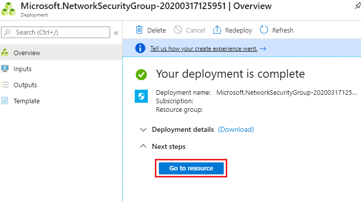

1. On the **Inbound security rules** tab, select **+Add**.
1. Fill out the form with the following details:
1. Fill out the form with the following information.

    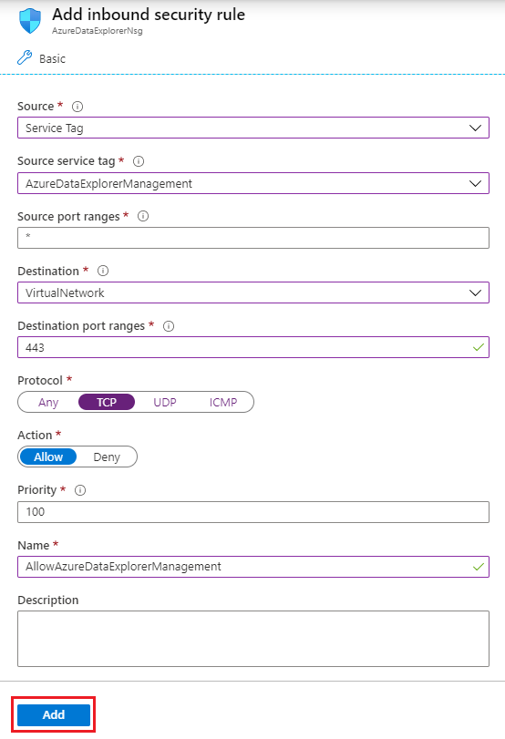

    **Setting** | **Suggested value** 
    |---|---|
    | Source | ServiceTag
    | Source service tag | AzureDataExplorerManagement
    | Source port ranges | *
    | Destination | VirtualNetwork
    | Destination port ranges | *
    | Protocol | TCP
    | Action | Allow
    | Priority | 100
    | Name | AllowAzureDataExplorerManagement
    | | |
    
1. Do the same steps for all inbound and outbound dependencies according to [Dependencies for VNet deployment](/azure/data-explorer/vnet-deloyment#dependencies-for-vnet-deployment)
    
    The NSG should look like this:
    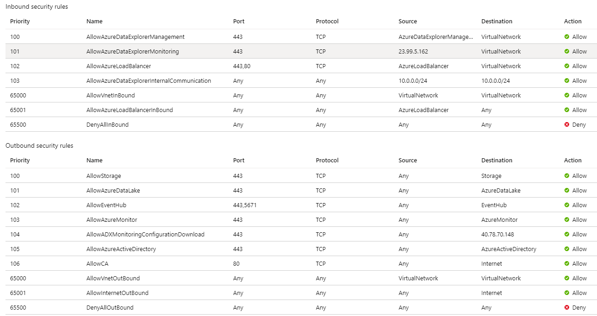

    Alternatively, outbound rules can be replaced with single Rule to allow *Internet* for the ports 443,80

## Create Public IP addresses

To create the query (Engine) public IP address:

1. Select the **Create a resource** button (+) in the upper-left corner of the  portal.
1. Search for *Network Security Group*.
1. Under **Public IP address**, at the bottom of the screen, select **Create**.
1. Fill out basic deatils with the following information.
   
   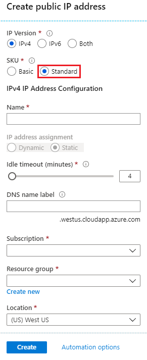
    **Setting** | **Suggested value** | **Field description**
    |---|---|---|
    | IP Version | IPv4 | Select IP version, We support IPv4 only.|
    | Sku | Standard | We require **Standard** for query (Engine) URI endpoint |
    | Name | engine-pip | Choose a name that identifies your Public IP address in the resource group.
    | Subscription | Your subscription | Select the Azure subscription that you want to use for your public IP.|
    | Resource group | Your resource group | Use an existing resource group or create a new resource group. |
    | Location | *West US* | Select *West US* for this quickstart. For a production system, select the region that best meets your needs.
    | | | |

1. Select **Create** to create the Public IP address.

To create the ingestion (Data Management) public IP address follow the same instructions and select **Basic** for **Sku** and **Static** for **IP address assignment** 

## Create Virtual Network and subnet

To create the virtual network and subnet, follow these steps:

1. Select the **Create a resource** button (+) in the upper-left corner of the  portal.
1. Search for *Virtual Network*.
1. Under **Virtual Network**, at the bottom of the screen, select **Create**.
1. Fill out basic deatils with the following information.
   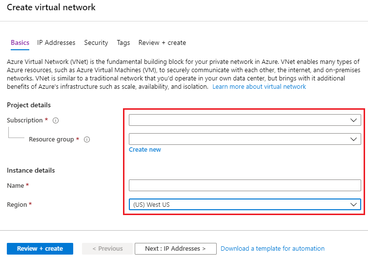
    **Setting** | **Suggested value** | **Field description**
    |---|---|---|
    | Subscription | Your subscription | Select the Azure subscription that you want to use for your cluster.|
    | Resource group | Your resource group | Use an existing resource group or create a new resource group. |
    | Name | AzureDataExplorerVnet | Choose a name that identifies your virtual network in the resource group.
    | Region | *West US* | Select *West US* for this quickstart. For a production system, select the region that best meets your needs.
    | | | |

1. Select **Review + create** to review your cluster details, and **Create** to provision the cluster.

1. When the deployment is complete, select **Go to resource**.

    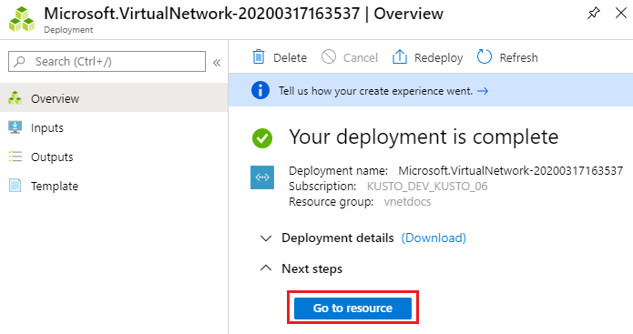

1. Go to **Subnets** blade and select **default** subnet
    
    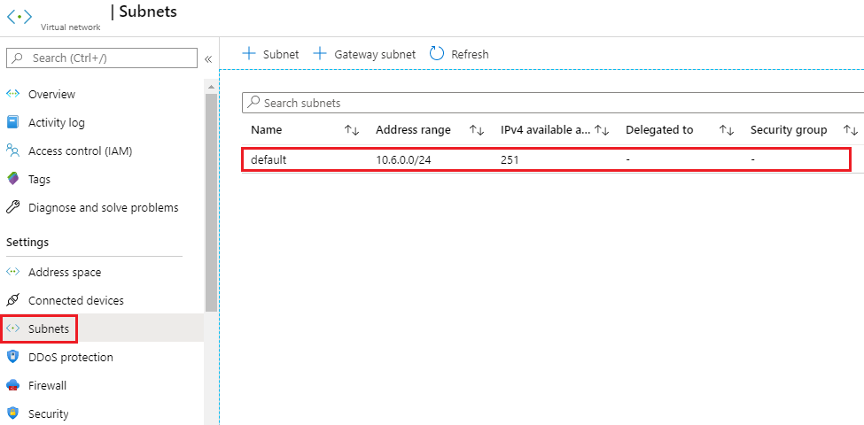

1. Select **Network Security Group** and select **AzureDataExplorerNsg** and hit **Save**

    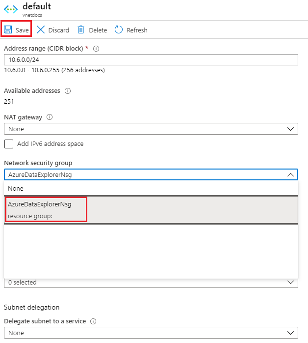

## Create a cluster

Create an Azure Data Explorer cluster with a defined set of compute and storage resources in an Azure resource group.

1. Select the **Create a resource** button (+) in the upper-left corner of the  portal.

1. Search for *Azure Data Explorer*.

   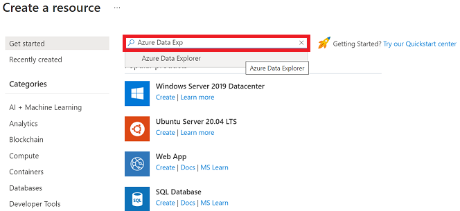

1. Under **Azure Data Explorer**, at the bottom of the screen, select **Create**.

1. Fill out the basic cluster details with the following information.

   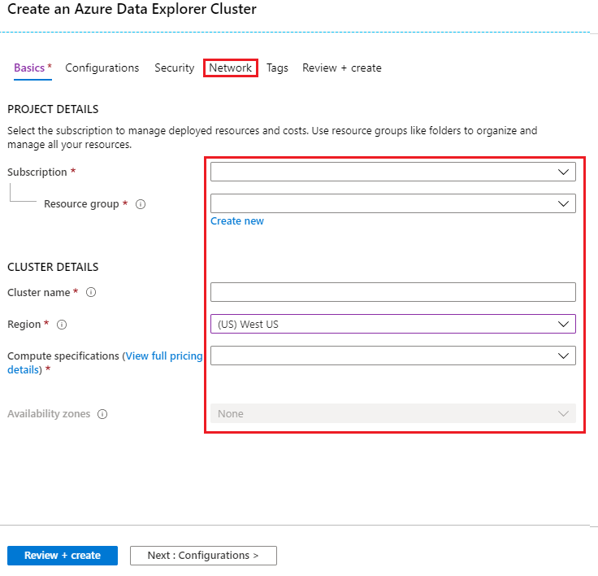

    **Setting** | **Suggested value** | **Field description**
    |---|---|---|
    | Subscription | Your subscription | Select the Azure subscription that you want to use for your cluster.|
    | Resource group | Your resource group | Use an existing resource group or create a new resource group. |
    | Name | A unique cluster name | Choose a unique name that identifies your cluster. The domain name *[region].kusto.windows.net* is appended to the cluster name you provide. The name can contain only lowercase letters and numbers. It must contain from 4 to 22 characters.
    | Region | *West US* | Select *West US* for this quickstart. For a production system, select the region that best meets your needs.
    | Compute specifications | *Standard_D11_v2* | Select the lowest price specification for this quickstart. For a production system, select the specification that best meets your needs.
    | | | |

1. Select **Network** to provide virtual network deatils.

1. Fill out the resources created in previous steps:

   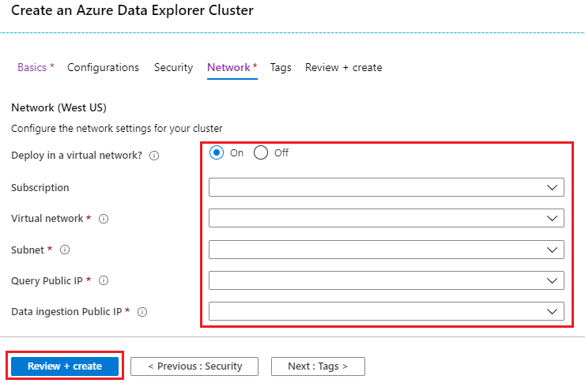

    **Setting** | **Suggested value** | **Field description**
    |---|---|---|
    | Subscription | Your subscription | Select the Azure subscription that you want to use for networking resources.|
    | Virtual Network | AzureDataExplorerVnet | Choose the virtual network created in previous step.
    | Subnet | default | Choose the subnet created in previous step.
    | Query Public IP | engine-pip | Choose the query Public IP created in previous step.
    | Data ingestion Public IP | dm-pip | Choose ingestion Public IP created in previous step.
    | | | |

1. When the deployment is complete, select **Go to resource**.

    

## Clean up resources

If you plan to follow other quickstarts and tutorials, keep the resources you created. Otherwise, clean up your resource group, to avoid incurring costs.

1. In the Azure portal, select **Resource groups** on the far left, and then select the resource group that contains your Data Explorer cluster.  

1. Select **Delete resource group** to delete the entire resource group. If using an existing resource group, you can choose to only delete the Data Explorer cluster.

## Next steps

> [!div class="nextstepaction"]
> [Quickstart: Ingest data from Event Hub into Azure Data Explorer](ingest-data-event-hub.md)