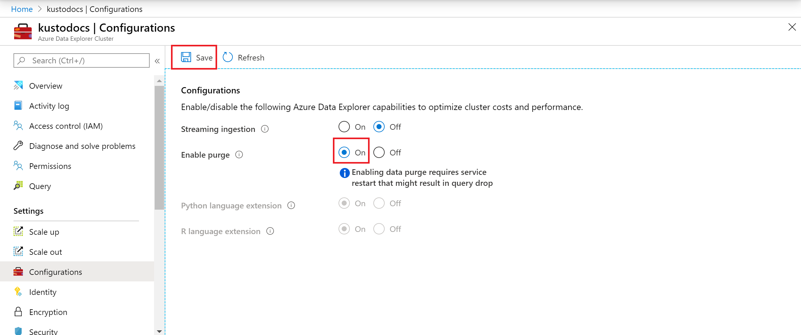
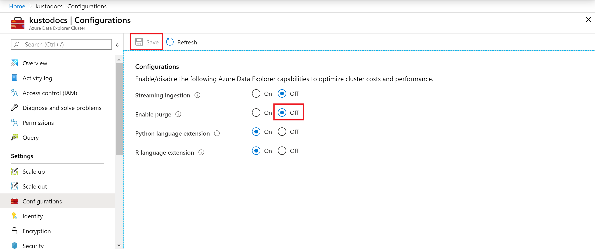

# Data purge

Use data purge when you want to delete data from your device or service, mostly for data protection, or to support your obligations under the GDPR. If you're looking for general information about GDPR, see the [GDPR section of the Service Trust portal](https://servicetrust.microsoft.com/ViewPage/GDPRGetStarted)

Data deletion through the `.purge` command is designed to be used to protect personal data and should not be used in other scenarios. It is not designed to support frequent delete requests, or deletion of massive quantities of data, and may have a significant performance impact on the service.

## Prerequisites

* If you don't have an Azure subscription, create a [free Azure account](https://azure.microsoft.com/free/) before you begin.
* Sign in to the [Web UI](https://dataexplorer.azure.com/).
* Create [an Azure Data Explorer cluster and database](create-cluster-database-portal.md)

## Enable data purge on your cluster

> [!WARNING]
> * Enabling data purge requires service restart that might result in query drop.
> * Please review the [limitations](#limitations) prior to enabling data purge.

1. In the Azure portal, go to your Azure Data Explorer cluster. In **Settings**, select **Configurations**. 
1. In the **Configurations** pane, select **On** to enable **Enable Purge**.
1. Select **Save**.
 
    

## Run purge operations on your cluster

    > [!NOTE]
    > Executing a `.purge` command triggers a process which can take a few days to complete. Note that if the "density" of records for which the `predicate` applies is sufficiently large, the process will effectively re-ingest all the data in the table, therefore, having a significant impact on performance and COGS.

Azure Data Explorer (Kusto) supports both individual records deletion and purging an entire table. Purge command may be invoked in two ways for differing usage scenarios:
1. Programmatic invocation: A single-step which is intended to be invoked by applications. Calling this command directly triggers purge execution sequence.
1. Human invocation: A two-step process that requires an explicit confirmation as a separate step. First invocation of the command returns a verification token, which should be provided to run the actual purge. This sequence reduces the risk of inadvertently deleting incorrect data. Using this option may take a long time to complete on large tables with significant cold cache data.
For more information please read [Data purge in Azure Data Explorer](kusto/concepts/data-purge.md). 

## Disable data purge on your cluster

1. In the Azure portal, go to your Azure Data Explorer cluster. In **Settings**, select **Configurations**. 
1. In the **Configurations** pane, select **Off** to disable **Enable purge**.
1. Select **Save**.

    

## Limitations

* The purge process is final and irreversible. It isn't possible to "undo" this process or recover data that has been purged. Therefore, commands such as [undo table drop](kusto/management/undo-drop-table-command.md) cannot recover purged data, and rollback of the data to a previous version cannot go to "before" the latest purge command.
* The `.purge` command is executed against the Data Management endpoint: https://ingest-[YourClusterName].kusto.windows.net`. The command requires [database admin](kusto/management/access-control/role-based-authorization.md) permissions on the relevant databases. 
* Due to the purge process performance impact, the caller is expected to modify the data schema so that minimal tables include relevant data, and batch commands per table to reduce the significant COGS impact of the purge process.
* The `predicate` parameter of the purge command is used to specify which records to purge. `Predicate` size is limited to 63 KB. 

## Next steps

* [Data purge in Azure Data Explorer](kusto/concepts/data-purge.md)
