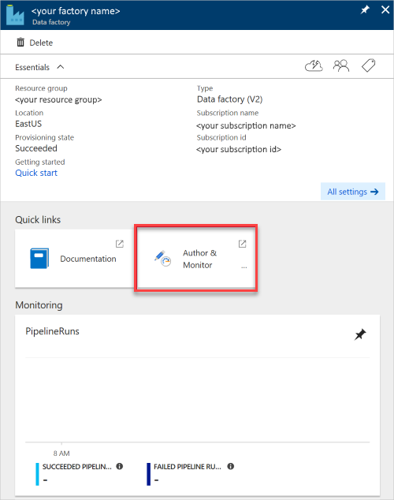
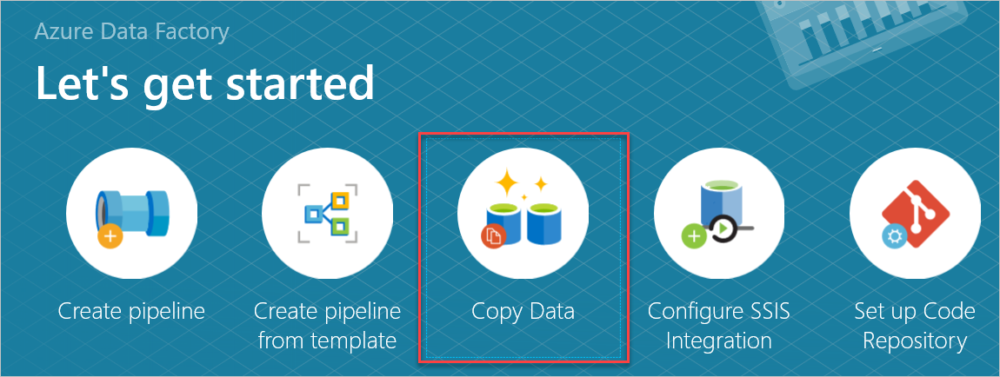

# Load data into Azure Data Explorer by using Azure Data Factory

Azure Data Factory is a fully managed cloud-based data integration service. You can use the service to populate your Azure Data Explorer database with data from your existing system and save time when building your analytics solutions.

Azure Data Factory offers the following benefits for loading data into Azure Data Explorer:

* **Easy to set up**: An intuitive 5-step wizard with no scripting required.
* **Rich data store support**: Built-in support for a rich set of on-premises and cloud-based data stores. For a detailed list, see the table of [Supported data stores](/azure/data-factory/copy-activity-overview#supported-data-stores-and-formats).
* **Secure and compliant**: Data is transferred over HTTPS or ExpressRoute. The global service presence ensures that your data never leaves the geographical boundary.
* **High performance**: Up to 1-GB/s data loading speed into Azure Data Explorer. For details, see [Copy activity performance](/azure/data-factory/copy-activity-performance).

This article shows you how to use the Data Factory Copy Data tool to load data from Amazon S3 into Azure Data Explorer. You can follow similar steps to copy data from other types of data stores.

## Prerequisites

* If you don't have an Azure subscription, create a [free Azure account](https://azure.microsoft.com/free/) before you begin.
* [An Azure Data Explorer cluster and database](create-cluster-database-portal.md)
* Amazon S3.

## Create a data factory

1. Select the **Create a resource** button (+) in the upper-left corner of the portal > **Analytics** > **Data Factory**.

   

1. In the **New data factory** pane, provide values for following fields:

   

    * **Name**: Enter a globally unique name for your data factory. If you receive the error *"Data factory name \"LoadADXDemo\" is not available"*, enter a different name for the data factory. For naming rules of Data Factory artifacts, see [Data Factory naming rules](/azure/data-factory/naming-rules).
    * **Subscription**: Select your Azure subscription in which to create the data factory.
    * **Resource Group**:
        * Select **Create new** and enter the name of a resource group. Or:
        * Select **Use existing** and select an existing resource group from the drop-down list.
        To learn about resource groups, see [Using resource groups to manage your Azure resources](/azure-resource-manager/resource-group-overview.md).  
    * **Version**: Select **V2**.
    * **Location**: Select the location for the data factory. Only supported locations are displayed in the drop-down list. The data stores that are used by data factory can be in other locations or regions.

1. Select **Create**.

1. After creation is complete, go to your data factory. You see the **Data Factory** home page as shown in the following image:

   

1. Select the **Author & Monitor** tile to launch the application in a separate tab.

## Load data into Azure Data Explorer

### Copy data from Amazon S3 (Source)

1. In the **Let's get started** page, select the **Copy Data** tile to launch the Copy Data tool:

   

1. In the **Properties** page, specify: **CopyFromAmazonS3ToADX** for the **Task name** field, and select **Next**:

    

1. In the **Source data store** page, click **+ Create new connection**:

    

1. Select **Amazon S3**, and then select **Continue**

    

1. In the **New Linked Service (Amazon S3)** pane, do the following steps:

    1. Specify **Name** of your new linked service.
    1. Specify the **Access Key ID** value.
    1. Specify the **Secret Access Key** value.
    1. Select **Finish**.

    

1. You will see a new connection. Select **Next**.

   

1. In the **Choose the input file or folder** page:

    1. Browse to the folder/file that you want to copy. Select the folder/file.
    1. Select **Choose**, and then select **Next**.

    

1. Select the copy behavior by selecting the **Copy files recursively** and **Binary copy** (copy files as-is) options. Select **Next**.

    

## Create a service principal

> [!IMPORTANT]
> In this how-to, you use a Create an Azure Active Directory (Azure AD) service principal. The service principal is used by Azure Data Factory to access the Azure Data Explorer service.

Create a service principal in the Azure portal or using the Azure cli command line experience. You will get values for 4 connection properties that you'll use in later steps.

> [NOTE]
> The Azure AAD app must have permissions on the Azure Data Explorer cluster.

### Create a service principal in the Azure Portal

1. Create the service principal as described in [Use the portal to create an Azure AD application and service principal](/azure/active-directory/develop/howto-create-service-principal-portal).

    1. In [Assign the application to a role](/azure/active-directory/develop/howto-create-service-principal-portal#assign-the-application-to-a-role), assign a role type, **Reader** to your Azure Data Explorer cluster.
    1. In [Get values for signing in](azure/active-directory/develop/howto-create-service-principal-portal#get-values-for-signing-in), copy the 3 property values: **Directory ID** (tenant ID), **Application ID**, and **Authentication Key** (password).

1. In the Azure portal, select **Subscriptions**. Copy the **Subscription ID** in which you created the service principal.

    

### Create a service principal using Azure CLI

Create a service principal as described in [Create an Azure service principal with Azure CLI](https://docs.microsoft.com/en-us/cli/azure/create-an-azure-service-principal-azure-cli).

1. Create a service principal with the [az ad sp create-for-rbac](/cli/azure/ad/sp#az-ad-sp-create-for-rbac) command. When creating a service principal, you choose the type of sign-in authentication it uses.

    ```azurecli-interactive
    az ad sp create-for-rbac --name ServicePrincipalName
    ```

1. Add the **Reader** role and remove the **Contributor** role (default):

    ```azurecli-interactive
    az role assignment create --assignee APP_ID --role Reader
    az role assignment delete --assignee APP_ID --role Contributor
    ```

///check additional info with Tzvia

## Create a new linked service

1. In the **Destination data store** page, click **+ Create new connection**, and then select **Azure Data Explorer**, and select **Continue**.

    

1. In the **New Linked Service (Azure Data Explorer)** page, do the following:

    

   1. Select **Name** for Azure Data Explorer linked service.
   1. In **Account selection method**: 
       1. Select **From Azure subscription** radio button and select your **Azure subscription** account. Then,select your **Cluster**. Or:
       1. Select **Enter manually** radio button and enter your **Endpoint**.
    a. Specify the **Tenant**.
    b. Enter **Service principal ID**.
    c. Enter **Service Principal Key**.
    d. Select your **Database**. Alternatively, select Edit and enter your database name. 
    e. Select **Test Connection** and **Finish**.

1. **Destination data store pane** opens.

## Place data in Azure Data Explorer (Sink)

1. In the **Choose the output file or folder** page, enter **copyfroms3** as the output folder name, and select **Next**.

    

1. In the **Settings** page, select **Next**.

    

1. In the **Summary** page, review the settings, and select **Next**.

    

1. In the **Deployment page**, select **Monitor** to monitor the pipeline (task):

    

1. The **Monitor** tab on the left is automatically selected. The **Actions** column includes links to view activity run details and to rerun the pipeline:

    

1. To view activity runs that are associated with the pipeline run, select the **View Activity Runs** link in the **Actions** column. There's only one activity (copy activity) in the pipeline, so you see only one entry.
1. To switch back to the pipeline runs view, select the **Pipelines** link at the top. Select **Refresh** to refresh the list.

    

1. To monitor the execution details for each copy activity, select the **Details** link under **Actions** in the activity monitoring view. You can monitor details like:

    * volume of data copied from the source to the sink
    * data throughput
    * execution steps with corresponding duration
    * used configurations

    

1. Verify that the data is copied into your Azure Data Explorer database:

    

## Next steps

Learn about Azure Data Explorer queries:

> [!div class="nextstepaction"]
>[Next step]()
