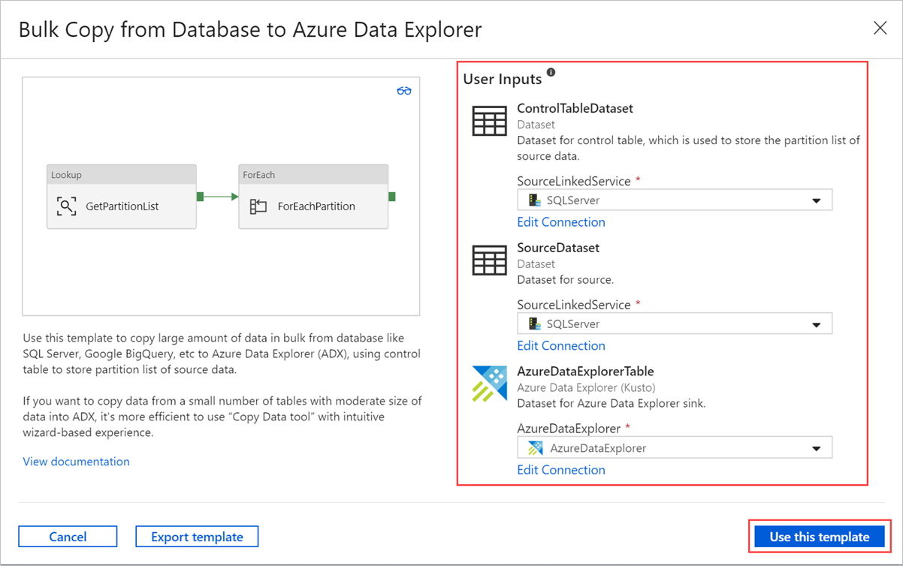
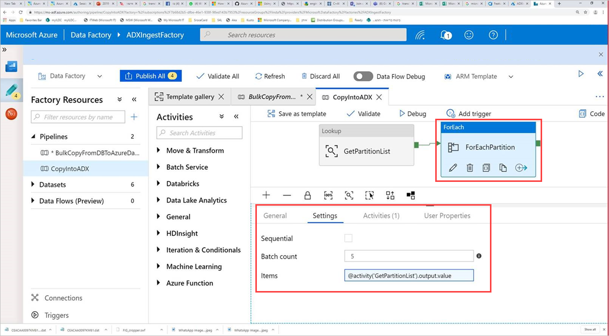

# Azure Data Factory Template for bulk copy from database to Azure Data Explorer

Azure Data Explorer is a fast, fully managed data analytics service for real-time analysis on large volumes of data streaming from many sources such as applications, websites, and IoT devices. Azure Data Factory is a fully managed cloud-based data integration service. You can use the service to populate your Azure Data Explorer database with data from your existing system and save time when building your analytics solutions. 
[Azure Data Factory Templates](/azure/data-factory/solution-templates-introduction) are predefined Azure Data Factory pipelines that allow you to get started quickly with Data Factory and reduce development time for building data integration projects. 
\\ The **Bulk copy from database to Azure Data Explorer** template contains...The data has to be partitioned in each table so that you can load rows with multiple threads in parallel from a single table.  \\

> [!IMPORTANT]
> Use the **Bulk copy from database to Azure Data Explorer** template to copy large amounts of data from databases such as SQL server and Google BigQuery to Azure Data Explorer. 
> Use the [copy tool](data-factory-load-data.md)) to copy a few tables with small or moderate amounts of data into Azure Data Explorer. 

## Prerequisites

* If you don't have an Azure subscription, create a [free Azure account](https://azure.microsoft.com/free/) before you begin.
* [An Azure Data Explorer cluster and database](create-cluster-database-portal.md)
* [Create a data factory](data-factory-load-data.md#create-a-data-factory)
* Source of data.

1. In the **Let's get started** page, select the **Create pipeline from template** tile and the pencil icon (Author tab) on the right.

    

1. On the Author tab in Resource Explorer, select **+**, then **Pipeline from template** to open the template gallery. Select template **Bulk Copy from Database to Azure Data Explorer**.
 
    

1.  In the **Bulk Copy from Database to Azure Data Explorer** window select existing datasets from drop-down. If the dataset is not available \\use the load-data info - break up topic[create a linked service]() to add the dataset.
    * **ControlTableDataset** - Stores partition list of source data
    * **SourceDataset** – Source database 
    * **AzureDataExplorerTable** - Azure Data Explorer Table
    Select \\button\\

    

    \\Format of source table DB :
    
    PartitionId	SourceQuery	ADXTableName
    <e.g. 1>	<e.g. select * from table where lastmodifiedtime LastModifytime >= ''2015-01-01 00:00:00''>	<e.g. MyAdxTable>	
    
    CREATE TABLE control_table (
        PartitionId int,
        SourceQuery varchar(255),
        ADXTableName varchar(255)
    );
\\
1. Select area in canvas outside the activities to access the template pipeline. Select **Settings**? > **Parameters** > Name of Table “control_table” to fill out column information for table 

    

1.	Select Lookup activity, **GetPartitionList**, to view default settings. The query is automatically created.
1.	Select Command activity, **ForEachPartition** > **Settings**
    * **Batch count**: Select number from 1-50. This selection determines the number of pipelines that run. 
    * DO NOT select **Sequential** checkbox to make sure that the pipeline batches are running in parallel.
    
    > [!TIP]
    > Best to run many pipelines in parallel, so data can be copied more quickly. Allocate partition per pipeline, according to date and table.

   

1. Select \\X to validate. There will be 10 different validations (1 for each batch count).

    

 

