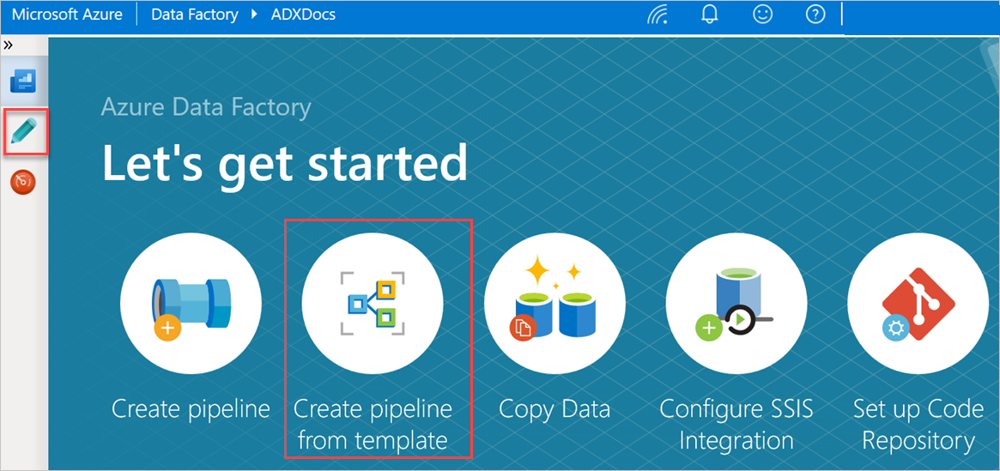
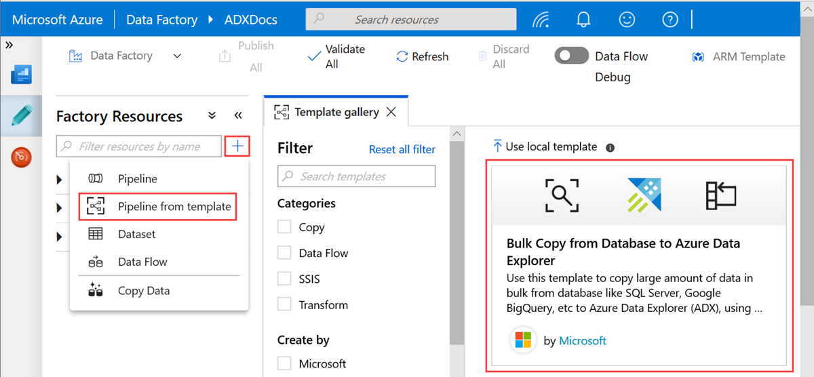
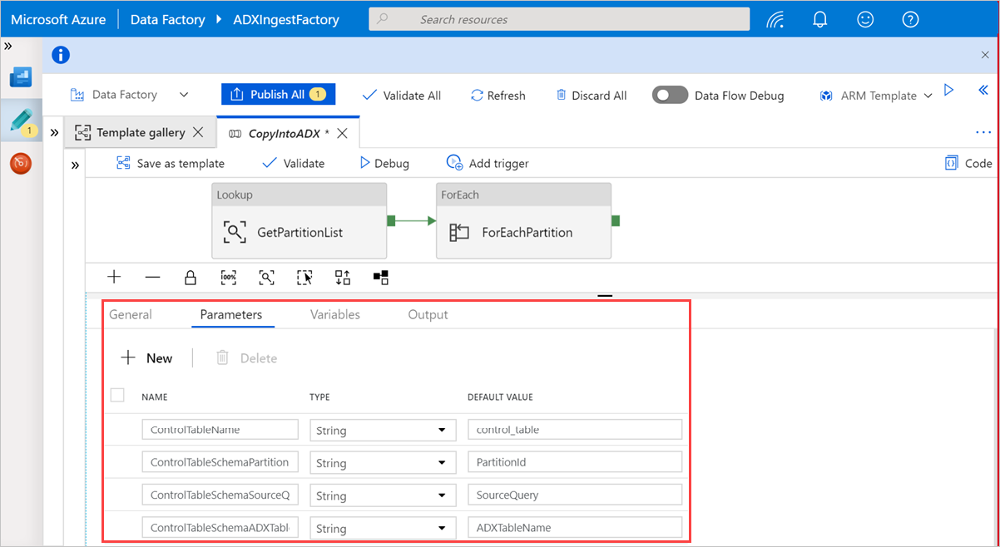
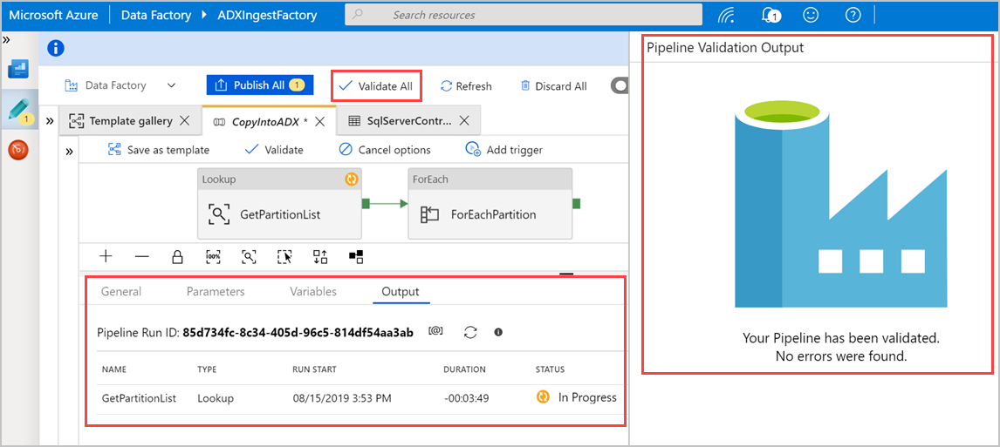

# Azure Data Factory template for bulk copy from database to Azure Data Explorer

Azure Data Explorer is a fast, fully managed data analytics service for real-time analysis on large volumes of data streaming from many sources such as applications, websites, and IoT devices. Azure Data Factory is a fully managed cloud-based data integration service. You can use the service to populate your Azure Data Explorer database with data from your existing system and save time when building your analytics solutions. 

[Azure Data Factory Templates](/azure/data-factory/solution-templates-introduction) are predefined Azure Data Factory pipelines that allow you to get started quickly with Data Factory and reduce development time for building data integration projects. 
Advantages of the template is faster copy of data due to partitioning and usage of different pipelines. You can create one pipeline per many tables. more effiecient. 
The **Bulk copy from database to Azure Data Explorer** template is created using lookup and ForEach activities. The data has to be partitioned in each table so that you can load rows with multiple threads in parallel from a single table. 

> [!IMPORTANT]
> Use the **Bulk copy from database to Azure Data Explorer** template to copy large amounts of data from databases such as SQL server and Google BigQuery to Azure Data Explorer. 
> Use the [copy tool](data-factory-load-data.md)) to copy a few tables with small or moderate amounts of data into Azure Data Explorer. 

## Prerequisites

* If you don't have an Azure subscription, create a [free Azure account](https://azure.microsoft.com/free/) before you begin.
* [An Azure Data Explorer cluster and database](create-cluster-database-portal.md)
* [Create a data factory](data-factory-load-data.md#create-a-data-factory)
* Source of data

## Create **ControlTableDataset**

The ControlTableDataset indicates what data will be copied from source to destination in pipeline. Number of rows indicate the total number of pipelines needed to copy data.

Example of SQL Server source table format:
   
    
    ```sql   
    CREATE TABLE control_table (
        PartitionId int,
        SourceQuery varchar(255),
        ADXTableName varchar(255)
    );
    ```    

\\change to table format
    PartitionId	SourceQuery	ADXTableName
    <e.g. 1> <e.g. select * from table where lastmodifiedtime LastModifytime >= ''2015-01-01 00:00:00''>	<e.g. MyAdxTable>\\

If your **ControlTableDataset** is in a different format, create a comparable dataset.

## Use ADF Template for Azure Data Explorer to copy data

1. In the **Let's get started** page, select the **Create pipeline from template** tile or select the pencil icon (Author tab) on the right > **+** > **Pipeline from template** to open the template gallery.

    

1. Select template **Bulk Copy from Database to Azure Data Explorer**.
 
    

1.  In the **Bulk Copy from Database to Azure Data Explorer** window select existing datasets from drop-down. If the dataset doesn't exist, [create a linked service]() to add the dataset.
\\use the load-data info - break up topic\\
    * **ControlTableDataset** - Control table indicates which data will be copied from source to destination and where it will be placed in destination. 
    * **SourceDataset** – Source database 
    * **AzureDataExplorerTable** - Azure Data Explorer Table
    * Select **Use this template**

   

1. Select area in canvas outside the activities to access the template pipeline. Select **Parameters** > to fill out parameters for table including control table name and column names.

    

1.	Select Lookup activity, **GetPartitionList**, to view default settings. The query is automatically created.
1.	Select Command activity, **ForEachPartition** > **Settings**
    * **Batch count**: Select number from 1-50. This selection determines the number of pipelines that run in parallel until the **ControlTableDataset** number of rows is reached. 
    * DO NOT select **Sequential** checkbox to make sure that the pipeline batches are running in parallel.
    
    > [!TIP]
    > Best to run many pipelines in parallel, so data can be copied more quickly. Allocate partition per pipeline, according to date and table to increase efficiency.

   

1. Select **Validate** to validate the ADF pipeline. 

    


 


