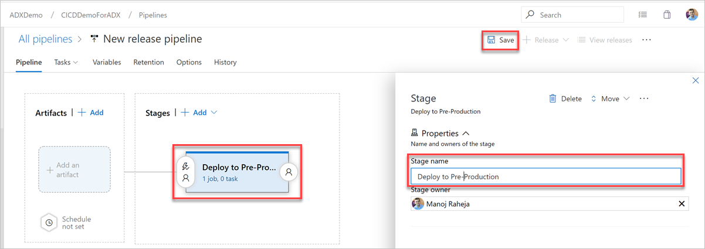
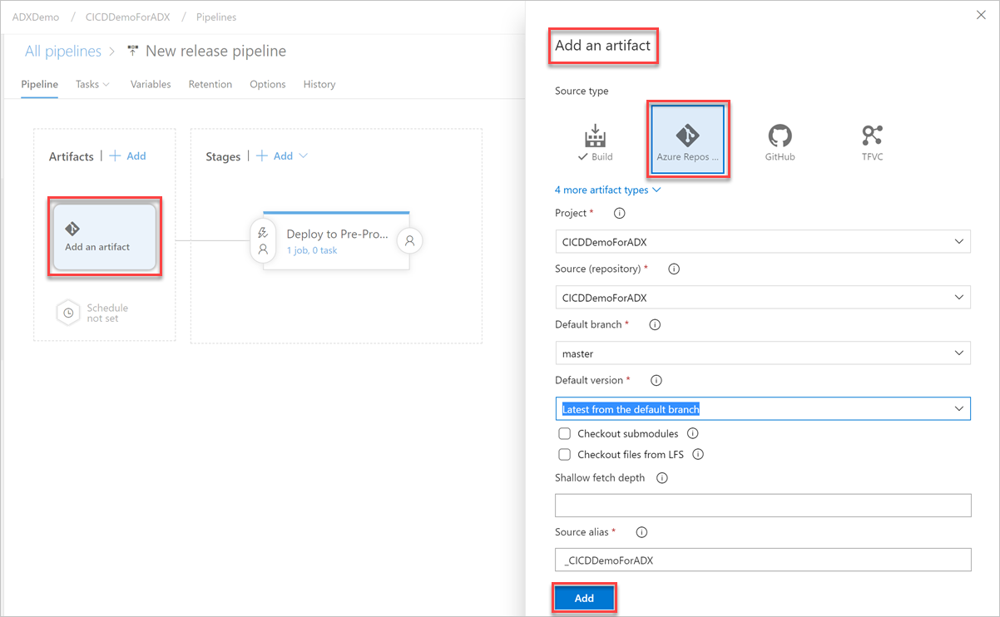
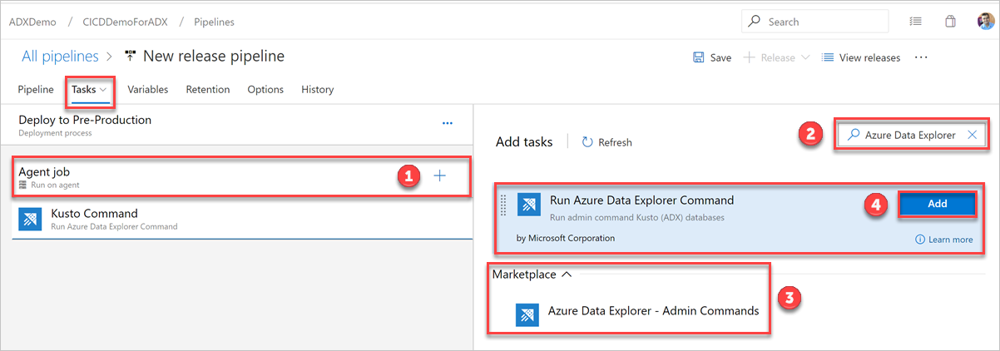
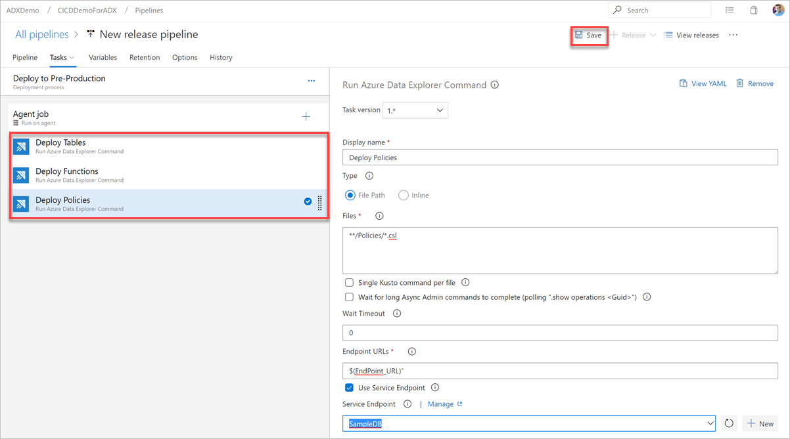
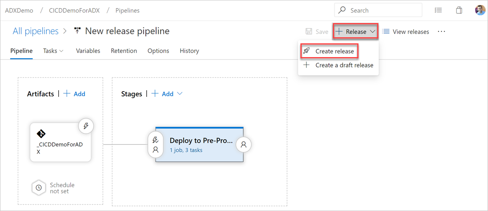

# Azure DevOps Task for Azure Data Explorer

[Azure DevOps Services](https://azure.microsoft.com/services/devops/) provides development collaboration tools including high-performance pipelines, free private Git repositories, configurable Kanban boards, and extensive automated and continuous testing capabilities. [Azure Pipelines](https://azure.microsoft.com/services/devops/pipelines/) is an Azure DevOps capability that enables you to manage CI/CD to deploy your code with a high-performance pipelines that works with any language, platform, and cloud.
[Azure Data Explorer - Admin Commands](https://marketplace.visualstudio.com/items?itemName=Azure-Kusto.PublishToADX) is the Azure Pipelines task that enables you to create release pipelines and deploy your database changes to your Azure Data Explorer databases. It is available for free in the [Visual Studio Marketplace](https://marketplace.visualstudio.com/).

This document describes a simple example on the use of the **Azure Data Explorer – Admin Commands** task to deploy your schema changes to your database. For complete CI/CD pipelines, refer to [Azure DevOps documentation](/azure/devops/user-guide/what-is-azure-devops?view=azure-devops#vsts).

## Prerequisites

* If you don't have an Azure subscription, create a [free Azure account](https://azure.microsoft.com/free/) before you begin.
* Azure Data Explorer Cluster setup:
    * An [Azure Data Explorer cluster and database](/azure/data-explorer/create-cluster-database-portal).
    * Create Azure AD app by [provisioning an Azure AD application](/azure/kusto/management/access-control/how-to-provision-aad-app).
    * Grant access to your Azure AD App on your Azure Data Explorer database by [managing Azure Data Explorer database permissions](/azure/data-explorer/manage-database-permissions).
* Azure DevOps setup:
    * [Sign up for a free organization](/azure/devops/user-guide/sign-up-invite-teammates?view=azure-devops)
    * [Create an organization](/azure/devops/organizations/accounts/create-organization?view=azure-devops)
    * [Create a project in Azure DevOps](/azure/devops/organizations/projects/create-project?view=azure-devops)
    * [Code with Git](/azure/devops/user-guide/code-with-git?view=azure-devops)

## Create folders

Create the following folders (*Functions*, *Policies*, *Tables*) in your Git repository. Copy the files from <location> into the respective folders and commit the change. These sample files are provided to execute the following workflow. 

When creating your own workflow, ensure your code idempotent. For example, use [.create-merge table](/azure/kusto/management/tables#create-merge-tables) instead of [.create table](/azure/kusto/management/tables#create-table), and use [.create-or-alter](/azure/kusto/management/functions#create-or-alter-function) function instead of [.create function](/azure/kusto/management/functions#create-function). In addition, use [.create-or-alter]() <table command to update the ingestion mappings.>

## Create a release pipeline 

1. Sign in to your [Azure DevOps account](https://dev.azure.com/).
1. Select **Pipelines** > **Releases** from left-hand menu and select **New pipeline**.

    

1. In **New release pipeline** window: **HOW get to pane** In the **Select a template** pane, select **Empty job**.

     

1. **HOW get to pane** In **Stage** pane, add the **Stage name**

    

1. Select **Add an artifact**. In the **Add an artifact** window, select the repository where your code exists, fill out relevant information, and click **Add**. **Manoj: Save your pipeline**.

    

** 1. Create a Variable for Endpoint URL that will be used in the task. You can get the Azure Data Explorer cluster URI from the overview page in the portal. Construct the URI in the following format “https://<cluster URI>?DatabaseName=<DBName>”  for example, https://democluster.westus2.kusto.windows.net?DatabaseName=SampleDB 

    

1. In the **Pipeline** tab, click on the **1 job, 0 task** to add the tasks.

1. Create three tasks to deploy **Tables**, **Functions**, and **Policies**, in this order.

1. Search for **Azure Data Explorer**, install the **Azure Data Explorer – Admin Commands** extension and click **Add**

     

1. Click on **Kusto Command** on the left and update the task with the following information:
    * **Display name**: name of the task
    * **File path**: Specify */Tables/*.csl since the table creation files are in the *Table* folder.
    * **Endpoint URL**: enter the variable we created in previous step “$(EndPoint_URL)”

1. Select **Use Service Endpoint** and **Create New** (**CORRECT?**). Complete the following information:

    |Setting  |Suggested value  |
    |---------|---------|
    |Connection name     |    Enter a name to identify this service endpoint     |
    |Cluster Url    |         | Value can be found in overview section of your Azure Data Explorer cluster in the Azure portal
    |Service Principal Id    |    Enter the AAD App ID (created as prerequisite)     |
    |Service Principal App Key     |    Enter the AAD App Key (created as prerequisite)    |
    |AAD tenant id    |      Enter your AAD tenant (such as microsoft.com, contoso.com...)    |

    Mark **Allow all pipelines to use this connection** checkbox. Select **OK**.

    

1. Repeat the last three steps to deploy files from *Functions* and *Policies* folders. Select **Save**.

    

1. Create a release:

    

1. Check the deployment status to check that it's successfully deployed.

     