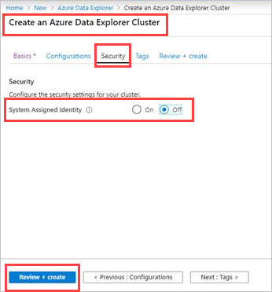

# Enable infrastructure encryption (double encryption) on cluster creation
  
When you create a cluster, its storage is automatically encrypted in service level using 256-bit AES encryption, one of the strongest block ciphers available, and is FIPS 140-2 compliant. Customers who require higher levels of assurance that their data is secure can also enable 256-bit AES encryption at the Azure Storage infrastructure level. 

When infrastructure encryption is enabled, data in the storage account is encrypted twice — once at the service level and once at the infrastructure level — with two different encryption algorithms and two different keys. 
Double encryption of Azure Storage data protects against a scenario where one of the encryption algorithms or keys may be compromised. In this scenario, the additional layer of encryption continues to protect your data.
For more information, see [storage infrastructure encryption](https://docs.microsoft.com/en-us/azure/storage/common/infrastructure-encryption-enable). 

## Restrictions

•	Enabling double encryption is possible only during cluster creation.
•	Once infrastructure encryption is enabled on your cluster, **you cannot disable it**.
•	This capability is available only in regions in which infrastructure encryption is supported in Azure. Please see [storage infrastructure encryption](https://docs.microsoft.com/en-us/azure/storage/common/infrastructure-encryption-enable) for more details.

# [Azure portal](#tab/portal)

1. [Create an Azure Data Explorer cluster](create-cluster-database-portal.md#create-a-cluster) 
2. In the **Security** tab > **System assigned identity**, select **On**. To remove the system assigned identity, select **Off**.
3. Select **Next:Tags>** or **Review + create** to create the cluster.

    


# [C#](#tab/c-sharp)

#### Prerequisites

To set up a managed identity using the Azure Data Explorer C# client:

* Install the [Azure Data Explorer (Kusto) NuGet package](https://www.nuget.org/packages/Microsoft.Azure.Management.Kusto/).
* Install the [Microsoft.IdentityModel.Clients.ActiveDirectory NuGet package](https://www.nuget.org/packages/Microsoft.IdentityModel.Clients.ActiveDirectory/) for authentication.
* [Create an Azure AD application](/azure/active-directory/develop/howto-create-service-principal-portal) and service principal that can access resources. You add role assignment at the subscription scope and get the required `Directory (tenant) ID`, `Application ID`, and `Client Secret`.

#### Create your cluster

1. Create your cluster using the `enableDoubleEncryption` property:

    ```csharp
    var tenantId = "xxxxxxxx-xxxxx-xxxx-xxxx-xxxxxxxxx";//Directory (tenant) ID
    var clientId = "xxxxxxxx-xxxxx-xxxx-xxxx-xxxxxxxxx";//Application ID
    var clientSecret = "xxxxxxxxxxxxxx";//Client Secret
    var subscriptionId = "xxxxxxxx-xxxxx-xxxx-xxxx-xxxxxxxxx";
    var authenticationContext = new AuthenticationContext($"https://login.windows.net/{tenantId}");
    var credential = new ClientCredential(clientId, clientSecret);
    var result = await authenticationContext.AcquireTokenAsync(resource: "https://management.core.windows.net/", clientCredential: credential);
    
    var credentials = new TokenCredentials(result.AccessToken, result.AccessTokenType);
    
    var kustoManagementClient = new KustoManagementClient(credentials)
    {
        SubscriptionId = subscriptionId
    };
                                                                                                    
    var resourceGroupName = "testrg";
    var clusterName = "mykustocluster";
    var location = "East US";
    var skuName = "Standard_D13_v2";
    var tier = "Standard";
    var capacity = 5;
    var sku = new AzureSku(skuName, tier, capacity);
    var enableDoubleEncryption = true;
    var cluster = new Cluster(location, sku, enableDoubleEncryption: enableDoubleEncryption);
    await kustoManagementClient.Clusters.CreateOrUpdateAsync(resourceGroupName, clusterName, cluster);
    ```
    
2. Run the following command to check if your cluster was successfully created:

    ```csharp
    kustoManagementClient.Clusters.Get(resourceGroupName, clusterName);
    ```

    If the result contains `ProvisioningState` with the `Succeeded` value, then the cluster was created successfully.


# [ARM template](#tab/arm)

### Add a system-assigned identity using an Azure Resource Manager template

An Azure Resource Manager template can be used to automate deployment of your Azure resources. To learn more about deploying to Azure Data Explorer, see [Create an Azure Data Explorer cluster and database by using an Azure Resource Manager template](create-cluster-database-resource-manager.md).

Adding the 'EnableDoubleEncryption' type tells Azure to enable infrastructure encryption (double encryption) for your cluster.

```json
{
    "apiVersion": "2020-06-14",
    "type": "Microsoft.Kusto/clusters",
    "name": "[variables('clusterName')]",
    "location": "[resourceGroup().location]",
    "properties": {
        "trustedExternalTenants": [],
        "virtualNetworkConfiguration": null,
        "optimizedAutoscale": null,
        "enableDiskEncryption": false,
        "enableStreamingIngest": false,
        "enableDoubleEncryption": true,
    }
}
```

When the cluster is created, it has the following additional properties:

```json
"identity": {
    "type": "SystemAssigned",
    "tenantId": "<TENANTID>",
    "principalId": "<PRINCIPALID>"
}
```

---

## Next steps

[Check cluster health](check-cluster-health.md)
