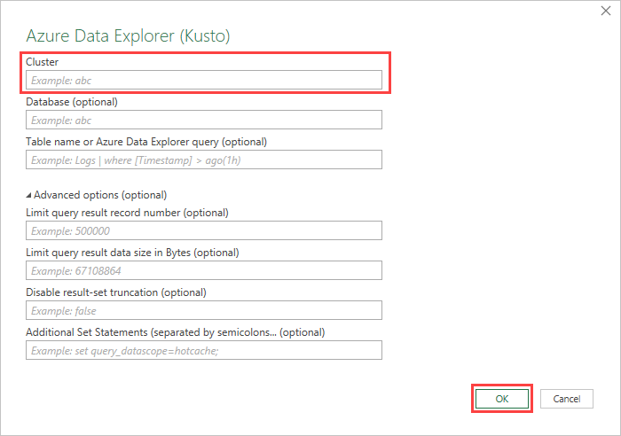
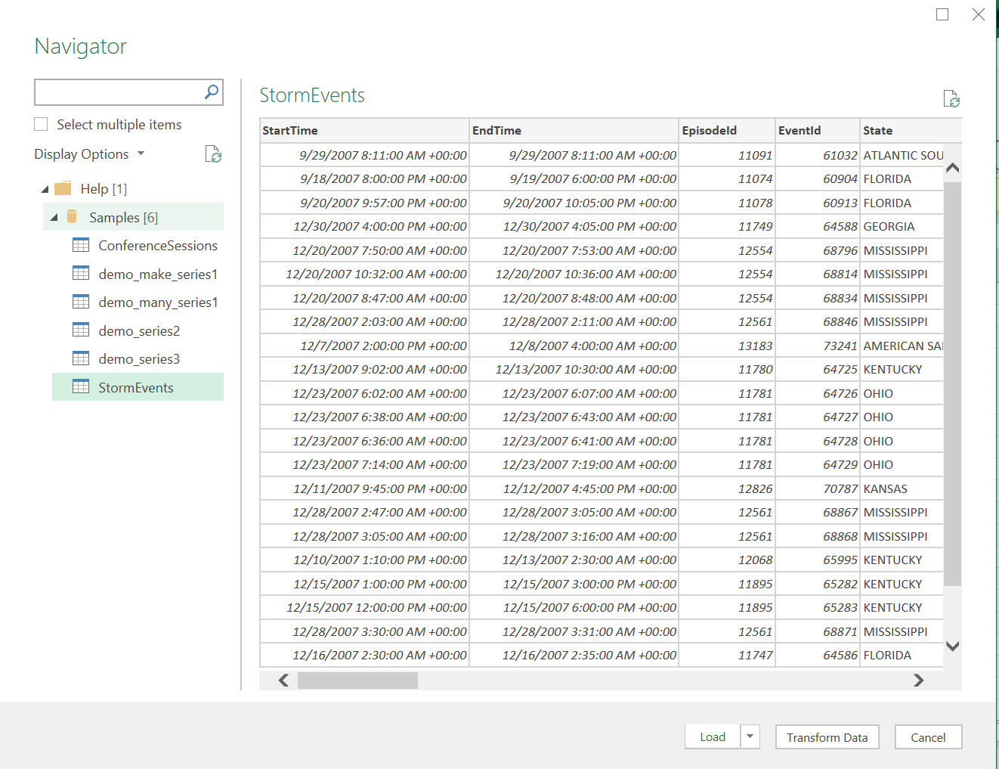
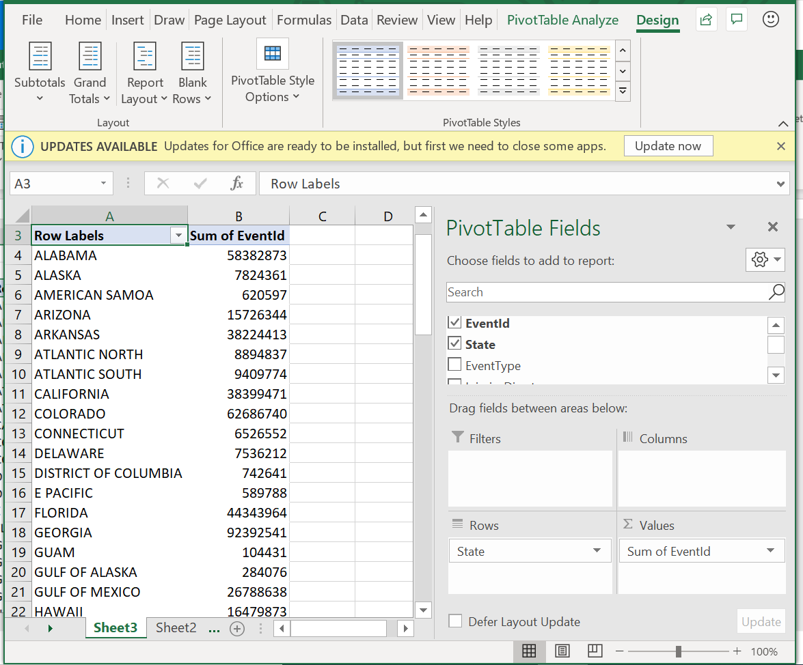
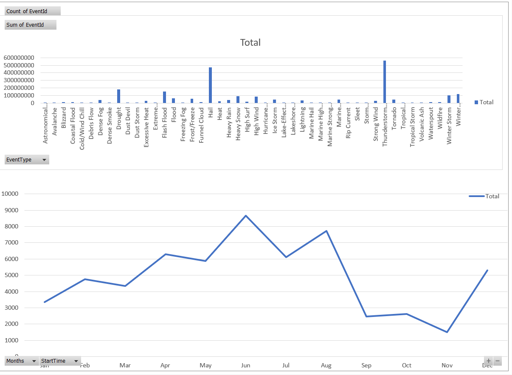

# Visualize data using the Azure Data Explorer connector for Excel

Azure Data Explorer offers the ability to export query results to Excel using the Excel native connector. You can also add a KQL query as an Excel data source for additional calculations or visualizations.

Azure Data Explorer provides two options for connecting to data in Excel: use the native connector or import a query from Azure Data Explorer. This article shows you how to use the native connector in Excel to connect to the Azure Data Explorer cluster to get and visualize data.

## Define Kusto query as Excel data source and load data to Excel

1. Open **Microsoft Excel**.
1. In **Data** tab, select **Get Data** > **From Azure** > **From Azure Data Explorer**

    

1. In the **Azure Data Explorer (Kusto)** window complete the following fields and select **OK**.

    
    
    |Field   |Description |
    |---------|---------|
    |**Cluster**   |   Name of cluster (mandatory)      |    
    |**Database**     |    Name of database      |    
    |**Table name or Azure Data Explorer query**    |     Name of table or Azure Data Explorer query    | 
    
    **Advanced Options:**

     |Field   |Description |
    |---------|---------|
    |**Limit query result record number**     |     Limit the number of records loaded into excel  |    
    |**Limit query result data size (bytes)**    |    Limit the data size      |   
    |**Disable result-set truncation**    |         |      
    |**Additional Set statements (separated by semicolons)**    |    Add `set` statements to apply to data source     |   

1.	In the **Navigator** pane, navigate to correct table. In the table preview pane, select **Transform Data** to make changes to your data or select **Load** to load it to Excel.

   > [!TIP]
   > If **Database** and/or **Table name or Azure Data Explorer query** are already specified, the correct table preview pane will open automatically. 

## Analyze and visualize data in Excel

Once the data loads to excel and is available in your Excel sheet you can analyze, summarize, and visualize the data by creating relationships and visuals. 

1.	In **Table Design** tab, select **Summarize with PivotTable**. In **Create PivotTable** window select the relevant table and **OK**.

    

1. In the **PivotTable Fields** pane, select the relevant table columns to create summary tables. In the example below,  **EventId** and **State** are selected.
    
    

1. In **PivotTable Analyze** tab, select **PivotChart** to create visuals based on the table. In the example below use **Event Id**, **StartTime**, and **EventType** to view additional information about the weather events.

    

1. Create full dashboards to monitor your data.

