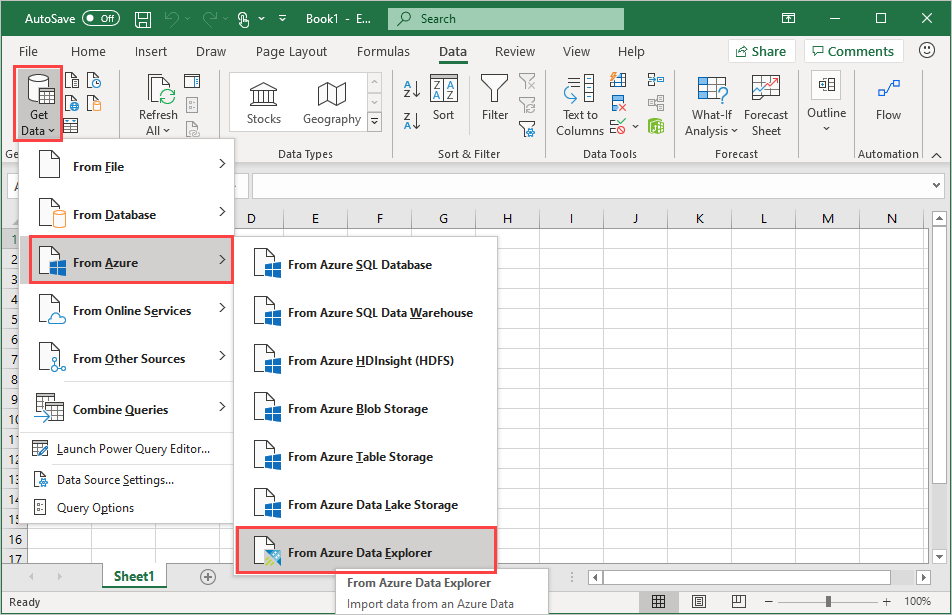

# Visualize data using the Azure Data Explorer connector for Excel

Azure Data Explorer offers the ability to export query results to Excel using the Excel native connector. In addition, you can add a Kusto query as an Excel data source for additional calculations or visualizations.

Azure Data Explorer provides two options for connecting to data in Excel:
* Use the native connector, detailed in this article, in Excel to connect to the Azure Data Explorer cluster.
* Import a query from Azure Data Explorer

## Define Kusto query as Excel data source

1. Open **Microsoft Excel**.
1. Select **Get Data** > **From Azure** > **From Azure Data Explorer**

    

1. In the Azure Data Explorer (Kusto) window complete the following fields and select **OK**.

    

    
    |Field   |Description |Mandatory/Optional  |
    |---------|---------|---------|
    |Cluster   |         |    mandatory     |
    |Database     |         |    optional        |
    |Table name or Azure Data Explorer query    |         |  optional          |

    
    **Advanced Options:**

     |Field   |Description |Mandatory/Optional  |
    |---------|---------|---------|
    |Limit query result record number     |         |    optional        |
    |Limit query result data size (bytes)    |         |   optional         |
    |Disable result-set truncation    |         |      optional      |
    |Additional Set statements (separated by semicolons)     |         |   optional      |

## old content:

1. Create a query and run it in Azure Data Explorer Web UI. Check that the results are satisfactory.

1. Click on the **Query to Power BI** button in ?.

1. You should see the following notification:

1. In the **Data** tab in Excel click on **New Query** > **From Other Data Sources** -> **Blank Query**:

1. Click on the **Advanced Editor** menu item.

1. Paste the M query, previously stored in the clipboard, and select **Done**.

1. To authenticate, select **Edit Credentials**.

1. Select **Organizational account**, then **Sign-in**. Complete the sign-in process and connect.

1. Repeat the steps above to get more queries into the designer. Rename the queries to more meaningful names.

(10) Select **Close & Load**.

(11) Your data is now in Excel. Select **Refresh** to refresh the query.

