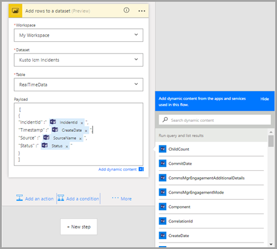
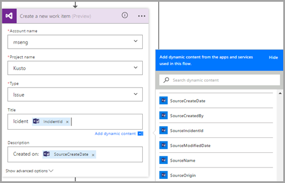
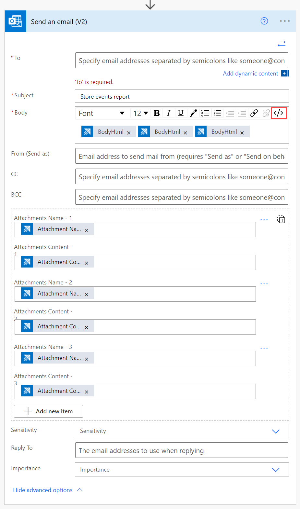

# Usage examples for Azure Data Explorer connector to :::no-loc text="Power Automate":::

The Azure Data Explorer :::no-loc text="Power Automate"::: (previously Microsoft flow) connector allows Azure Data Explorer to use the flow capabilities of [Microsoft :::no-loc text="Power Automate":::](https://flow.microsoft.com/). You can run Kusto queries and commands automatically, as part of a scheduled or triggered task. This article includes several common :::no-loc text="Power Automate"::: connector usage examples.

For more information, see [Azure Data Explorer :::no-loc text="Power Automate"::: connector](flow.md).

## :::no-loc text="Power Automate"::: connector and your SQL database

Use the :::no-loc text="Power Automate"::: connector to query your data and aggregate it in a SQL database.

> [!Note]
> Only use the :::no-loc text="Power Automate"::: connector for small amounts of output data. The SQL insert operation is done separately for each row.

> [!IMPORTANT]
> In the **Cluster Name** field, enter the cluster URL.

## Push data to a Microsoft Power BI dataset

You can use the :::no-loc text="Power Automate"::: connector with the Power BI connector to push data from Kusto queries to Power BI streaming datasets.

1. Create a new **Run query and list results** action.
1. Select **New step**.
1. Select **Add an action**, and search for Power BI.
1. Select **Power BI** > **Add rows to a dataset**.

    

1. Enter the **Workspace**, **Dataset**, and **Table** to which data will be pushed.
1. From the dynamic content dialog box, add a **Payload** that contains your dataset schema and the relevant Kusto query results.

    

The flow automatically applies the Power BI action for each row of the Kusto query result table.

## Conditional queries

You can use the results of Kusto queries as input or conditions for the next :::no-loc text="Power Automate"::: actions.

In the following example, we query Kusto for incidents that occurred during the last day. For each resolved incident, a Slack message is posted and a push notification is created.
For each incident that is still active, we query Kusto for more information about similar incidents. It sends that information as an email, and opens a related task in Azure DevOps Server.

Follow these instructions to create a similar flow:

1. Create a new **Run query and list results** action.
1. Select **New step** > **Condition control**.
1. From the dynamic content window, select the parameter you want to use as a condition for the next actions.
1. Select the type of *Relationship* and *Value* to set a specific condition on the particular parameter.

    :::image type="content" source="./media/flow-usage/flow-condition.png" alt-text="Using flow conditions based on the results of a Kusto query to determine the next flow action, Azure Data Explorer" lightbox="./media/flow-usage/flow-condition.png#lightbox":::

    The flow applies this condition on each row of the query result table.
1. Add actions for when the condition is true and false.

    :::image type="content" source="./media/flow-usage/flow-conditionactions.png" alt-text="Adding actions for when a condition is true or false, flow conditions based on Kusto query results, Azure Data Explorer" lightbox="./media/flow-usage/flow-conditionactions.png#lightbox":::

You can use the result values from the Kusto query as input for the next actions. Select the result values from the dynamic content window.
In the following example, we add a **Slack - Post Message** action and a **Visual Studio - Create a new work item** action, containing data from the Kusto query.

In this example, if an incident is still active, query Kusto again to get information about how incidents from the same source were solved in the past.

> [!IMPORTANT]
> In the **Cluster Name** field, enter the cluster URL.

Visualize this information as a pie chart, and email it to the team.

## Email multiple Azure Data Explorer flow charts

1. Create a new flow with the recurrence trigger, and define the interval and frequency of the flow.
1. Add a new step, with one or more **Kusto - Run query and visualize results** actions.

    

1. For each **Kusto - Run query and visualize result** action, define the following fields:
    * Cluster URL.
    * Database Name.
    * Query and Chart Type (for example, HTML table, pie chart, time chart, bar chart, or a custom value).

    

1. Add a **Send an email (v2)** action:
    1. In the body section, select the code view icon.
    1. In the **Body** field, insert the required **BodyHtml** so that the visualized result of the query is included in the body of the email.
    1. To add an attachment to the email, add **Attachment Name** and **Attachment Content**.

    

    For more information about creating an email action, see [Email Kusto query results](flow.md#email-kusto-query-results).

Results:

:::image type="content" source="./media/flow-usage/flow-resultsmultipleattachments.png" alt-text="Results of multiple email attachments, visualized as a pie chart and bar chart, Azure Data Explorer" lightbox="./media/flow-usage/flow-resultsmultipleattachments.png#lightbox":::

:::image type="content" source="./media/flow-usage/flow-resultsmultipleattachments2.png" alt-text="Results of multiple email attachments, visualized as a time chart, Azure Data Explorer" lightbox="./media/flow-usage/flow-resultsmultipleattachments2.png#lightbox":::

## Next steps

Learn about the [Azure Kusto Logic App connector](kusto/tools/logicapps.md), which is another way to run Kusto queries and commands automatically, as part of a scheduled or triggered task.
