# Azure Data Explorer connector to :::no-loc text="Power Automate"::: (Preview)

The Azure Data Explorer :::no-loc text="Power Automate"::: (previously Microsoft Flow) connector allows Azure Data Explorer to use the flow capabilities of [Microsoft :::no-loc text="Power Automate":::](https://flow.microsoft.com/). You can run Kusto queries and commands automatically, as part of a scheduled or triggered task.

You can:

* Send daily reports containing tables and charts.
* Set notifications based on query results.
* Schedule control commands on clusters.
* Export and import data between Azure Data Explorer and other databases. 

For more information, see [Azure Data Explorer :::no-loc text="Power Automate"::: connector usage examples](flow-usage.md).

##  Sign in 

1. When you connect for the first time, you're prompted to sign in.

1. Select **Sign in**, and enter your credentials.

## Authentication

You can authenticate with user credentials, or with an Azure Active Directory (Azure AD) application.

> [!Note]
> Make sure your application is an [Azure AD application](./provision-azure-ad-app.md), and is authorized to run queries on your cluster.

1. In **Run control command and visualize results**, select the three dots at the top right of the flow connector.

   

1. Select **Add new connection** > **Connect with Service Principal**.

   

1. Enter the required information:
   - Connection Name: A descriptive and meaningful name for the new connection.
   - Client ID: Your application ID.
   - Client Secret: Your application key.
   - Tenant: The ID of the Azure AD directory in which you created the application.

   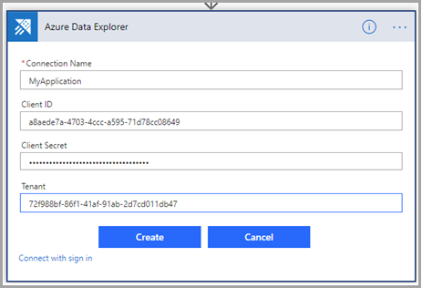

When authentication is complete, you'll see that your flow uses the newly added connection.

From now on, this flow will run by using these application credentials.

## Find the Azure Kusto connector

To use the :::no-loc text="Power Automate"::: connector, you need to first add a trigger. 
You can define a trigger based on a recurring time period, or as a response to a previous flow action.

1. [Create a new flow](https://flow.microsoft.com/manage/flows/new), or, from the Microsoft :::no-loc text="Power Automate"::: home page, select the **My flows** > **+ New**.

    

1. Select **Scheduled--from blank**.

    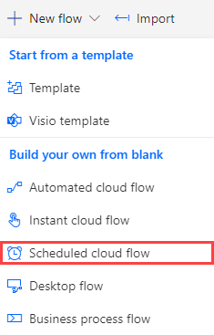

1. In **Build a scheduled flow**, enter the required information.
    
    

1. Select **Create** > **+ New step**.
1. In the search box, enter *Kusto*, and select **Azure Data Explorer**.

    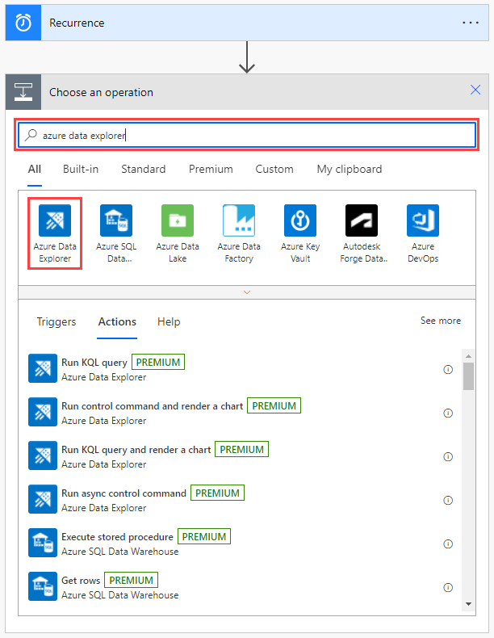

## Flow actions

When you open the Azure Data Explorer connector, there are three possible actions you can add to your flow. This section describes the capabilities and parameters for each action.

### Run control command and visualize results

Use this action to run a [control command](kusto/management/index.md).

1. Specify the cluster URL. For example, `https://clusterName.eastus.kusto.windows.net`.
1. Enter the name of the database.
1. Specify the control command:
   * Select dynamic content from the apps and connectors used in the flow.
   * Add an expression to access, convert, and compare values.
1. To send the results of this action by email as a table or a chart, specify the chart type. This can be:
   * An HTML table.
   * A pie chart.
   * A time chart.
   * A bar chart.

> [!IMPORTANT]
> In the **Cluster Name** field, enter the cluster URL.

### Run query and list results

> [!Note]
> If your query starts with a dot (meaning that it's a [control command](kusto/management/index.md)), use [Run control command and visualize results](#run-control-command-and-visualize-results).

This action sends a query to the Kusto cluster. The actions that are added afterwards iterate over each line of the results of the query.

The following example triggers a query every minute, and sends an email based on the query results. The query checks the number of lines in the database, and then sends an email only if the number of lines is greater than 0. 

> [!Note]
> If the column has several lines, the connector will run for each line in the column.

### Run query and visualize results
        
> [!Note]
> If your query starts with a dot (meaning that it's a [control command](kusto/management/index.md)), use [Run control command and visualize results](#run-control-command-and-visualize-results).
        
Use this action to visualize a Kusto query result as a table or chart. For example, use this flow to receive daily reports by email. 
    
In this example, the results of the query are returned as an HTML table.
            

> [!IMPORTANT]
> In the **Cluster Name** field, enter the cluster URL.

## Email Kusto query results

You can include a step in any flow to send reports by email, to any email address. 

1. Select **+ New Step** to add a new step to your flow.
1. In the search box, enter *Office 365* and select **Office 365 Outlook**.
1. Select **Send an email (V2)**.
1. Enter the email address to which you want the email report sent.
1. Enter the subject of the email.
1. Select **Code view**.
1. Place your cursor in the **Body** field, and select **Add dynamic content**.
1. Select **BodyHtml**.
    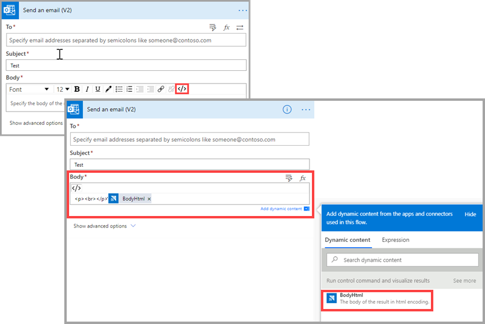
1. Select **Show advanced options**.
1. Under **Attachments Name -1**, select **Attachment Name**.
1. Under **Attachments Content**, select **Attachment Content**.
1. If necessary, add more attachments. 
1. If necessary, set the importance level.
1. Select **Save**.

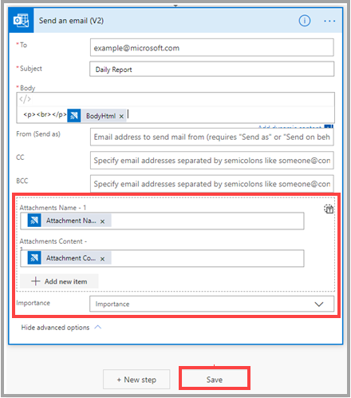

## Check if your flow succeeded

To check if your flow succeeded, see the flow's run history:
1. Go to the [Microsoft :::no-loc text="Power Automate"::: home page](https://flow.microsoft.com/).
1. From the main menu, select [My flows](https://flow.microsoft.com/manage/flows).
   
   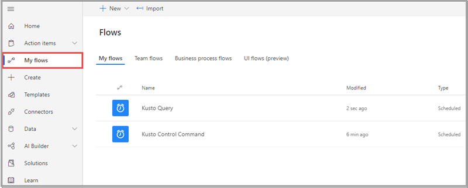

1. On the row of the flow you want to investigate, select the more commands icon, and then select **Run history**.

    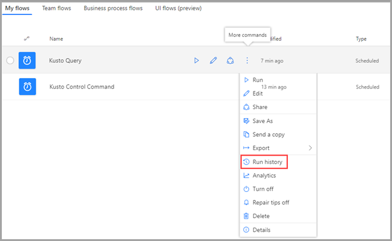

    All flow runs are listed, with information about start time, duration, and status.
    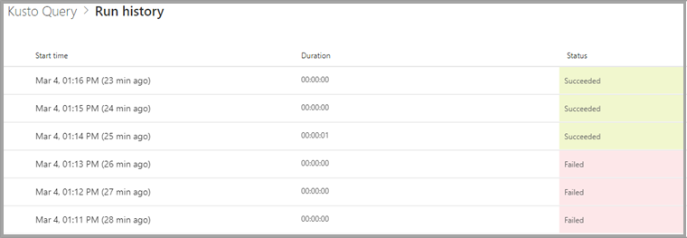

    For full details about the flow, on **[My flows](https://flow.microsoft.com/manage/flows)**, select the flow you want to investigate.

    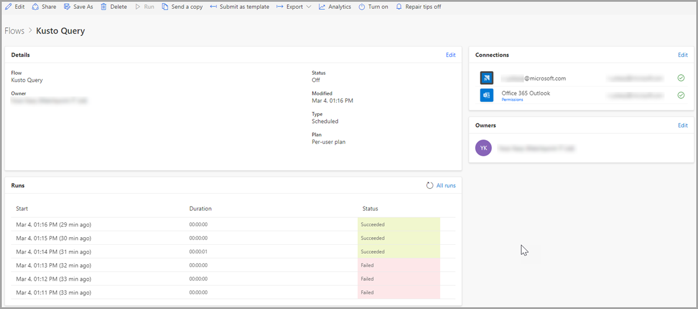 

To see why a run failed, select the run start time. The flow appears, and the step of the flow that failed is indicated by a red exclamation point. Expand the failed step to view its details. The **Details** pane on the right contains information about the failure so that you can troubleshoot it.

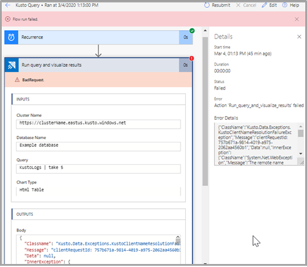

## Timeout exceptions

Your flow can fail and return a "RequestTimeout" exception if it runs for more than 90 seconds.
    
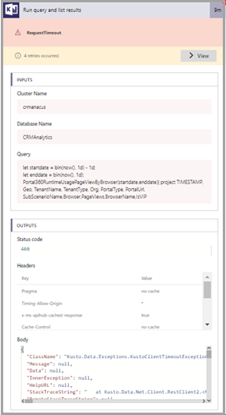

To fix a timeout issue, make your query more efficient so that it runs faster, or separate it into chunks. Each chunk can run on a different part of the query. For more information, see [Query best practices](kusto/query/best-practices.md).

The same query might run successfully in Azure Data Explorer, where the time isn't limited and can be changed.

## Limitations

* Results returned to the client are limited to 500,000 records. The overall memory for those records can't exceed 64 MB and a time of 90 seconds to run.
* The connector doesn't support operators that aren't supported by the [`getschema` operator](kusto/query/getschemaoperator.md). For example, the [fork](kusto/query/forkoperator.md), [facet](kusto/query/facetoperator.md), and [evaluate](kusto/query/evaluateoperator.md) operators aren't supported. 
* Flow works best on Microsoft Edge and Google Chrome.

## Next steps

Learn about the [Azure Kusto Logic App connector](kusto/tools/logicapps.md), which is another way to run Kusto queries and commands automatically, as part of a scheduled or triggered task.
