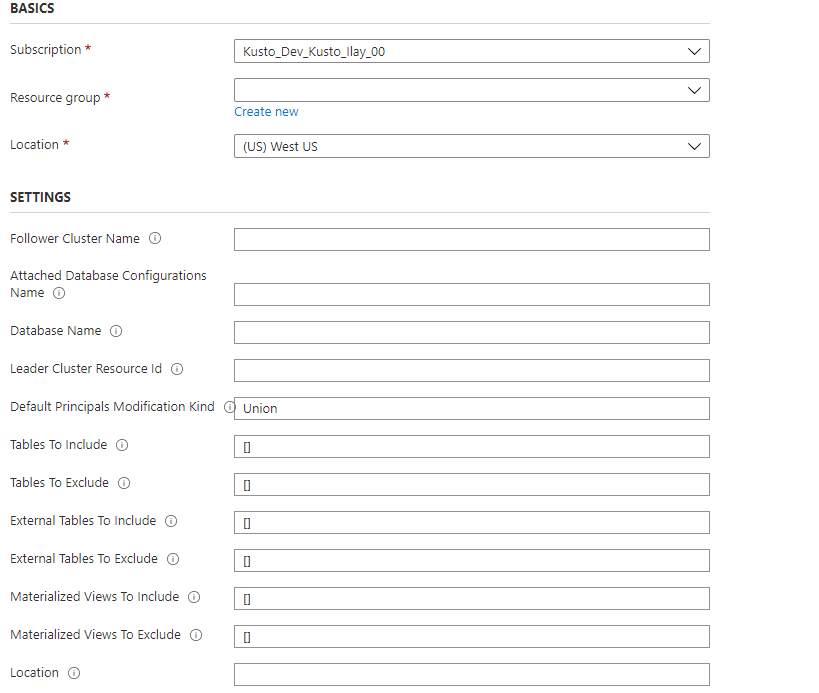
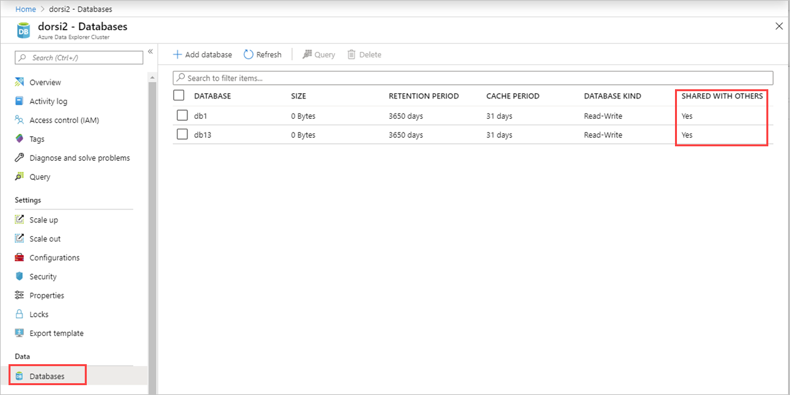

# Use follower database to attach databases in Azure Data Explorer

The **follower database** feature allows you to attach a database located in a different cluster to your Azure Data Explorer cluster. The **follower database** is attached in *read-only* mode, making it possible to view the data and run queries on the data that was ingested into the **leader database**. The follower database synchronizes changes in the leader databases. Due to the synchronization, there's a data lag of a few seconds to a few minutes in data availability. The length of the time lag depends on the overall size of the leader database metadata. The leader and follower databases use the same storage account to fetch the data. The storage is owned by the leader database. The follower database views the data without needing to ingest it. Since the attached database is a read-only database, the data, tables, and policies in the database can't be modified except for [caching policy](#configure-caching-policy), [principals](#manage-principals), and [permissions](#manage-permissions). Attached databases can't be deleted. They must be detached by the leader or follower and only then they can be deleted. 

Attaching a database to a different cluster using the follower capability is used as the infrastructure to share data between organizations and teams. The feature is useful to segregate compute resources to protect a production environment from non-production use cases. Follower can also be used to associate the cost of Azure Data Explorer cluster to the party that runs queries on the data.

## Which databases are followed?

* A cluster can follow one database, several databases, or all databases of a leader cluster. 
* A single cluster can follow databases from multiple leader clusters. 
* A cluster can contain both follower databases and leader databases

## Prerequisites

1. If you don't have an Azure subscription, [create a free account](https://azure.microsoft.com/free/) before you begin.
1. [Create cluster and DB](/azure/data-explorer/create-cluster-database-portal) for the leader and follower.
1. [Ingest data](/azure/data-explorer/ingest-sample-data) to leader database using one of various methods discussed in [ingestion overview](/azure/data-explorer/ingest-data-overview).

## Attach a database

There are various methods you can use to attach a database. In this article, we discuss attaching a database using C# or an Azure Resource Manager template. To attach a database, you must have permissions on the leader cluster and the follower cluster. For more information about permissions, see [manage permissions](#manage-permissions).

### Attach a database using C#

#### Needed NuGets

* Install [Microsoft.Azure.Management.kusto](https://www.nuget.org/packages/Microsoft.Azure.Management.Kusto/).
* Install [Microsoft.Rest.ClientRuntime.Azure.Authentication for authentication](https://www.nuget.org/packages/Microsoft.Rest.ClientRuntime.Azure.Authentication).

#### Code Example

```Csharp
var tenantId = "xxxxxxxx-xxxxx-xxxx-xxxx-xxxxxxxxx";//Directory (tenant) ID
var clientId = "xxxxxxxx-xxxxx-xxxx-xxxx-xxxxxxxxx";//Application ID
var clientSecret = "xxxxxxxxxxxxxx";//Client secret
var leaderSubscriptionId = "xxxxxxxx-xxxxx-xxxx-xxxx-xxxxxxxxx";
var followerSubscriptionId = "xxxxxxxx-xxxxx-xxxx-xxxx-xxxxxxxxx";

var serviceCreds = await ApplicationTokenProvider.LoginSilentAsync(tenantId, clientId, clientSecret);
var resourceManagementClient = new KustoManagementClient(serviceCreds){
	SubscriptionId = followerSubscriptionId
};

var followerResourceGroupName = "followerResouceGroup";
var leaderResourceGroup = "leaderResouceGroup";
var leaderClusterName = "leader";
var followerClusterName = "follower";
var attachedDatabaseConfigurationName = "adc";
var databaseName = "db"; // Can be specific database name or * for all databases
var defaultPrincipalsModificationKind = "Union"; 
var location = "North Central US";

AttachedDatabaseConfiguration attachedDatabaseConfigurationProperties = new AttachedDatabaseConfiguration()
{
	ClusterResourceId = $"/subscriptions/{leaderSubscriptionId}/resourceGroups/{leaderResourceGroup}/providers/Microsoft.Kusto/Clusters/{leaderClusterName}",
	DatabaseName = databaseName,
	DefaultPrincipalsModificationKind = defaultPrincipalsModificationKind,
	Location = location
};

var attachedDatabaseConfigurations = resourceManagementClient.AttachedDatabaseConfigurations.CreateOrUpdate(followerResourceGroupName, followerClusterName, attachedDatabaseConfigurationName, attachedDatabaseConfigurationProperties);
```

### Attach a database using Python

#### Needed Modules

```
pip install azure-common
pip install azure-mgmt-kusto
```

#### Code Example

```python
from azure.mgmt.kusto import KustoManagementClient
from azure.mgmt.kusto.models import AttachedDatabaseConfiguration
from azure.common.credentials import ServicePrincipalCredentials
import datetime

#Directory (tenant) ID
tenant_id = "xxxxxxxx-xxxxx-xxxx-xxxx-xxxxxxxxx"
#Application ID
client_id = "xxxxxxxx-xxxxx-xxxx-xxxx-xxxxxxxxx"
#Client Secret
client_secret = "xxxxxxxxxxxxxx"
follower_subscription_id = "xxxxxxxx-xxxxx-xxxx-xxxx-xxxxxxxxx"
leader_subscription_id = "xxxxxxxx-xxxxx-xxxx-xxxx-xxxxxxxxx"
credentials = ServicePrincipalCredentials(
        client_id=client_id,
        secret=client_secret,
        tenant=tenant_id
    )
kusto_management_client = KustoManagementClient(credentials, follower_subscription_id)

follower_resource_group_name = "followerResouceGroup"
leader_resouce_group_name = "leaderResouceGroup"
follower_cluster_name = "follower"
leader_cluster_name = "leader"
attached_database_Configuration_name = "adc"
database_name  = "db" # Can be specific database name or * for all databases
default_principals_modification_kind  = "Union"
location = "North Central US"
cluster_resource_id = "/subscriptions/" + leader_subscription_id + "/resourceGroups/" + leader_resouce_group_name + "/providers/Microsoft.Kusto/Clusters/" + leader_cluster_name

attached_database_configuration_properties = AttachedDatabaseConfiguration(cluster_resource_id = cluster_resource_id, database_name = database_name, default_principals_modification_kind = default_principals_modification_kind, location = location)

#Returns an instance of LROPoller, see https://docs.microsoft.com/python/api/msrest/msrest.polling.lropoller?view=azure-python
poller = kusto_management_client.attached_database_configurations.create_or_update(follower_resource_group_name, follower_cluster_name, attached_database_Configuration_name, attached_database_configuration_properties)
```

### Attach a database using an Azure Resource Manager template

In this section, you learn how to create a follower cluster and attach a database to it by using an [Azure Resource Manager template](../azure-resource-manager/management/overview.md). 
If you already have a cluster just remove "Microsoft.Kusto/clusters" resource from the list of the resource below.

```json
{
	"$schema": "https://schema.management.azure.com/schemas/2015-01-01/deploymentTemplate.json#",
	"contentVersion": "1.0.0.0",
	"parameters": {
		"followerClusterName": {
			"type": "string",
			"defaultValue": "",
			"metadata": {
				"description": "Name of the follower cluster."
			}
		},
		"attachedDatabaseConfigurationsName": {
			"type": "string",
			"defaultValue": "",
			"metadata": {
				"description": "Name of the attached database configurations to create."
			}
		},
		"databaseName": {
			"type": "string",
			"defaultValue": "",
			"metadata": {
				"description": "The name of the database to follow. You can follow all databases by using '*'."
			}
		},
		"leaderClusterResourceId": {
			"type": "string",
			"defaultValue": "",
			"metadata": {
				"description": "The resouce ID of the leader cluster."
			}
		},
		"defaultPrincipalsModificationKind": {
			"type": "string",
			"defaultValue": "",
			"metadata": {
				"description": "The default principal modification kind."
			}
		},
		"location": {
			"type": "string",
			"defaultValue": "",
			"metadata": {
				"description": "Location for all resources."
			}
		}
	},
	"variables": {},
	"resources": [
		{
			"name": "[parameters('followerClusterName')]",
			"type": "Microsoft.Kusto/clusters",
			"sku": {
				"name": "Standard_D13_v2",
				"tier": "Standard",
				"capacity": 2
			},
			"apiVersion": "2019-09-07",
			"location": "[parameters('location')]"
		},
		{
			"name": "[concat(parameters('followerClusterName'), '/', parameters('attachedDatabaseConfigurationsName'))]",
			"type": "Microsoft.Kusto/clusters/attachedDatabaseConfigurations",
			"apiVersion": "2019-09-07",
			"location": "[parameters('location')]",
			"dependsOn": [
				"[resourceId('Microsoft.Kusto/clusters', parameters('followerClusterName'))]"
			],
			"properties": {
				"databaseName": "[parameters('databaseName')]",
				"clusterResourceId": "[parameters('leaderClusterResourceId')]",
				"defaultPrincipalsModificationKind": "[parameters('defaultPrincipalsModificationKind')]"
			}
		}
	]
}
```

### Deploy the template 

You can deploy the Azure Resource Manager template by [using the Azure portal](https://portal.azure.com) or using powershell.

   


|**Setting**  |**Description**  |
|---------|---------|
|Follower Cluster Name     |  The name of the follower cluster       |
|Attached Database Configurations Name    |    The name of the attached database configurations object. The name must be unique at the cluster level.     |
|Database Name     |      The name of the database to be followed. If you want to follow all the leader's databases, use '*'.   |
|Leader Cluster Resource ID    |   The resource ID of the leader cluster.      |
|Default Principals Modification Kind    |   The default principal modification kind. Can be `Union`, `Replace` or `None`. For more information about default principal modification kind, see [principal modification kind control command](/azure/kusto/management/cluster-follower?branch=master#alter-follower-database-principals-modification-kind).      |
|Location   |   The location of all the resources. The leader and the follower must be in the same location.       |
 
### Verify that the database was successfully attached

To verify that the database was successfully attached, find your attached databases in the [Azure portal](https://portal.azure.com). 

1. Navigate to the follower cluster and select **Databases**
1. Search for new Read-only databases in the database list.

    

Alternatively:

1. Navigate to the leader cluster and select **Databases**
2. Check that the relevant databases are marked as **SHARED WITH OTHERS** > **Yes**

    

## Detach the follower database using C# 

### Detach the attached follower database from the follower cluster

The follower cluster can detach any attached database as follows:

```csharp
var tenantId = "xxxxxxxx-xxxxx-xxxx-xxxx-xxxxxxxxx";//Directory (tenant) ID
var clientId = "xxxxxxxx-xxxxx-xxxx-xxxx-xxxxxxxxx";//Application ID
var clientSecret = "xxxxxxxxxxxxxx";//Client secret
var leaderSubscriptionId = "xxxxxxxx-xxxxx-xxxx-xxxx-xxxxxxxxx";
var followerSubscriptionId = "xxxxxxxx-xxxxx-xxxx-xxxx-xxxxxxxxx";

var serviceCreds = await ApplicationTokenProvider.LoginSilentAsync(tenantId, clientId, clientSecret);
var resourceManagementClient = new KustoManagementClient(serviceCreds){
	SubscriptionId = followerSubscriptionId
};

var followerResourceGroupName = "testrg";
//The cluster and database that are created as part of the prerequisites
var followerClusterName = "follower";
var attachedDatabaseConfigurationsName = "adc";

resourceManagementClient.AttachedDatabaseConfigurations.Delete(followerResourceGroupName, followerClusterName, attachedDatabaseConfigurationsName);
```

### Detach the attached follower database from the leader cluster

The leader cluster can detach any attached database as follows:

```csharp
var tenantId = "xxxxxxxx-xxxxx-xxxx-xxxx-xxxxxxxxx";//Directory (tenant) ID
var clientId = "xxxxxxxx-xxxxx-xxxx-xxxx-xxxxxxxxx";//Application ID
var clientSecret = "xxxxxxxxxxxxxx";//Client secret
var leaderSubscriptionId = "xxxxxxxx-xxxxx-xxxx-xxxx-xxxxxxxxx";
var followerSubscriptionId = "xxxxxxxx-xxxxx-xxxx-xxxx-xxxxxxxxx";

var serviceCreds = await ApplicationTokenProvider.LoginSilentAsync(tenantId, clientId, clientSecret);
var resourceManagementClient = new KustoManagementClient(serviceCreds){
	SubscriptionId = leaderSubscriptionId
};

var leaderResourceGroupName = "testrg";
var followerResourceGroupName = "followerResouceGroup";
var leaderClusterName = "leader";
var followerClusterName = "follower";
//The cluster and database that are created as part of the Prerequisites
var followerDatabaseDefinition = new FollowerDatabaseDefinition()
    {
        AttachedDatabaseConfigurationName = "adc",
        ClusterResourceId = $"/subscriptions/{followerSubscriptionId}/resourceGroups/{followerResourceGroupName}/providers/Microsoft.Kusto/Clusters/{followerClusterName}"
    };

resourceManagementClient.Clusters.DetachFollowerDatabases(leaderResourceGroupName, leaderClusterName, followerDatabaseDefinition);
```

## Detach the follower database using Python

### Detach the attached follower database from the follower cluster

The follower cluster can detach any attached database as follows:

```python
from azure.mgmt.kusto import KustoManagementClient
from azure.common.credentials import ServicePrincipalCredentials
import datetime

#Directory (tenant) ID
tenant_id = "xxxxxxxx-xxxxx-xxxx-xxxx-xxxxxxxxx"
#Application ID
client_id = "xxxxxxxx-xxxxx-xxxx-xxxx-xxxxxxxxx"
#Client Secret
client_secret = "xxxxxxxxxxxxxx"
follower_subscription_id = "xxxxxxxx-xxxxx-xxxx-xxxx-xxxxxxxxx"
credentials = ServicePrincipalCredentials(
        client_id=client_id,
        secret=client_secret,
        tenant=tenant_id
    )
kusto_management_client = KustoManagementClient(credentials, follower_subscription_id)

follower_resource_group_name = "followerResouceGroup"
follower_cluster_name = "follower"
attached_database_configurationName = "adc"

#Returns an instance of LROPoller, see https://docs.microsoft.com/python/api/msrest/msrest.polling.lropoller?view=azure-python
poller = kusto_management_client.attached_database_configurations.delete(follower_resource_group_name, follower_cluster_name, attached_database_configurationName)
```

### Detach the attached follower database from the leader cluster

The leader cluster can detach any attached database as follows:

```python

from azure.mgmt.kusto import KustoManagementClient
from azure.mgmt.kusto.models import FollowerDatabaseDefinition
from azure.common.credentials import ServicePrincipalCredentials
import datetime

#Directory (tenant) ID
tenant_id = "xxxxxxxx-xxxxx-xxxx-xxxx-xxxxxxxxx"
#Application ID
client_id = "xxxxxxxx-xxxxx-xxxx-xxxx-xxxxxxxxx"
#Client Secret
client_secret = "xxxxxxxxxxxxxx"
follower_subscription_id = "xxxxxxxx-xxxxx-xxxx-xxxx-xxxxxxxxx"
leader_subscription_id = "xxxxxxxx-xxxxx-xxxx-xxxx-xxxxxxxxx"
credentials = ServicePrincipalCredentials(
        client_id=client_id,
        secret=client_secret,
        tenant=tenant_id
    )
kusto_management_client = KustoManagementClient(credentials, follower_subscription_id)

follower_resource_group_name = "followerResourceGroup"
leader_resource_group_name = "leaderResourceGroup"
follower_cluster_name = "follower"
leader_cluster_name = "leader"
attached_database_configuration_name = "adc"
location = "North Central US"
cluster_resource_id = "/subscriptions/" + follower_subscription_id + "/resourceGroups/" + follower_resource_group_name + "/providers/Microsoft.Kusto/Clusters/" + follower_cluster_name


#Returns an instance of LROPoller, see https://docs.microsoft.com/python/api/msrest/msrest.polling.lropoller?view=azure-python
poller = kusto_management_client.clusters.detach_follower_databases(resource_group_name = leader_resource_group_name, cluster_name = leader_cluster_name, cluster_resource_id = cluster_resource_id, attached_database_configuration_name = attached_database_configuration_name)
```

## Manage principals, permissions, and caching policy

### Manage principals

When attaching a database, specify the **"default principals modification kind"**. The default is keeping the leader database collection of [authorized principals](/azure/kusto/management/access-control/index#authorization)

|**Kind** |**Description**  |
|---------|---------|
|**Union**     |   The attached database principals will always include the original database principals plus additional new principals added to the follower database.      |
|**Replace**   |    No inheritance of principals from the original database. New principals must be created for the attached database.     |
|**None**   |   The attached database principals include only the principals of the original database with no additional principals.      |

For more information about using control commands to configure the authorized principals, see [Control commands for managing a follower cluster](/azure/kusto/management/cluster-follower).

### Manage permissions

Managing read-only database permission is the same as for all database types. See [manage permissions in the Azure portal](/azure/data-explorer/manage-database-permissions#manage-permissions-in-the-azure-portal).

### Configure caching policy

The follower database administrator can modify the [caching policy](/azure/kusto/management/cache-policy) of the attached database or any of its tables on the hosting cluster. The default is keeping the leader database collection of database and table-level caching policies. You can, for example, have a 30 day caching policy on the leader database for running monthly reporting and a three day caching policy on the follower database to query only the recent data for troubleshooting. For more information about using control commands to configure the caching policy on the follower database or table, see [Control commands for managing a follower cluster](/azure/kusto/management/cluster-follower).

## Limitations

* The follower and the leader clusters must be in the same region.
* [Streaming ingestion](/azure/data-explorer/ingest-data-streaming) can't be used on a database that is being followed.
* You can't delete a database that is attached to a different cluster before detaching it.
* You can't delete a cluster that has a database attached to a different cluster before detaching it.
* You can't stop a cluster that has attached follower or leader database(s). 

## Next steps

* For information about follower cluster configuration, see [Control commands for managing a follower cluster](/azure/kusto/management/cluster-follower).