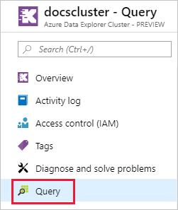
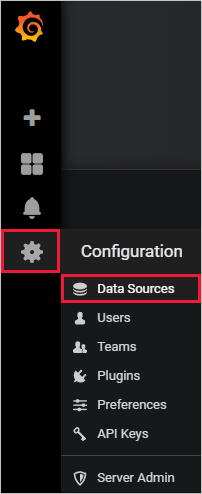

# Visualize data from Azure Data Explorer in Grafana

Grafana is an analytics platform that enables you to query and visualize data, then create and share dashboards based on your visualizations. Grafana provides an Azure Data Explorer *plugin*, which enables you to connect to and visualize data from Azure Data Explorer. In this article, you learn how to set up Azure Data Explorer as a data source for Grafana, and then visualize data from a sample cluster.

## Prerequisites

You need the following to complete this how to:

* [Grafana version 5.3.0 or later](http://docs.grafana.org/installation/) for your operating system

* The [Azure Data Explorer plugin](https://grafana.com/plugins/grafana-azure-data-explorer-datasource/installation) for Grafana

* A cluster that includes the StormEvents sample data. For  more information, see [Quickstart: Create an Azure Data Explorer cluster and database](create-cluster-database-portal.md) and [Ingest sample data into Azure Data Explorer](ingest-sample-data.md).

    [!INCLUDE [data-explorer-storm-events](../../includes/data-explorer-storm-events.md)]

## Configure the data source

You perform the following steps to configure Azure Data Explorer as a data source for Grafana:

1. Create an Azure Active Directory (Azure AD) service principal. The service principal is used by Grafana to access the Azure Data Explorer service.

1. Add the Azure AD service principal to the *viewers* role in the Azure Data Explorer database.

1. Specify Grafana connection properties based on information from the Azure AD service principal, then test the connection.

### Create a service principal

You can create the service principal in the [Azure portal](#azure-portal) or using the [Azure CLI](#azure-cli) command-line experience. Regardless of which method you use, after creation you get values for four connection properties that you'll use in later steps.

#### Azure portal

1. To create the service principal, follow the instructions in the [Azure portal documentation](/azure/active-directory/develop/howto-create-service-principal-portal).

    1. In the [Assign the application to a role](/azure/active-directory/develop/howto-create-service-principal-portal#assign-the-application-to-a-role) section, select an appropriate scope and a role type of **Reader**.

    1. In the [Get values for signing in](/azure/active-directory/develop/howto-create-service-principal-portal#get-values-for-signing-in) section, copy the three property values covered in the steps: **Directory ID** (tenant ID), **Application ID**, and **Password**.

1. In the Azure portal, select **Subscriptions** then copy the ID for the subscription in which you created the service principal.

    

#### Azure CLI

1. Create a service principal. Set an appropriate scope and a role type of `reader`.

    ```Azure CLI
    az ad sp create-for-rbac --name "https://{UrlToYourGrafana}:{PortNumber}" --role "reader" \
                             --scopes /subscriptions/{SubID}/resourceGroups/{ResourceGroup1}
    ```

    For more information, see [Create an Azure service principal with Azure CLI](/cli/azure/create-an-azure-service-principal-azure-cli).

1. The command returns a result set like the following. Copy the three property values: **appID**, **password**, and **tenant**.

    ```JSON
    {
      "appId": "XXXXXXXX-XXXX-XXXX-XXXX-XXXXXXXXXXXX",
      "displayName": "{UrlToYourGrafana}:{PortNumber}",
      "name": "https://{UrlToYourGrafana}:{PortNumber}",
      "password": "XXXXXXXX-XXXX-XXXX-XXXX-XXXXXXXXXXXX",
      "tenant": "XXXXXXXX-XXXX-XXXX-XXXX-XXXXXXXXXXXX"
    }
    ```

1. Get a list of your subscriptions.

    ```Azure CLI
    az account list --output table
    ```

    Copy the appropriate subscription ID.

    

### Add the service principal to the viewers role

Now that you have a service principal, you add it to the *viewers* role in the Azure Data Explorer database.

1. In the Azure portal, go to your Azure Data Explorer cluster, and select **Query**.

    

1. Run the following command in the query window. Use the application ID and tenant ID from the Azure portal or CLI.

    ```Kusto
    .add database {TestDatabase} viewers ('aadapp={ApplicationID};{TenantID}')
    ```

    The command returns a result set like the following.

    

### Specify properties and test the connection

With the service principal assigned to the *viewers* role, you now specify properties in your instance of Grafana and test the connection to Azure Data Explorer.

1. In Grafana, on the left menu, select the gear icon then **Data Sources**.

    

1. Select **Add data source**.

1. On the **Data Sources / New** page, enter a name for the data source, then select the type **Azure Data Explorer Datasource**.

    

1. Enter the name of your cluster, your subscription ID, and the other values from the Azure portal or CLI. See the table below the following image for a mapping.

    

    | Grafana UI | Azure portal | Azure CLI |
    | --- | --- | --- |
    | Tenant Id | Directory ID | tenant |
    | Client Id | Application ID | appId |
    | Client secret | Password | password |
    | | | |

1. Select **Save & Test**.

    If the test is successful, go to the next section. If you encounter any issues, check the values you specified in Grafana and review previous steps.

## Visualize data

```Kusto
StormEvents
| summarize event_count=count() by bin(StartTime, 1d)
```