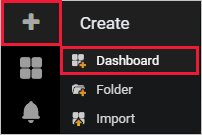
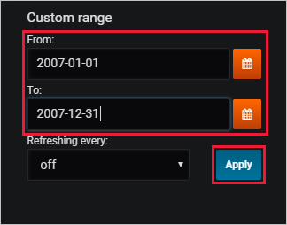
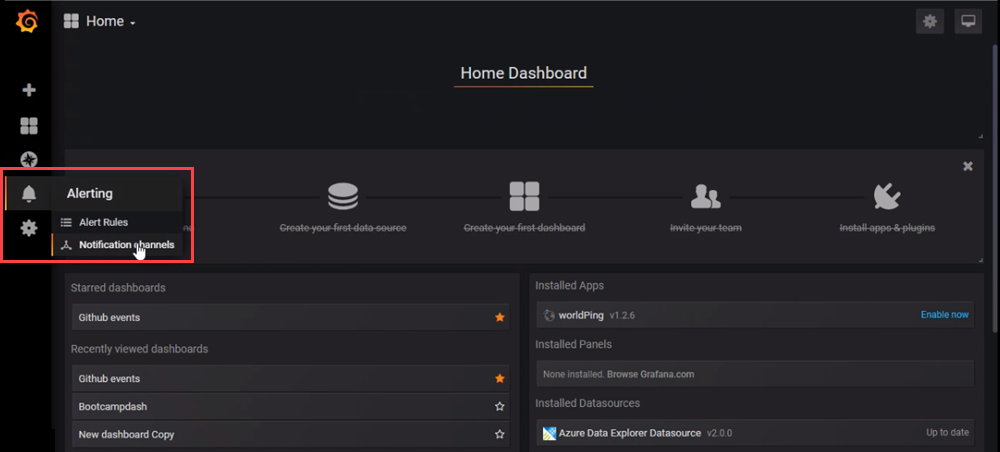

# Visualize data from Azure Data Explorer in Grafana

Grafana is an analytics platform that enables you to query and visualize data, then create and share dashboards based on your visualizations. Grafana provides an Azure Data Explorer *plugin*, which enables you to connect to and visualize data from Azure Data Explorer. In this article, you learn to set up Azure Data Explorer as a data source for Grafana, and then visualize data from a sample cluster.

Use the following video, to learn how to use Grafana's Azure Data Explorer plugin, set up Azure Data Explorer as a data source for Grafana, and then visualize data. 

> [!VIDEO https://www.youtube.com/embed/fSR_qCIFZSA]

Alternatively you can [configure the data source](#configure-the-data-source) and [visualize data](#visualize-data) as detailed in the article below.

## Prerequisites

You need the following to complete this article:

* [Grafana version 5.3.0 or later](https://docs.grafana.org/installation/) for your operating system

* The [Azure Data Explorer plugin](https://grafana.com/plugins/grafana-azure-data-explorer-datasource/installation) for Grafana. Plugin version 3.0.5 or later is required to use Grafana query builder.

* A cluster that includes the StormEvents sample data. For  more information, see [Quickstart: Create an Azure Data Explorer cluster and database](create-cluster-database-portal.md) and [Ingest sample data into Azure Data Explorer](ingest-sample-data.md).

    [!INCLUDE [data-explorer-storm-events](includes/data-explorer-storm-events.md)]

[!INCLUDE [data-explorer-configure-data-source](includes/data-explorer-configure-data-source.md)]

### Specify properties and test the connection

With the service principal assigned to the *viewers* role, you now specify properties in your instance of Grafana, and test the connection to Azure Data Explorer.

1. In Grafana, on the left menu, select the gear icon then **Data Sources**.

    

1. Select **Add data source**.

1. On the **Data Sources / New** page, enter a name for the data source, then select the type **Azure Data Explorer Datasource**.

    

1. Enter the name of your cluster in the form https://{ClusterName}.{Region}.kusto.windows.net. Enter the other values from the Azure portal or CLI. See the table below the following image for a mapping.

    

    | Grafana UI | Azure portal | Azure CLI |
    | --- | --- | --- |
    | Subscription Id | SUBSCRIPTION ID | SubscriptionId |
    | Tenant Id | Directory ID | tenant |
    | Client Id | Application ID | appId |
    | Client secret | Password | password |
    | | | |

1. Select **Save & Test**.

    If the test is successful, go to the next section. If you come across any issues, check the values you specified in Grafana, and review previous steps.

## Visualize data

Now you've finished configuring Azure Data Explorer as a data source for Grafana, it's time to visualize data. We'll show a basic example using both the query builder mode and the raw mode of the query editor. We recommend looking at [Write queries for Azure Data Explorer](write-queries.md) for examples of other queries to run against the sample data set.

1. In Grafana, on the left menu, select the plus icon then **Dashboard**.

    

1. Under the **Add** tab, select **Add new panel**.

    

1. On the graph panel, select **Panel Title** then **Edit**.

    

1. At the bottom of the panel, select **Data Source** then select the data source that you configured.

    

### Query builder mode

The query editor has two modes. The query builder mode and raw mode. Use the query builder mode to define your query.

1. Below the data source, select **Database** and choose your database from the drop-down. 
1. Select **From** and choose your table from the drop-down.

    :::image type="content" source="media/grafana/query-builder-from-table.png" alt-text="Select table in query builder":::    

1. Once the table is defined, filter the data, select the values to present, and define the grouping of those values.

    **Filter**
    1. Click **+** to right of **Where (filter)** to select from the drop-down 1 or more columns in your table. 
    1. For each filter, define the value(s) by using the applicable operator. 
    This is similar to using the [where operator](kusto/query/whereoperator.md) in Kusto query language.

    **Value selection**
    1. Click **+** to right of **value columns** to select from the drop-down the value columns that will be displayed in the panel.
    1. For each value column, set the aggregation type. 
    One or more value columns can be set. This is equivalent to using the [summarize operator](kusto/query/summarizeoperator.md).

    **Value grouping** 
    1. Click **+** to right of **Group by (summarize)** to select from the drop-down 1 or more columns that will be used to arrange the values into groups. 
    This is equivalent to the group expression in the summarize operator.

1. To execute the query, select **Run query**.

:::image type="content" source="media/grafana/query-builder-all-values.png" alt-text="Query builder with all values complete":::

> [!TIP]
> While finalizing the settings in the query builder, a Kusto query language query is created. This query shows the logic you constructed with the graphical query editor. 

1. Select **Edit KQL** to move to raw mode and edit your query using the flexibility and power of the Kusto query language.

:::image type="content" source="media/grafana/query-builder-with-raw query.png" alt-text="Query builder with raw query":::

### Raw mode

Use raw mode to edit your query. 

1. In the query pane, copy in the following query then select **Run Query**. The query buckets the count of events by day for the sample data set.

    ```kusto
    StormEvents
    | summarize event_count=count() by bin(StartTime, 1d)
    ```

    

1. The graph doesn't show any results because it's scoped by default to data from the last six hours. On the top menu, select **Last 6 hours**.

    

1. Specify a custom range that covers 2007, the year included in our StormEvents sample data set. Select **Apply**.

    

    Now the graph shows the data from 2007, bucketed by day.

    

1. On the top menu, select the save icon: .

> [!IMPORTANT]
> To switch to the query builder mode, select **Switch to builder**. Grafana will convert the query to the available logic in the Query builder. The query builder logic is limited and therefore you may lose manual changes done to the query.

:::image type="content" source="media/grafana/raw-mode.png" alt-text="Move to builder from raw mode":::

## Create Alerts

1. In Home Dashboard, select **Alerting** > **Notification channels** to create a new notification channel

    

1. Create a new **Notification channel**, then **Save**.

    

1. On the **Dashboard**, select **Edit** from the dropdown.

    

1. Select the alert bell icon to open the **Alert** pane. Select **Create Alert**. Complete the following properties in the **Alert** pane.

    

1. Select the **Save dashboard** icon to save your changes.

## Next steps

* [Write queries for Azure Data Explorer](write-queries.md)
