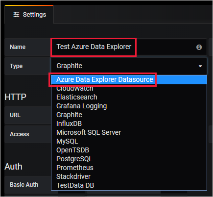
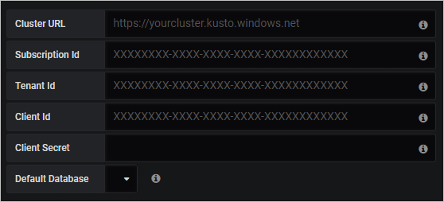
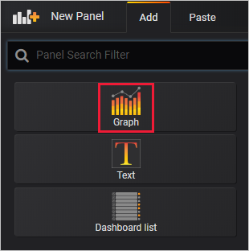
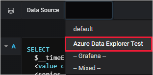
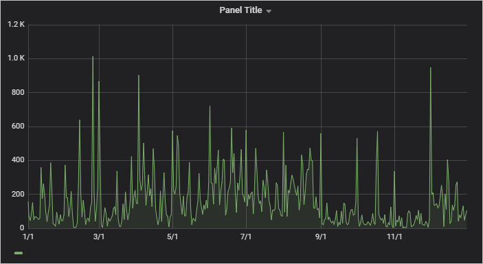
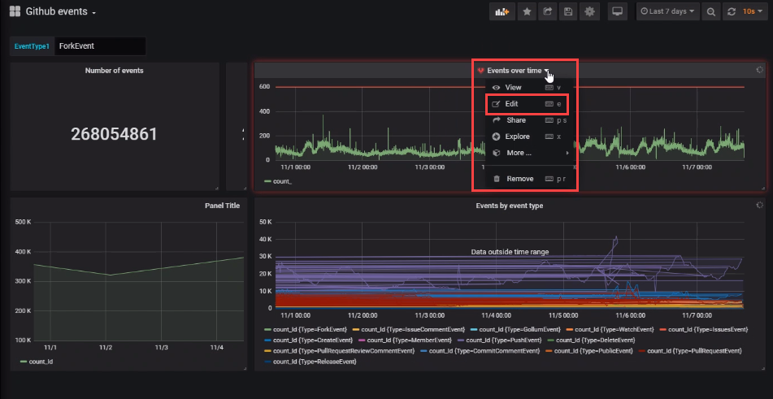
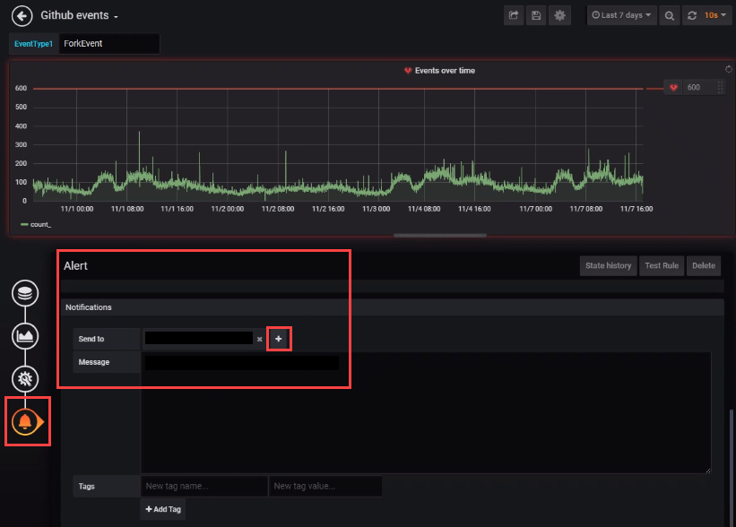
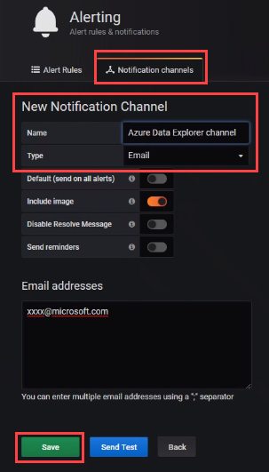
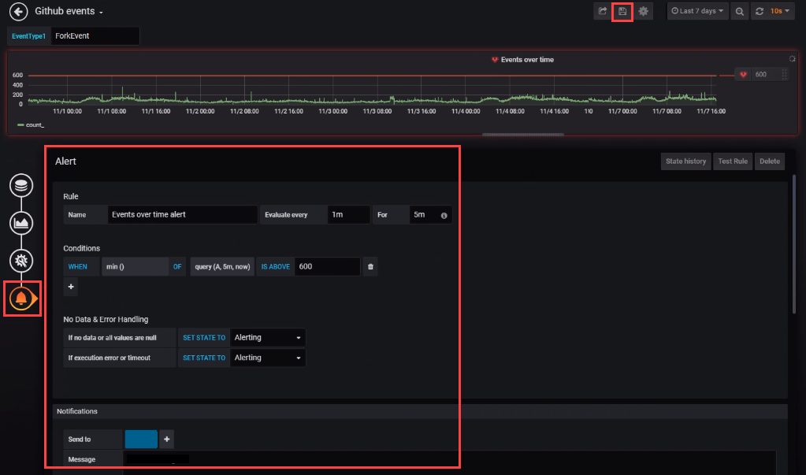

# Visualize data from Azure Data Explorer in Grafana

Grafana is an analytics platform that enables you to query and visualize data, then create and share dashboards based on your visualizations. Grafana provides an Azure Data Explorer *plugin*, which enables you to connect to and visualize data from Azure Data Explorer. In this article, you learn how to set up Azure Data Explorer as a data source for Grafana, and then visualize data from a sample cluster.

Using the following video, you can learn to use Grafana's Azure Data Explorer plugin, set up Azure Data Explorer as a data source for Grafana, and then visualize data. 

> [!VIDEO https://www.youtube.com/embed/fSR_qCIFZSA]

Alternatively you can [configure the data source](#configure-the-data-source) and [visualize data](#visualize-data) as detailed in the article below.

## Prerequisites

You need the following to complete this how to:

* [Grafana version 5.3.0 or later](https://docs.grafana.org/installation/) for your operating system

* The [Azure Data Explorer plugin](https://grafana.com/plugins/grafana-azure-data-explorer-datasource/installation) for Grafana

* A cluster that includes the StormEvents sample data. For  more information, see [Quickstart: Create an Azure Data Explorer cluster and database](create-cluster-database-portal.md) and [Ingest sample data into Azure Data Explorer](ingest-sample-data.md).

    [!INCLUDE [data-explorer-storm-events](../../includes/data-explorer-storm-events.md)]

[!INCLUDE [data-explorer-configure-data-source](../../includes/data-explorer-configure-data-source.md)]

### Specify properties and test the connection

With the service principal assigned to the *viewers* role, you now specify properties in your instance of Grafana, and test the connection to Azure Data Explorer.

1. In Grafana, on the left menu, select the gear icon then **Data Sources**.

    

1. Select **Add data source**.

1. On the **Data Sources / New** page, enter a name for the data source, then select the type **Azure Data Explorer Datasource**.

    

1. Enter the name of your cluster in the form https://{ClusterName}.{Region}.kusto.windows.net. Enter the other values from the Azure portal or CLI. See the table below the following image for a mapping.

    

    | Grafana UI | Azure portal | Azure CLI |
    | --- | --- | --- |
    | Subscription Id | SUBSCRIPTION ID | SubscriptionId |
    | Tenant Id | Directory ID | tenant |
    | Client Id | Application ID | appId |
    | Client secret | Password | password |
    | | | |

1. Select **Save & Test**.

    If the test is successful, go to the next section. If you encounter any issues, check the values you specified in Grafana, and review previous steps.

## Visualize data

Now you've finished configuring Azure Data Explorer as a data source for Grafana, it's time to visualize data. We'll show a basic example here, but there's a lot more you can do. We recommend looking at [Write queries for Azure Data Explorer](write-queries.md) for examples of other queries to run against the sample data set.

1. In Grafana, on the left menu, select the plus icon then **Dashboard**.

    

1. Under the **Add** tab, select **Graph**.

    

1. On the graph panel, select **Panel Title** then **Edit**.

    

1. At the bottom of the panel, select **Data Source** then select the data source that you configured.

    

1. In the query pane, copy in the following query then select **Run**. The query buckets the count of events by day for the sample data set.

    ```kusto
    StormEvents
    | summarize event_count=count() by bin(StartTime, 1d)
    ```

    

1. The graph doesn't show any results because it's scoped by default to data from the last six hours. On the top menu, select **Last 6 hours**.

    

1. Specify a custom range that covers 2007, the year included in our StormEvents sample data set. Select **Apply**.

    

    Now the graph shows the data from 2007, bucketed by day.

    

1. On the top menu, select the save icon: .

## Create Alerts

1. On the **Dashboard**, select **Edit** from **<Panel title>** dropdown.

    

1. Select alert icon to open the alert property panel. Select **+** to create a new alert notification.

    

1. Create new **Notification channel**, then **Save**.

    

1. Fill out the following properties in **Alert** pane.

    

1. Select **Save dashboard** icon to save your changes


## Next steps

* [Write queries for Azure Data Explorer](write-queries.md)

* [Tutorial: Visualize data from Azure Data Explorer in Power BI](visualize-power-bi.md)
