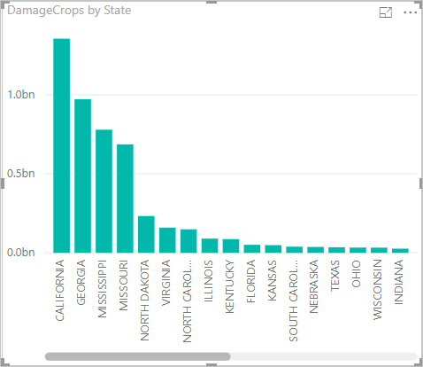

Now that you have data in Power BI Desktop, you can create reports based on that data. You'll create a simple report with a column chart that shows crop damage by state.

1. On the left side of the main window, select the report view.

    

1. In the **VISUALIZATIONS** pane, select the clustered column chart.

    

    A blank chart is added to the canvas.

    

1. In the **FIELDS** list, select **DamageCrops** and **State**.

    

    You now have a chart that shows the damage to crops for the top 1000 rows in the table.

    

1. Save the report.