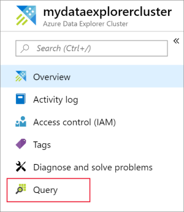
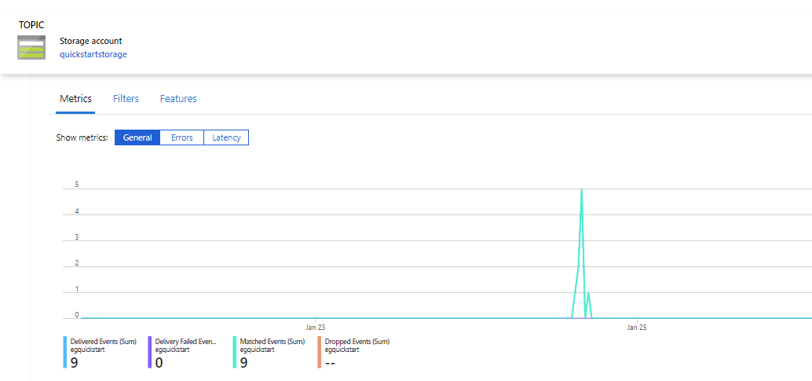

# Ingest blobs into Azure Data Explorer by subscribing to Event Grid notifications

> [!div class="op_single_selector"]
> * [Portal](ingest-data-event-grid.md)
> * [C#](data-connection-event-grid-csharp.md)
> * [Python](data-connection-event-grid-python.md)
> * [Azure Resource Manager template](data-connection-event-grid-resource-manager.md)

Azure Data Explorer is a fast and scalable data exploration service for log and telemetry data. It offers continuous ingestion (data loading) from blobs written to blob containers. 

In this article, you learn how to set an [Azure Event Grid](/azure/event-grid/overview) subscription, and route events to Azure Data Explorer via an event hub. To begin, you should have a storage account with an event grid subscription that sends notifications to Azure Event Hubs. Then you'll create an Event Grid data connection and see the data flow throughout the system.

## Prerequisites

* An Azure subscription. Create a [free Azure account](https://azure.microsoft.com/free/).
* [A cluster and database](create-cluster-database-portal.md).
* [A storage account](https://docs.microsoft.com/azure/storage/common/storage-quickstart-create-account?tabs=azure-portal).
* [An event hub](https://docs.microsoft.com/azure/event-hubs/event-hubs-create).

## Create an Event Grid subscription in your storage account

1. In the Azure portal, find your storage account.
1. Select **Events** > **Event Subscription**.

    

1. In the **Create Event Subscription** window within the **Basic** tab, provide the following values:

    **Setting** | **Suggested value** | **Field description**
    |---|---|---|
    | Name | *test-grid-connection* | The name of the event grid that you want to create.|
    | Event Schema | *Event Grid schema* | The schema that should be used for the event grid. |
    | Topic Type | *Storage account* | The type of event grid topic. |
    | Topic Resource | *gridteststorage* | The name of your storage account. |
    | Subscribe to all event types | *clear* | Don't get notified on all events. |
    | Defined Event Types | *Blob created* | Which specific events to get notified for. |
    | Endpoint Type | *Event hubs* | The type of endpoint to which you send the events. |
    | Endpoint | *test-hub* | The event hub you created. |
    | | |

1. Select the **Filters** tab if you want to track files from a specific container. Set the filters for the notifications as follows:
    * **Subject Begins With** field is the *literal* prefix of the blob container. As the pattern applied is *startswith*, it can span multiple containers. No wildcards are allowed.
     It *must* be set as follows: *`/blobServices/default/containers/`*[container prefix]
    * **Subject Ends With** field is the *literal* suffix of the blob. No wildcards are allowed.

## Create a target table in Azure Data Explorer

Create a table in Azure Data Explorer where Event Hubs will send data. Create the table in the cluster and database prepared in the prerequisites.

1. In the Azure portal, under your cluster, select **Query**.

    

1. Copy the following command into the window and select **Run** to create the table (TestTable) that will receive the ingested data.

    ```Kusto
    .create table TestTable (TimeStamp: datetime, Value: string, Source:string)
    ```

    

1. Copy the following command into the window and select **Run** to map the incoming JSON data to the column names and data types of the table (TestTable).

    ```Kusto
    .create table TestTable ingestion json mapping 'TestMapping' '[{"column":"TimeStamp","path":"$.TimeStamp"},{"column":"Value","path":"$.Value"},{"column":"Source","path":"$.Source"}]'
    ```

## Create an Event Grid data connection in Azure Data Explorer

Now connect to the Event Grid from Azure Data Explorer, so that data flowing into the blob container is streamed to the test table. 

1. Select **Notifications** on the toolbar to verify that the event hub deployment was successful.

1. Under the cluster you created, select **Databases** > **TestDatabase**.

    

1. Select **Data ingestion** > **Add data connection**.

    

1.  Select the connection type: **Blob Storage**.

1. Fill out the form with the following information, and select **Create**.

    

     Data source:

    **Setting** | **Suggested value** | **Field description**
    |---|---|---|
    | Data connection name | *test-hub-connection* | The name of the connection that you want to create in Azure Data Explorer.|
    | Storage account subscription | Your subscription ID | The subscription ID where your storage account resides.|
    | Storage account | *gridteststorage* | The name of the storage account that you created previously.|
    | Event Grid | *test-grid-connection* | The name of the event grid that you created. |
    | Event Hub name | *test-hub* | The event hub that you created. This field is automatically filled when you pick an event grid. |
    | Consumer group | *test-group* | The consumer group defined in the event hub that you created. |
    | | |

    Target table:

     **Setting** | **Suggested value** | **Field description**
    |---|---|---|
    | Table | *TestTable* | The table you created in **TestDatabase**. |
    | Data format | *JSON* | Supported formats are Avro, CSV, JSON, MULTILINE JSON, PSV, SOH, SCSV, TSV, RAW and TXT. Supported compression options: Zip and GZip |
    | Column mapping | *TestMapping* | The mapping you created in **TestDatabase**, which maps incoming JSON data to the column names and data types of **TestTable**.|
    | | |
    
## Generate sample data

Now that Azure Data Explorer and the storage account are connected, you can create sample data and upload it to the blob storage.

We'll work with a small shell script that issues a few basic Azure CLI commands to interact with Azure Storage resources. This script creates a new container in your storage account, uploads an existing file (as a blob) to that container, and then lists the blobs in the container. You can use [Azure Cloud Shell](https://docs.microsoft.com/azure/cloud-shell/overview) to execute the script directly in the portal.

Save the data into a file and upload it with this script:

```Json
{"TimeStamp": "1987-11-16 12:00","Value": "Hello World","Source": "TestSource"}
```

```bash
#!/bin/bash
### A simple Azure Storage example script

    export AZURE_STORAGE_ACCOUNT=<storage_account_name>
    export AZURE_STORAGE_KEY=<storage_account_key>

    export container_name=<container_name>
    export blob_name=<blob_name>
    export file_to_upload=<file_to_upload>
    export destination_file=<destination_file>

    echo "Creating the container..."
    az storage container create --name $container_name

    echo "Uploading the file..."
    az storage blob upload --container-name $container_name --file $file_to_upload --name $blob_name --metadata "rawSizeBytes=1024"

    echo "Listing the blobs..."
    az storage blob list --container-name $container_name --output table

    echo "Done"
```
> [!NOTE]
> To achieve the best ingestion performance, **uncompressed** size of the compressed blobs submitted for ingestion must be communicated. Since Event Grid notifications only contain the basic details, the size information needs to be communicated explicitly. Uncompressed size information can be provided by setting the `rawSizeBytes` property on the blob metadata with **uncompressed** data size in bytes.

### Ingestion Properties
You can specify [Ingestion properties](https://docs.microsoft.com/en-us/azure/kusto/management/data-ingestion/#ingestion-properties) of the blob ingestion via the blob metadata.
These follow properties can be set:
|**Property** | **Property description**|
|---|---|
| `rawSizeBytes` | Size of the raw (uncompressed) data. For Avro/ORC/Parquet it is the size before format-specific compression is applied.|
| `kustoTable` |  Name of the existing target table. Overrides the `Table` set on the `Data Connection` blade. |
| `kustoDataFormat` |  Data format. Overrides the `Data format` set on the `Data Connection` blade. |
| `kustoIngestionMappingReference` |  Name of the existing ingestion mapping to be used. Overrides the `Column mapping` set on the `Data Connection` blade.|
| `kustoIgnoreFirstRecord` | If set to ‘true’, Kusto will ignore the first row of the blob. Use in tabular format data (CSV, TSV, or similar) to ignore headers. |
| `kustoExtentTags` | String representing [tags](/azure/kusto/management/extents-overview#extent-tagging) that will be attached to resulting extent. |
| `kustoCreationTime` |  Overrides the [$IngestionTime](/azure/kusto/query/ingestiontimefunction?pivots=azuredataexplorer) for the blob, formatted as a ISO8601 string. Use for backfilling. |

> [!NOTE]
> Azure Data Explorer won't delete the blobs post ingestion.
> Retain the blobs for thrre to five days.
> Use [Azure Blob storage lifecycle](https://docs.microsoft.com/azure/storage/blobs/storage-lifecycle-management-concepts?tabs=azure-portal) to manage blob deletion. 

## Review the data flow

> [!NOTE]
> Azure Data Explorer has an aggregation (batching) policy for data ingestion designed to optimize the ingestion process.
By default, the policy is configured to 5 minutes.
You’ll be able to alter the policy at a later time if needed. In this article you can expect a latency of a few minutes.

1. In the Azure portal, under your event grid, you see the spike in activity while the app is running.

    

1. To check how many messages have made it to the database so far, run the following query in your test database.

    ```Kusto
    TestTable
    | count
    ```

1. To see the content of the messages, run the following query in your test database.

    ```Kusto
    TestTable
    ```

    The result set should look like the following.

    

## Clean up resources

If you don't plan to use your event grid again, clean up **test-hub-rg**, to avoid incurring costs.

1. In the Azure portal, select **Resource groups** on the far left, and then select the resource group you created.  

    If the left menu is collapsed, select  to expand it.

   

1. Under **test-resource-group**, select **Delete resource group**.

1. In the new window, enter the name of the resource group to delete (*test-hub-rg*), and then select **Delete**.

## Next steps

* [Query data in Azure Data Explorer](web-query-data.md)
