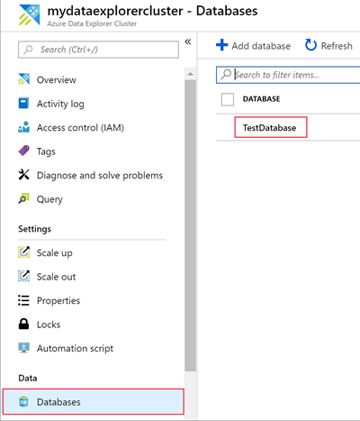
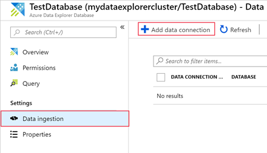
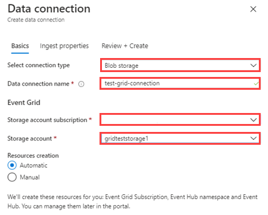
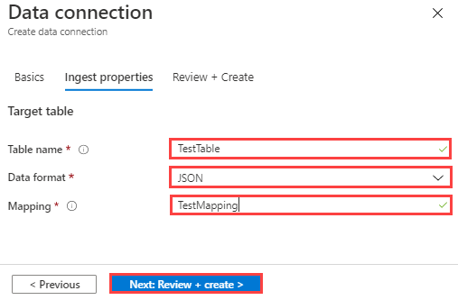
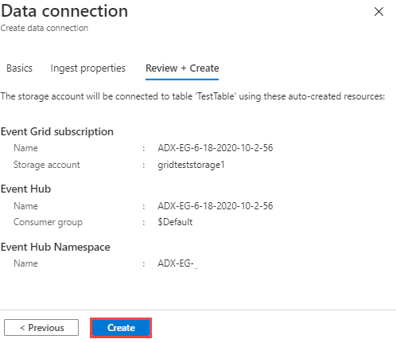
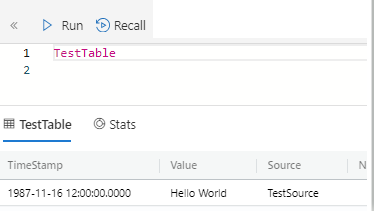
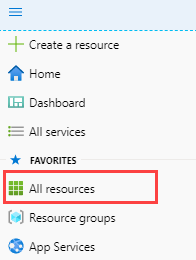
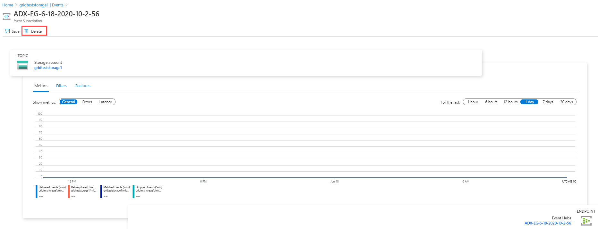
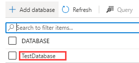
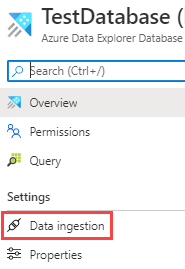

# Ingest blobs into Azure Data Explorer by subscribing to Event Grid notifications

> [!div class="op_single_selector"]
> * [Portal](ingest-data-event-grid.md)
> * [C#](data-connection-event-grid-csharp.md)
> * [Python](data-connection-event-grid-python.md)
> * [Azure Resource Manager template](data-connection-event-grid-resource-manager.md)

Azure Data Explorer is a fast and scalable data exploration service for log and telemetry data. It offers continuous ingestion (data loading) from blobs written to blob containers.

In this article, you learn how to ingest blobs from your storage account into Azure Data Explorer using an Event Grid data connection. You'll create an Event Grid data connection that set an [Azure Event Grid](/azure/event-grid/overview) subscription. The Event Grid subscription routes events from your storage account to Azure Data Explorer via an Azure Event Hub. Then you'll see an example of the data flow throughout the system.

## Prerequisites

* An Azure subscription. Create a [free Azure account](https://azure.microsoft.com/free/).
* [A cluster and database](create-cluster-database-portal.md).
* [A storage account](https://docs.microsoft.com/azure/storage/common/storage-quickstart-create-account?tabs=azure-portal).

## Create a target table in Azure Data Explorer

Create a table in Azure Data Explorer where Event Hubs will send data. Create the table in the cluster and database prepared in the prerequisites.

1. In the Azure portal, under your cluster, select **Query**.

    

1. Copy the following command into the window and select **Run** to create the table (TestTable) that will receive the ingested data.

    ```kusto
    .create table TestTable (TimeStamp: datetime, Value: string, Source:string)
    ```

    

1. Copy the following command into the window and select **Run** to map the incoming JSON data to the column names and data types of the table (TestTable).

    ```kusto
    .create table TestTable ingestion json mapping 'TestMapping' '[{"column":"TimeStamp","path":"$.TimeStamp"},{"column":"Value","path":"$.Value"},{"column":"Source","path":"$.Source"}]'
    ```

## Create an Event Grid data connection in Azure Data Explorer

Now connect the storage account to Azure Data Explorer, so that data flowing into the storage is streamed to the test table. 

1. Under the cluster you created, select **Databases** > **TestDatabase**.

    

1. Select **Data ingestion** > **Add data connection**.

    

1. Select the connection type: **Blob Storage**.

1. Fill out the form with the following information:

    

     Data source:

    **Setting** | **Suggested value** | **Field description**
    |---|---|---|
    | Data connection name | *test-grid-connection* | The name of the connection that you want to create in Azure Data Explorer.|
    | Storage account subscription | Your subscription ID | The subscription ID where your storage account resides.|
    | Storage account | *gridteststorage1* | The name of the storage account that you created previously.|
    | Resources creation | *Automatic* | Define whether you want ADX to create an Event Grid Subscription, an Event Hub namespace and an Event Hub for you. A detailed explanation of how to create Event Grid subscription manually, can be found in the references under the [Create an Event Grid subscription in your storage account](../data-explorer/kusto/management/data-ingestion/eventgrid.md#create-an-event-grid-subscription-in-your-storage-account) section.|
    | | |

1. Select **Filter settings** if you want to track files from a specific container. Set the filters for the notifications as follows:
    * **Prefix** field is the *literal* prefix of the blob container. As the pattern applied is *startswith*, it can span multiple containers. No wildcards are allowed.
        * To define a filter on the blob container, the field *must* be set as follows: *`/blobServices/default/containers/[container prefix]`*. 
        * To define a filter on a blob prefix (or folder in Azure Data Lake Gen2), the field *must* be set as follows: *`/blobServices/default/containers/[container name]/blobs/[folder/blob prefix]`*. 
    * **Suffix** field is the *literal* suffix of the blob. No wildcards are allowed.
    * **Case Sensitive** field indicates whether the prefix and suffix filters are case sensitive
    * For more information about filtering events see [Blob storage events](https://docs.microsoft.com/azure/storage/blobs/storage-blob-event-overview#filtering-events).

1. Select **Next: Ingest properties**.

1. Fill out the form with the following information and select **Next: Review + create**. Note that table and mapping names are case sensitive:

   

    Ingest properties:

     **Setting** | **Suggested value** | **Field description**
    |---|---|---|
    | Table | *TestTable* | The table you created in **TestDatabase**. |
    | Data format | *JSON* | Supported formats are Avro, CSV, JSON, MULTILINE JSON, ORC, PARQUET, PSV, SCSV, SOHSV, TSV, TXT and TSVE. Supported compression options: Zip and GZip |
    | Mapping | *TestMapping* | The mapping you created in **TestDatabase**, which maps incoming JSON data to the column names and data types of **TestTable**.|
    | | |

1. Review the resources that auto created for you and Select **Create**.

   

1. Wait until the deployment is completed. If your deployment is failed, you can select **Operation details** next to the failed stage to get more information for the failing reason. You can also select **Redeploy** to try to deploy the resources again.

    

## Generate sample data

Now that Azure Data Explorer and the storage account are connected, you can create sample data and upload it to the storage container.

We'll work with a small shell script that issues a few basic Azure CLI commands to interact with Azure Storage resources. This script creates a new container in your storage account, uploads an existing file (as a blob) to that container, and then lists the blobs in the container. You can use [Azure Cloud Shell](https://docs.microsoft.com/azure/cloud-shell/overview) to execute the script directly in the portal.

Save the data into a file and upload it with this script:

```json
{"TimeStamp": "1987-11-16 12:00","Value": "Hello World","Source": "TestSource"}
```

```azurecli
#!/bin/bash
### A simple Azure Storage example script

    export AZURE_STORAGE_ACCOUNT=<storage_account_name>
    export AZURE_STORAGE_KEY=<storage_account_key>

    export container_name=<container_name>
    export blob_name=<blob_name>
    export file_to_upload=<file_to_upload>
    export destination_file=<destination_file>

    echo "Creating the container..."
    az storage container create --name $container_name

    echo "Uploading the file..."
    az storage blob upload --container-name $container_name --file $file_to_upload --name $blob_name --metadata "rawSizeBytes=1024"

    echo "Listing the blobs..."
    az storage blob list --container-name $container_name --output table

    echo "Done"
```

> [!NOTE]
> To achieve the best ingestion performance, the *uncompressed* size of the compressed blobs submitted for ingestion must be communicated. Because Event Grid notifications contain only basic details, the size information must be explicitly communicated. The uncompressed size information can be provided by setting the `rawSizeBytes` property on the blob metadata with the *uncompressed* data size in bytes.

### Ingestion properties

You can specify the [Ingestion properties](ingestion-properties.md) of the blob ingestion via the blob metadata.

These properties can be set:

|**Property** | **Property description**|
|---|---|
| `rawSizeBytes` | Size of the raw (uncompressed) data. For Avro/ORC/Parquet, that is the size before format-specific compression is applied.|
| `kustoTable` |  Name of the existing target table. Overrides the `Table` set on the `Data Connection` blade. |
| `kustoDataFormat` |  Data format. Overrides the `Data format` set on the `Data Connection` blade. |
| `kustoIngestionMappingReference` |  Name of the existing ingestion mapping to be used. Overrides the `Column mapping` set on the `Data Connection` blade.|
| `kustoIgnoreFirstRecord` | If set to `true`, Kusto ignores the first row of the blob. Use in tabular format data (CSV, TSV, or similar) to ignore headers. |
| `kustoExtentTags` | String representing [tags](kusto/management/extents-overview.md#extent-tagging) that will be attached to resulting extent. |
| `kustoCreationTime` |  Overrides [$IngestionTime](kusto/query/ingestiontimefunction.md?pivots=azuredataexplorer) for the blob, formatted as a ISO 8601 string. Use for backfilling. |

> [!NOTE]
> Azure Data Explorer won't delete the blobs post ingestion.
> Retain the blobs for three to five days.
> Use [Azure Blob storage lifecycle](https://docs.microsoft.com/azure/storage/blobs/storage-lifecycle-management-concepts?tabs=azure-portal) to manage blob deletion. 

## Review the data flow

> [!NOTE]
> Azure Data Explorer has an aggregation (batching) policy for data ingestion designed to optimize the ingestion process.
By default, the policy is configured to 5 minutes.
You'll be able to alter the policy at a later time if needed. In this article you can expect a latency of a few minutes.

1. In the Azure portal, under your event grid, you see the spike in activity while the app is running.

    

1. To check how many messages have made it to the database so far, run the following query in your test database.

    ```kusto
    TestTable
    | count
    ```

1. To see the content of the messages, run the following query in your test database.

    ```kusto
    TestTable
    ```

    The result set should look like the following.

    

## Clean up resources

If you don't plan to use your event grid again, clean up the Event Grid Subscription, Event Hub namespace and Event Hub that were auto created for you, to avoid incurring costs.

1. In Azure portal, go to the left menu and select **All resources**.

    

1. Search for your Event Hub Namespace and select **Delete** to delete it:

    

1. In the Delete resources form, confirm the deletion to delete the Event Hub Namespace and Event Hub resources.

1. Go to your storage account. In the left menu, select **Events**:

    

1. Below the graph, Select your Event Grid Subscription and then select **Delete** to delete it:

   

1. To delete your Event Grid data connection, go to your Azure Data Explorer cluster. On the left menu, select **Databases**.

1. Select your database **TestDatabase**:

    

1. On the left menu, select **Data ingestion**:

    

1. Select your data connection *test-grid-connection* and then select **Delete** to delete it.

## Next steps

* [Query data in Azure Data Explorer](web-query-data.md)
