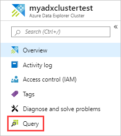
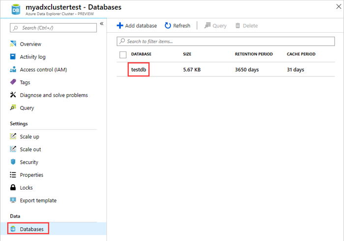
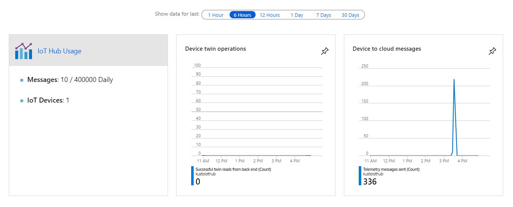
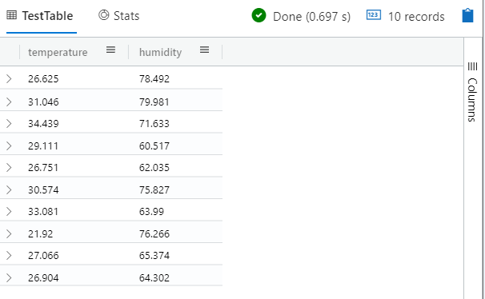
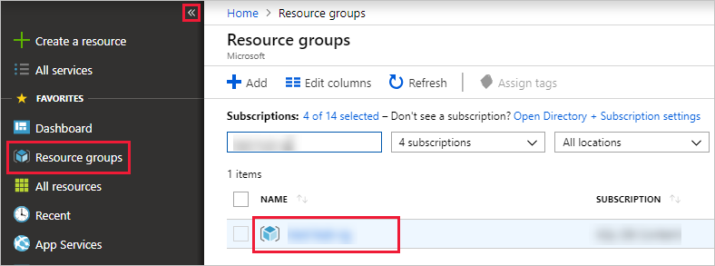

# Ingest data from IoT Hub into Azure Data Explorer

> [!div class="op_single_selector"]

> * [Portal](ingest-data-iot-hub.md)
> * [C#](data-connection-iot-hub-csharp.md)
> * [Python](data-connection-iot-hub-python.md)
> * [Azure Resource Manager template](data-connection-iot-hub-resource-manager.md)

[!INCLUDE [data-connector-intro](includes/data-connector-intro.md)]

This article shows you how to ingest data into Azure Data Explorer from IoT Hub, a big data streaming platform and IoT ingestion service.

For general information about ingesting into Azure Data Explorer from IoT Hub, see [Connect to IoT Hub](ingest-data-iot-hub-overview.md).

## Prerequisites

* An Azure subscription. Create a [free Azure account](https://azure.microsoft.com/free/).
* Create [a cluster and database](create-cluster-database-portal.md).
* [A sample app](https://github.com/Azure-Samples/azure-iot-samples-csharp) and documentation for simulating a device.
* [.NET SDK](https://dotnet.microsoft.com/download) to compile and run the sample app.

## Create an Iot Hub

[!INCLUDE [iot-hub-include-create-hub](includes/iot-hub-include-create-hub.md)]

## Register a device to the IoT Hub

[!INCLUDE [iot-hub-get-started-create-device-identity](includes/iot-hub-get-started-create-device-identity.md)]

## Create a target table in Azure Data Explorer

Now you create a table in Azure Data Explorer to which IoT Hubs will send data. You create the table in the cluster and database provisioned in [**Prerequisites**](#prerequisites).

1. In the Azure portal, navigate to your cluster and select **Query**.

    

1. Copy the following command into the window and select **Run** to create the table (TestTable) which will receive the ingested data.

    ```Kusto
    .create table TestTable (temperature: real, humidity: real)
    ```

    

1. Copy the following command into the window and select **Run** to map the incoming JSON data to the column names and data types of the table (TestTable).

    ```Kusto
    .create table TestTable ingestion json mapping 'TestMapping' '[{"column":"humidity","path":"$.humidity","datatype":"real"},{"column":"temperature","path":"$.temperature","datatype":"real"}]'
    ```

## Connect Azure Data Explorer table to IoT hub

Now you connect to the IoT Hub from Azure Data Explorer. When this connection is complete, data that flows into the iot hub streams to the [target table you created](#create-a-target-table-in-azure-data-explorer).

1. Select **Notifications** on the toolbar to verify that the IoT Hub deployment was successful.

1. Under the cluster you created, select **Databases** then select the database that you created **testdb**.

    

1. Select **Data ingestion** and **Add data connection**.

    :::image type="content" source="media/ingest-data-iot-hub/iot-hub-connection.png" alt-text="Create data connection to IoT Hub- Azure Data Explorer.":::

### Create a data connection

* Fill out the form with the following information.

    :::image type="content" source="media/ingest-data-iot-hub/data-connection-pane.png" alt-text="Data connection pane in IoT Hub - Azure Data Explorer.":::

    |**Setting** | **Field description**|
    |---|---|
    | Data connection name | The name of the connection you want to create in Azure Data Explorer|
    | Subscription |  The subscription ID where the Event Hubs resource is located.  |
    | IoT Hub | IoT Hub name |
    | Shared access policy | The name of the shared access policy. Must have read permissions |
    | Consumer group |  The consumer group defined in the IoT Hub built-in endpoint |
    | Event system properties | The [IoT Hub event system properties](/azure/iot-hub/iot-hub-devguide-messages-construct#system-properties-of-d2c-iot-hub-messages). When adding system properties, [create](kusto/management/create-table-command.md) or [update](kusto/management/alter-table-command.md) table schema and [mapping](kusto/management/mappings.md) to include the selected properties.|

#### Target database (multi-database data connection)

Specifying a target database allows you to override the default associated with the data connection. For more information about database routing, see [Events routing](ingest-data-iot-hub-overview.md#events-routing).

Before you can set an alternate target database, you must first *allow* routing the data to multiple databases. Use the following steps to *allow* routing the data to alternate databases:

1. In the Azure portal, browse to your cluster.
1. Select **Databases** > **Data connections**.
1. Create or edit a data connection and in the **Data connection** pane, under **Data routing settings**, turn on the allow routing data to other database (multi-database data connection) option.

    :::image type="content" source="media/ingest-data-iot-hub/data-connection-allow-multi-database.png" alt-text="Screenshot of Data routing settings to allow routing data to other databases using multi-database routing.":::

#### Target table

There are two options for routing the ingested data: *static* and *dynamic*.
For this article, you use static routing, where you specify the table name, data format, and mapping. If the Event Hubs message includes data routing information, this routing information will override the default settings.

1. Fill out the following routing settings:

    :::image type="content" source="media/ingest-data-iot-hub/default-routing-settings.png" alt-text="Default routing properties - IoT Hub - Azure Data Explorer.":::

     **Setting** | **Suggested value** | **Field description**
    |---|---|---|
    | Table name | *TestTable* | The table you created in **testdb**. |
    | Data format | *JSON* | Supported formats are Avro, CSV, JSON, MULTILINE JSON, ORC, PARQUET, PSV, SCSV, SOHSV, TSV, TXT, TSVE, APACHEAVRO, and W3CLOG.|
    | Mapping | *TestMapping* | The [mapping](kusto/management/mappings.md) you created in **testdb**, which maps incoming data to the column names and data types of **testdb**. Required for JSON, MULTILINE JSON, and AVRO, and optional for other formats.|
    | | |

    > [!WARNING]
    > In case of a [manual failover](/azure/iot-hub/iot-hub-ha-dr#manual-failover), you must recreate the data connection.

    > [!NOTE]
    >
    > * You don't have to specify all **Default routing settings**. Partial settings are also accepted.
    > * Only events enqueued after you create the data connection are ingested.

1. Select **Create**.

### Event system properties mapping

> [!Note]
>
> * System properties are supported for single-record events.
> * For `csv` mapping, properties are added at the beginning of the record. For `json` mapping, properties are added according to the name that appears in the drop-down list.

If you selected **Event system properties** in the **Data Source** section of the table, you must include [system properties](ingest-data-iot-hub-overview.md#system-properties) in the table schema and mapping.

## Generate sample data for testing

The simulated device application connects to a device-specific endpoint on your IoT hub and sends simulated temperature and humidity telemetry.

1. Download the sample C# project from [GitHub](https://github.com/Azure-Samples/azure-iot-samples-csharp/archive/refs/heads/main.zip) and extract the ZIP archive.

1. In a local terminal window, navigate to the root folder of the sample C# project. Then navigate to the **iot-hub\Quickstarts\SimulatedDevice** folder.

1. Open the **Program.cs** file in a text editor of your choice.

    Replace the value of the `s_connectionString` variable with the device connection string from [Register a device to the IoT Hub](#register-a-device-to-the-iot-hub). Then save your changes to **Program.cs** file.

1. In the local terminal window, run the following commands to install the required packages for simulated device application:

    ```cmd/sh
    dotnet restore
    ```

1. In the local terminal window, run the following command to build and run the simulated device application:

    ```cmd/sh
    dotnet run
    ```

    The following screenshot shows the output as the simulated device application sends telemetry to your IoT hub:

    

## Review the data flow

With the app generating data, you can now see the data flow from the IoT hub to the table in your cluster.

1. In the Azure portal, under your IoT hub, you see the spike in activity while the app is running.

    

1. To check how many messages have made it to the database so far, run the following query in your test database.

    ```Kusto
    TestTable
    | count
    ```

1. To see the content of the messages, run the following query:

    ```Kusto
    TestTable
    ```

    The result set:

    

    > [!NOTE]
    >
    > * Azure Data Explorer has an aggregation (batching) policy for data ingestion, designed to optimize the ingestion process. The policy is configured to 5 minutes, 1000 items or 1 GB of data by default, so you may experience a latency. See [batching policy](kusto/management/batchingpolicy.md) for aggregation options.
    > * Configure your table to support streaming and remove the lag in response time. See [streaming policy](kusto/management/streamingingestionpolicy.md).

## Clean up resources

If you don't plan to use your IoT Hub again, clean up your resource group to avoid incurring costs.

1. In the Azure portal, select **Resource groups** on the far left, and then select the resource group you created.

    If the left menu is collapsed, select  to expand it.

   

1. Under **test-resource-group**, select **Delete resource group**.

1. In the new window, type the name of the resource group to delete it, and then select **Delete**.

## Next steps

* [Query data in Azure Data Explorer](web-query-data.md)
