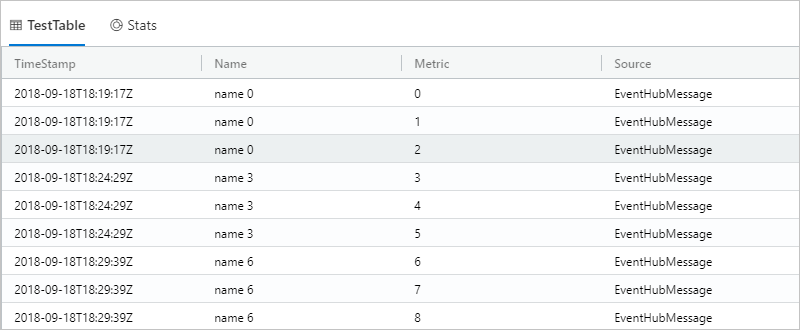

 
# Quickstart: Ingest data from Kafka into Azure Data Explorer
 
Azure Data Explorer is a fast and highly scalable data exploration service for log and telemetry data. Azure Data Explorer offers ingestion (data loading) from Kafka. Kafka is a distributed streaming platform that allows building of real-time streaming data pipelines that reliably move data between systems or applications. 
 
## Prerequisites
 
* If you don't have an Azure subscription, create a [free Azure account](https://azure.microsoft.com/free/) before you begin. 
 
* [A test cluster and database](create-cluster-database-portal.md)
 
* [A sample app](https://github.com/Azure/azure-kusto-samples-dotnet/tree/master/kafka) that generates data and sends it to Kafka

* [Visual studio 2017 Version 15.3.2 or greater](https://www.visualstudio.com/vs/) to run the sample app
 
## Kafka connector setup
Kafka Connect is a tool for scalably and reliably streaming data between Apache Kafka and other systems. It makes it simple to quickly define connectors that move large collections of data into and out of Kafka. The ADX Kafka Sink serves as the connector from Kafka.
 
### Bundle 
Kafka can load a `.jar` as a plugin that will act as a custom connector. 
To produce such a `.jar`, we will clone the code locally and build using Maven. 

#### Clone

```bash
git clone git://github.com:Azure/kafka-sink-azure-kusto.git
cd ./kafka-sink-azure-kusto/kafka/
```
 
#### Build

Build locally with Maven to produce a `.jar` complete with dependencies.

* JDK >= 1.8 [download](https://www.oracle.com/technetwork/java/javase/downloads/index.html)
* Maven [download](https://maven.apache.org/install.html)
 

Inside the root directory *kafka-sink-azure-kusto*, run:

```bash
mvn clean compile assembly:single
```
 
### Deploy 
 
Load plugin into Kafka. An deployment example using docker can be found at [kafka-sink-azure-kusto](https://github.com/Azure/kafka-sink-azure-kusto#deploy)
 

Detailed documentation on Kafka connectors and how to deploy them can be found at [Kafka Connect](https://kafka.apache.org/documentation/#connect) 

### Example configuration 
 
```config
name=KustoSinkConnector 
connector.class=com.microsoft.azure.kusto.kafka.connect.sink.KustoSinkConnector 
kusto.sink.flush_interval_ms=300000 
key.converter=org.apache.kafka.connect.storage.StringConverter 
value.converter=org.apache.kafka.connect.storage.StringConverter 
tasks.max=1 
topics=testing1 
kusto.tables.topics_mapping=[{'topic': 'testing1','db': 'daniel', 'table': 'TestTable','format': 'json', 'mapping':'TestMapping'}] 
kusto.auth.authority=XXX 
kusto.url=https://ingest-{mycluster}.kusto.windows.net/ 
kusto.auth.appid=XXX 
kusto.auth.appkey=XXX 
kusto.sink.tempdir=/var/tmp/ 
kusto.sink.flush_size=1000
```
 
## Create a target table in Azure Data Explorer
 
Create a table in ADX to which Kafka can send data. Create the table in the cluster and database provisioned in the **Prerequisites**.
 
1. In the Azure portal, navigate to your cluster and select **Query**.
 

 
1. Copy the following command into the window and select **Run**.
 
```Kusto
.create table TestTable (TimeStamp: datetime, Name: string, Metric: int, Source:string)
```
 

 
1. Copy the following command into the window and select **Run**.
 
```Kusto
.create table TestTable ingestion json mapping 'TestMapping' '[{"column":"TimeStamp","path":"$.timeStamp","datatype":"datetime"},{"column":"Name","path":"$.name","datatype":"string"},{"column":"Metric","path":"$.metric","datatype":"int"},{"column":"Source","path":"$.source","datatype":"string"}]'
```

This command maps incoming JSON data to the column names and data types of the table (TestTable).


## Generate sample data

Now that the Kafka cluster is connected to ADX, use the [sample app](https://github.com/Azure-Samples/event-hubs-dotnet-ingest) you downloaded to generate data.

### Clone
Clone the sample app locally:

```cmd
git clone git://github.com:Azure/azure-kusto-samples-dotnet.git
cd ./azure-kusto-samples-dotnet/kafka/
```
### Run the app
1. Open the sample app solution in Visual Studio.

1. In the `Program.cs` file, update the `connectionString` constant to your Kafka connection string.

```csharp    
const string connectionString = @"<YourConnectionString>";
```

1. Build and run the app. The app sends messages to the Kafka cluster, and it prints out its status every ten seconds.

1. After the app has sent a few messages, move on to the next step.
 
## Query and review the data 

1. To make sure no errors occured during ingestion:

```Kusto
.show ingestion failures
```

2. To see the newly ingested data:

```Kusto
TestTable 
| count
```

3. To see the content of the messages:
 
```Kusto
TestTable
```
 
The result set should look like the following:
 

 
## Next steps
 
> [!div class="nextstepaction"]
> [Quickstart: Query data in Azure Data Explorer](web-query-data.md)
