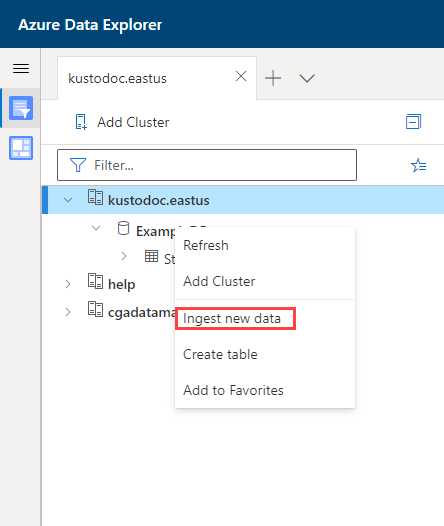

# What is one-click ingestion? 

One-click ingestion enables you to quickly ingest data and automatically suggest tables and mapping structures, based on a data source in Azure Data Explorer. 

Using the Azure Data Explorer Web UI, you can ingest data from storage (blob file), a local file, or a container (up to 10,000 blobs). You can also define an event grid on a container for continuous ingestion. The data can be ingested into an existing or new table in JSON, CSV, and [other formats](#file-formats). One click ingestion can suggest a structure for a new table and table mapping, based on the data source, and provide an intuitive platform to adjust table mapping and the table structure of an existing or new table. One click ingestion will ingest the data into the table within only a few minutes.

One-click ingestion is particularly useful when ingesting data for the first time, or when your data's schema is unfamiliar to you.

## Prerequisites

* If you don't have an Azure subscription, create a [free Azure account](https://azure.microsoft.com/free/) before you begin.
* Create [an Azure Data Explorer cluster and database](create-cluster-database-portal.md).
* Sign in to the [Azure Data Explorer Web UI](https://dataexplorer.azure.com/) and [add a connection to your cluster](web-query-data.md#add-clusters).

## File formats

One-click ingestion supports ingesting a new table from source data in any of the following formats:
* JSON
* CSV
* TSV
* SCSV
* SOHSV
* TSVE
* PSV

## One-click ingestion wizard

The one-click ingestion wizard guides you through the one-click ingestion process. 

> [!Note]
> This section describes the wizard in general. The options you select depend on whether you are ingesting into a new or existing table. 
> For more information, see:
    > * Ingest into [a new table](one-click-ingestion-new-table.md)
    > * Ingest into an [existing table](one-click-ingestion-existing-table.md) 
    
1. To access the wizard, right-click the *database* or *table* row in left menu of the Azure Data Explorer web UI and select **Ingest new data (preview)**.

       

1. The wizard guides you through the following options:
    * Ingest into an [existing table](one-click-ingestion-existing-table.md)
    * Ingest into [a new table](one-click-ingestion-new-table.md)
    * Ingest data from:
      * Blob storage
      * A local file
      * A container
    * Enter the sample size, from 1 to 10,000 rows (from container only)
       
1. If you are ingesting data from a container, you can filter the data so that only files with specific prefixes or file extensions are ingested. For example, you might only want to ingest files with filenames beginning with the word *Europe*, or only files with the extension *.json*. 

1. For other sources (not a container), when you have successfully selected the data source, a preview of the data is displayed. 

1. Click **Edit schema**. Review and adjust the auto generated schema and ingestion properties (data format, mapping name, etc.). The service automatically identifies if the source is compressed or not by looking at its name.

1. Start the data ingestion process.

> [!Note]
> If your data source is a container, note that Azure Data Explorer's data ingestion aggregation (batching) policy is designed to optimize the ingestion process. By default, the policy is configured to 5 minutes or 500 MB of data, so you may experience latency. See [batching policy](kusto/management/batchingpolicy.md) for aggregation options. When ingesting data from other sources, the ingestion will take immediate effect.

## Next steps

* Decide if you will use one-click ingestion to ingest data into [an existing table](one-click-ingestion-existing-table.md) or [a new table](one-click-ingestion-new-table.md)
* [Query data in Azure Data Explorer Web UI](web-query-data.md)
* [Write queries for Azure Data Explorer using Kusto Query Language](write-queries.md)
