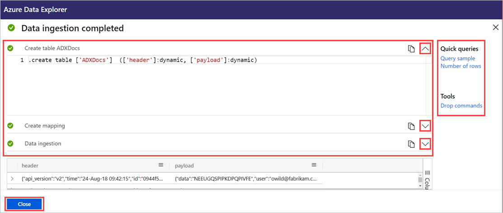

# Use one-click ingestion to ingest data into Azure Data Explorer

This article shows how to use one-click ingestion for quick ingestion of a new table in json or csv formats from storage into Azure Data Explorer. Once the data is ingested, you can edit the table and run queries using the Web UI.

## Prerequisites

* If you don't have an Azure subscription, create a [free Azure account](https://azure.microsoft.com/free/) before you begin.
* Sign in to [the application](https://dataexplorer.azure.com/).
* Create [an Azure Data Explorer cluster and database](create-cluster-database-portal.md)
* Source of data in Azure Storage.

## Ingest new data

1. Right-click on the *database* or *table* row in left hand menu and select **Ingest new data (Preview)**

       
 
1. In the **Ingest new data (preview)** window, in **Source** tab, complete the **Project Details**:

    * **Table**: Select existing table name from drop-down or select **Create new** to make a new table.
	* Select **Ingestion type** > **from storage** or **from file**.
	    * If you selected **from storage**, enter **Link to storage** Add url to storage. Use [Blob SAS URL](/azure/vs-azure-tools-storage-explorer-blobs#get-the-sas-for-a-blob-container) for private storage accounts. 
        * If you selected **from file**, select **Browse** and drag file into the box.
    * Select **Edit schema** to view and edit your table column configuration.
 
     

    > [!TIP]
    > If you select **Ingest new data (Preview)** on a *table* row, the selected table name will appear in the **Project Details**.

1. If you selected an existing table, the **Map columns** window opens to map source data columns to target table columns. 
    * Use **Omit column** to remove a target column from the table. 
    * Use **New column** to add a new column to your table. 

    

1. In **Schema** tab:

    * Select **Compression type** from drop-down > **Uncompressed** or **GZip**.
    * Select **Data format** from drop-down > **JSON**, **CSV**, **TSV**, **SCSV**, **SOHSV**, **TSVE**, or **PSV**. 
        * When select **JSON** format, select **JSON levels**: 1-10. The levels affect the table column data depiction. 
        * If select format other than JSON: select checkbox **Include column names** to ignore heading row of file.    
    * **Mapping name** is set automatically but can be edited.
    * If you selected an existing table, you can select **Map columns** button to open the **Map columns** window.

    

1. In **Editor**, select **V** on the right to open the editor. In the editor, you can view and copy the automatic queries generated from your inputs. 

1.	In table: 
    * Right-click on new column headers to **Change data type**, **Rename column**, **Delete column**, **Sort ascending**, or **Sort descending**. On existing columns only data sorting is available. 
    * Double-click on the new column name to edit.

1. Select **Start ingestion** to create table, create mapping, and data ingestion.

 
 
## Query data

1. In the **Data ingestion completed** window, all three steps will be marked with green checkmarks, if data ingestion completed successfully. 
 
    

1. Select **V** to open query. Copy to Web UI to edit the query.

1. The menu on the right contains **Quick queries** and **Tools**. 

    * **Quick queries** includes links to Web UI with example queries.
    * **Tools** includes link to Web UI with **Drop commands** that allow you to troubleshoot issues by running the relevant `.drop` command.

    > [!TIP]
    > Data may be lost using `.drop` commands. Use them carefully.

## Next steps

* [Query data in Azure Data Explorer Web UI](web-query-data.md)
* [Write queries for Azure Data Explorer using Kusto Query Language](write-queries.md)
