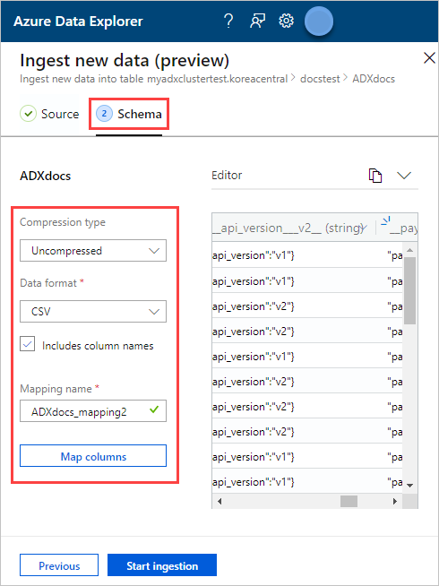

# Use one-click ingestion to ingest data into Azure Data Explorer

This article shows how to perform one-click ingestion for quick ingestion of a new table in json or csv formats from storage into Azure Data Explorer. Once the data is ingested, you can edit the table and run queries using the Web UI.

## Prerequisites

* If you don't have an Azure subscription, create a [free Azure account](https://azure.microsoft.com/free/) before you begin.
* Sign in to [the application](https://dataexplorer.azure.com/).
* Create [an Azure Data Explorer cluster and database](create-cluster-database-portal.md)
* Source of data.

## Ingest new data

1. Right-click on the *Database name* and select **Ingest new data (Preview)**

       
 
1. In the **Data Ingestion (Preview)** window, in **Source** tab, complete the **Project Details**:

    * Enter new **Table name**. Existing table name is not supported yet.
	* Select **Ingestion type** > **from storage**.
	* Enter **Link to storage** Add url to storage. Use Blob SAS URL for private storage accounts. 
    * Select **Edit schema**
 
     

1. In **Schema** tab, select **Data format** from drop-down > **JSON** or **CSV**. If select **CSV**: 

    * Select checkbox **Ignore headline** to ignore heading row of csv file.    
    * **Mapping name** is set automatically but can be edited.

    

   In the **Schema** tab > **Data format**, if select **JSON**:
    * Select **JSON levels**: 1-10 from drop-down. The levels in the json file are depicted in the table on the bottom right. 
    * **Mapping name** is set automatically but can be edited.

      

1. In **Editor**, select **V** on right to open the editor. In the editor you can view the automatic queries generated from the information inputed. 

1.	In table depicted on the bottom right: 
    * Select **V** on right of column to **Rename column**, **Delete column**, **Sort ascending**, or **Sort descending**
    * Double-click on column name to edit.
    * Select the icon to the left of the column name to change the data type. 

1. Select **Start ingestion**. This will start the process to create table, create mapping, and data ingestion.
 
## Query data

1. In the **Data ingestion completed** window, all three steps will be marked with green checkmarks, if data ingestion completed successfully. 
 
    

1. Select **V** to open query. Copy to Web UI to edit the query.

1. The menu on the right contains **Quick queries** and **Tools**. 

    * **Quick queries** includes links to Web UI with example queries.
    * **Tools** includes link to Web UI with **Drop commands** that allow you to troubleshoot issues by running the relevant `.drop` command.

    > [!TIP]
    > Data may be lost using `.drop` commands. Use them carefully.

## Next steps

* [Query data in Azure Data Explorer Web UI](web-query-data.md)
* [Write queries for Azure Data Explorer using Kusto Query Language](write-queries.md)
