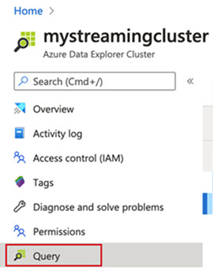
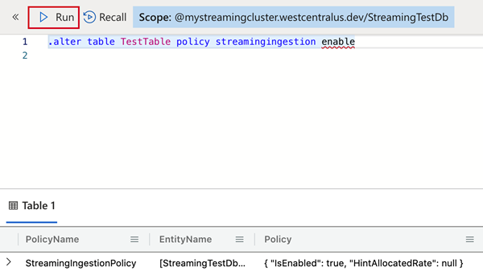
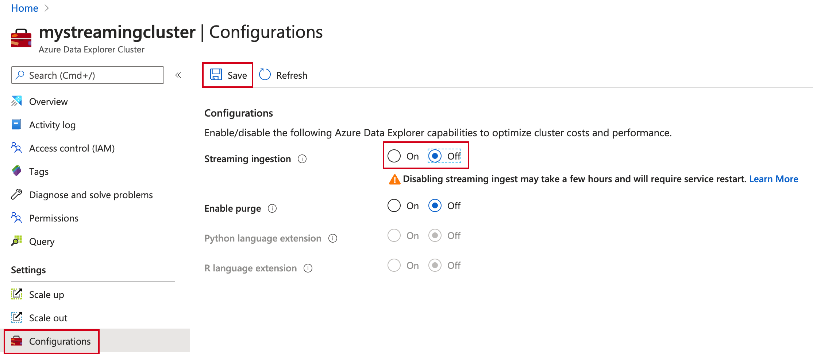

# Streaming ingestion

Use streaming ingestion when you require low latency with an ingestion time of less than 10 seconds for varied volume data. It's used to optimize operational processing of many tables, in one or more databases, where the stream of data into each table is relatively small (few records per second) but overall data ingestion volume is high (thousands of records per second). 

Use bulk ingestion instead of streaming ingestion when the amount of data grows to more than 4 GB per hour per table. Read [Data ingestion overview](ingest-data-overview.md) to learn more about the various methods of ingestion.

## Prerequisites

* If you don't have an Azure subscription, create a [free Azure account](https://azure.microsoft.com/free/) before you begin.
* Create [an Azure Data Explorer cluster and database](create-cluster-database-portal.md)
> [!NOTE]
You can enable streaming ingestion while creating a new Azure Data Explorer cluster
In the **Configurations** section select **On** to enable **Streaming ingestion**.


## Enable streaming ingestion on your cluster

> [!WARNING]
> Please review the [limitations](#limitations) prior to enabling steaming ingestion.

1. In the Azure portal, go to your Azure Data Explorer cluster. In **Settings**, select **Configurations**. 
1. In the **Configurations** pane, select **On** to enable **Streaming ingestion**.
1. Select **Save**.
 
    

## Create a target table and define streaming ingestion policy

1. In the Azure portal, navigate to your cluster then select **Query**.
 

1. To create the table that will receive the data via streaming copy the following command into Query pane and run
    ```Kusto
    .create table TestTable (TimeStamp: datetime, Name: string, Metric: int, Source:string)
    ```
     

1. Define [streaming ingestion policy](kusto/management/streamingingestionpolicy.md) on the table just created or on the database that contains it. Policy defined at the database level applies to all existing and future tables in the database. Copy one of the following commands into Query pane and run
    ```kusto
    .alter table TestTable policy streamingingestion enable
    ```
     


## Use streaming ingestion to ingest data to your cluster

There are two supported streaming ingestion types:

* [**Event Hub**](ingest-data-event-hub.md) or [**IoT Hub**](ingest-data-iot-hub.md), which is used as a data source.
* **Custom ingestion** requires you to write an application that uses one of the Azure Data Explorer [client libraries](kusto/api/client-libraries.md). See [streaming ingestion sample](https://github.com/Azure/azure-kusto-samples-dotnet/tree/master/client/StreamingIngestionSample) for a sample application.

### Choose the appropriate streaming ingestion type

|   |Event Hub  |Custom Ingestion  |
|---------|---------|---------|
|Data delay between ingestion initiation and the data available for query   |    Longer delay     |   Shorter delay      |
|Development overhead    |   Fast and easy setup, no development overhead    |   High development overhead for application to handle errors and ensure data consistency     |

## Disable streaming ingestion on your cluster

> [!WARNING]
> Disabling streaming ingestion could take a few hours.

1. Drop [streaming ingestion policy](kusto/management/streamingingestionpolicy.md) from all relevant tables and databases. The streaming ingestion policy removal triggers streaming ingestion data movement from the initial storage to the permanent storage in the column store (extents or shards). The data movement can last between a few seconds to a few hours, depending on the amount of data in the initial storage, and how the CPU and memory is used by the cluster.

In the Azure portal, go to your Azure Data Explorer cluster and select **Query**.
To drop streaming ingestion policy from the table copy the following command into **Query** pane and run
    ```Kusto
    .delete  table TestTable policy streamingingestion 
    ```
    

1. In the Azure portal, go to your Azure Data Explorer cluster. In **Settings**, select **Configurations**.
1. In the **Configurations** pane, select **Off** to disable **Streaming ingestion**.
1. Select **Save**.

    

## Limitations

* [Database cursors](kusto/management/databasecursor.md) aren't supported for a database if the database itself or any of its tables have [streaming ingestion policy](kusto/management/streamingingestionpolicy.md) defined and enabled. In this case there is no support for continuous export, and the update policy is limited to a query of the source table only.
* [Data mapping](kusto/management/mappings.md) must be [pre-created](kusto/management/create-ingestion-mapping-command.md) for use in streaming ingestion. Individual streaming ingestion requests don't accommodate inline data mappings.
* Streaming ingestion performance and capacity scales with increased VM and cluster sizes. The number of concurrent ingestion requests is limited to six per core. For example, for 16 core SKUs, such as D14 and L16, the maximal supported load is 96 concurrent ingestion requests. For two core SKUs, such as D11, the maximal supported load is 12 concurrent ingestion requests.
* The data size limit for streaming ingestion request is 4 MB.
* Schema updates, such as creation and modification of tables and ingestion mappings, may take up to five minutes for the streaming ingestion service. For more information see [Streaming ingestion and schema changes](kusto/management/data-ingestion/streaming-ingestion-schema-changes.md).
* Enabling streaming ingestion on a cluster, even when data isn't ingested via streaming, uses part of the local SSD disk of the cluster machines for streaming ingestion data and reduces the storage available for hot cache.
* [Extent tags](kusto/management/extents-overview.md#extent-tagging) can't be set on the streaming ingestion data.

## Next steps

* [Query data in Azure Data Explorer](web-query-data.md)
