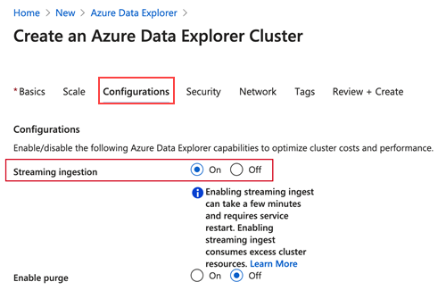
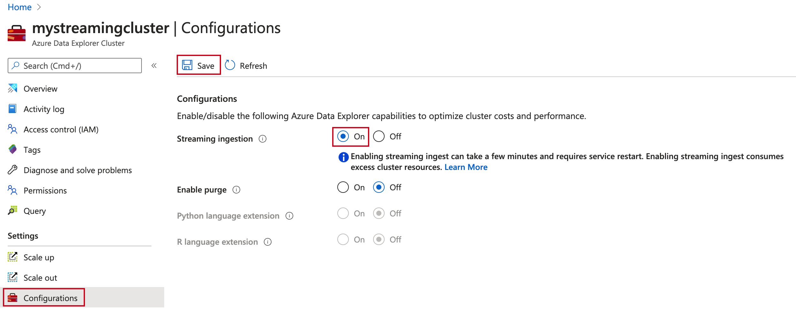
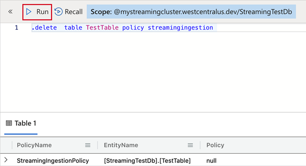

# Streaming ingestion

> [!div class="op_single_selector"]
> * [Portal](ingest-data-streaming.md)
> * [C#](ingest-data-streaming-csharp.md)

[!INCLUDE [ingest-data-streaming-intro](includes/ingest-data-streaming-intro.md)]

## Prerequisites

* If you don't have an Azure subscription, create a [free Azure account](https://azure.microsoft.com/free/) before you begin.
* Create [an Azure Data Explorer cluster and database](create-cluster-database-portal.md)

> [!NOTE]
>You can enable streaming ingestion while creating a new Azure Data Explorer cluster
>In the **Configurations** section select **On** to enable **Streaming ingestion**.
>

## Enable streaming ingestion on your cluster

> [!WARNING]
> Please review the [limitations](#limitations) prior to enabling steaming ingestion.

1. In the Azure portal, go to your Azure Data Explorer cluster. In **Settings**, select **Configurations**. 
1. In the **Configurations** pane, select **On** to enable **Streaming ingestion**.
1. Select **Save**.

    

## Create a target table and define streaming ingestion policy

1. In the Azure portal, navigate to your cluster then select **Query**.
 

1. To create the table that will receive the data via streaming ingestion copy the following command into Query pane and run

    ```Kusto
    .create table TestTable (TimeStamp: datetime, Name: string, Metric: int, Source:string)
    ```

     

1. Define [streaming ingestion policy](kusto/management/streamingingestionpolicy.md) on the table just created or on the database that contains it. Policy defined at the database level applies to all existing and future tables in the database. Copy one of the following commands into Query pane and run

    ```kusto
    .alter table TestTable policy streamingingestion enable
    ```

    or

    ```kusto
    .alter database StreamingTestDb policy streamingingestion enable
    ```

    

## Use streaming ingestion to ingest data to your cluster

[!INCLUDE [ingest-data-streaming-disabling](includes/ingest-data-streaming-ingest.md)]

## Disable streaming ingestion on your cluster

[!INCLUDE [ingest-data-streaming-disabling](includes/ingest-data-streaming-disabling.md)]

1. In the Azure portal, go to your Azure Data Explorer cluster and select **Query**.
To drop streaming ingestion policy from the table copy the following command into **Query** pane and run

    ```Kusto
    .delete  table TestTable policy streamingingestion 
    ```

    

1. In **Settings**, select **Configurations**.
1. In the **Configurations** pane, select **Off** to disable **Streaming ingestion**.
1. Select **Save**.

    

## Limitations

[!INCLUDE [ingest-data-streaming-limitations](includes/ingest-data-streaming-limitations.md)]

## Next steps

* [Query data in Azure Data Explorer](web-query-data.md)
