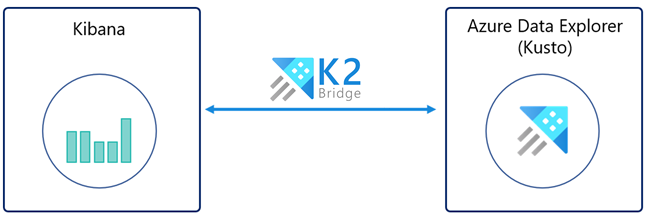
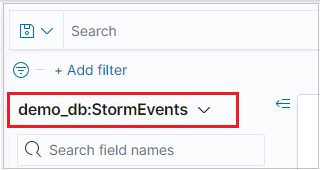
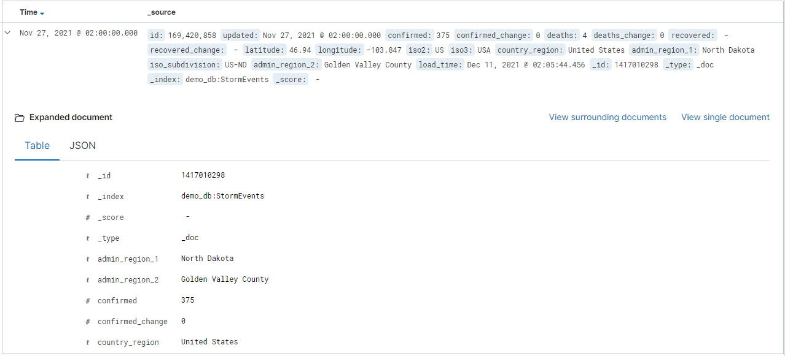
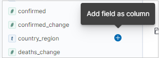
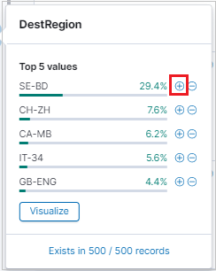

# Visualize data from Azure Data Explorer in Kibana with the K2Bridge open-source connector

K2Bridge (Kibana-Kusto Bridge) enables you to use Azure Data Explorer as the data source and to visualize that data in Kibana. K2Bridge is an open-source containerized application which acts as a proxy between a Kibana instance and an Azure Data Explorer cluster. This article describes how to use K2Bridge to create that connection.

K2Bridge translates Kibana queries to Kusto Query Language (KQL) and sends the Azure Data Explorer results back to Kibana. 

   

K2Bridge supports Kibana’s Discover tab, where you can:
* Search and explore the data
* Filter results
* Add or remove fields in the results grid
* View record content
* Save and share searches

The image below shows a Kibana instance bound to Azure Data Explorer by K2Bridge. The search experience is in Kibana, and the overall look and feel is as usual.

   [](media/k2bridge/k2bridge-kibana-page.png#lightbox)

The K2Bridge connector source code is on [GitHub](https://github.com/microsoft/K2Bridge).

## Prerequisites

Before you can visualize data from Azure Data Explorer in Kibana, have the following ready:

* [Helm V3](https://github.com/helm/helm#install), the Kubernetes package manager
* Azure Kubernetes Service (AKS) cluster, or any other Kubernetes cluster (version 1.14 to version 1.16 have been tested and verified). If you need an AKS cluster, see the AKS Quickstart guide [using the Azure CLI](https://docs.microsoft.com/azure/aks/kubernetes-walkthrough) or [using the Azure portal](https://docs.microsoft.com/azure/aks/kubernetes-walkthrough-portal)
* An Azure Data Explorer cluster, including:
    * The Azure Data Explorer cluster's URL 
    * The database name
    
    For more information, see: [Create an Azure Data Explorer cluster and database](create-cluster-database-portal.md)
* An Azure AD service principal authorized to view data in Azure Data Explorer, including:
    * The Client ID 
    * The Client Secret

    > [!Note]
    > A service principal with 'Viewer' permission is recommended. It is discouraged to use higher permissions.

    * [Set the cluster's view permissions for the Azure AD service principal](https://docs.microsoft.com/azure/data-explorer/manage-database-permissions#manage-permissions-in-the-azure-portal).

    For more information about the Azure AD service principal, see [Create an Azure AD service principal](https://docs.microsoft.com/azure/active-directory/develop/howto-create-service-principal-portal#create-an-azure-active-directory-application).

## Run K2Bridge on Azure Kubernetes Service (AKS)

By default, K2Bridges's Helm chart references a publicly available image located on Microsoft's Container Registry (MCR). MCR doesn't require any credentials, and works out-of-the-box.

1. Download the required Helm charts.

1. Add the Elasticsearch dependency to Helm. 
    The reason for the Elasticsearch dependency is that K2Bridge uses an internal small Elasticsearch instance to service metadata-related requests (such as index-patterns and saved queries). No business data is saved in this internal instance, and it can be considered as an implementation detail. 

    1. To add the Elasticsearch dependency to Helm:

        ```bash
        helm repo add elastic https://helm.elastic.co
        helm repo update
        ```

    1. To get the K2Bridge chart from under the charts directory of the GitHub repository:
        1. Clone the repository from [GitHub](https://github.com/microsoft/K2Bridge).
        1. Go to the K2Bridges root repository directory.
        1. Run:

            ```bash
            helm dependency update charts/k2bridge
            ```

1. Deploy K2Bridge:

    1. Set the variables with the correct values for your environment:

        ```bash
        ADX_URL=[YOUR_ADX_CLUSTER_URL] #For example, https://mycluster.westeurope.kusto.windows.net
        ADX_DATABASE=[YOUR_ADX_DATABASE_NAME]
        ADX_CLIENT_ID=[SERVICE_PRINCIPAL_CLIENT_ID]
        ADX_CLIENT_SECRET=[SERVICE_PRINCIPAL_CLIENT_SECRET]
        ADX_TENANT_ID=[SERVICE_PRINCIPAL_TENANT_ID]
        ```

    1. (Optional) Enable Azure Application Insights telemetry. 
        If this is the first time you're using Azure Application Insights, you should first [create an Application Insights resource](https://docs.microsoft.com/azure/azure-monitor/app/create-new-resource). You will need to [copy the instrumentation key](https://docs.microsoft.com/azure/azure-monitor/app/create-new-resource#copy-the-instrumentation-key) to a variable: 

        ```bash
        APPLICATION_INSIGHTS_KEY=[INSTRUMENTATION_KEY]
        COLLECT_TELEMETRY=true
        ```

    1. <a name="install-k2bridge-chart"></a>Install the K2Bridge chart:

        ```bash
        helm install k2bridge charts/k2bridge -n k2bridge --set image.repository=$REPOSITORY_NAME/$CONTAINER_NAME --set settings.adxClusterUrl="$ADX_URL" --set settings.adxDefaultDatabaseName="$ADX_DATABASE" --set settings.aadClientId="$ADX_CLIENT_ID" --set settings.aadClientSecret="$ADX_CLIENT_SECRET" --set settings.aadTenantId="$ADX_TENANT_ID" [--set image.tag=latest] [--set privateRegistry="$IMAGE_PULL_SECRET_NAME"] [--set settings.collectTelemetry=$COLLECT_TELEMETRY]
        ```

        The complete set of configuration options is [here](https://github.com/microsoft/K2Bridge/blob/master/docs/configuration.md).

    1. The command output will suggest the next Helm command to run to deploy Kibana. Optionally, run:

        ```bash
        helm install kibana elastic/kibana -n k2bridge --set image=docker.elastic.co/kibana/kibana-oss --set imageTag=6.8.5 --set elasticsearchHosts=http://k2bridge:8080
        ```
    1. Use port forwarding to access Kibana on localhost: 

        ```bash
        kubectl port-forward service/kibana-kibana 5601 --namespace k2bridge
        ```
    1. Connect to Kibana by browsing to http://127.0.0.1:5601.

    1. Expose Kibana to the end users. There are multiple methods to do so. The method you use largely depends on your use case.

        Example:

        Expose the service as a LoadBalancer service. To do so, add the following parameter to the K2Bridge Helm install command ([above](#install-k2bridge-chart)):

	    `--set service.type=LoadBalancer`
	
	    Then run:

        ```bash
        kubectl get service -w -n k2bridge
        ```   
        The output should look like: 

        ```bash
        NAME            TYPE           CLUSTER-IP     EXTERNAL-IP   PORT(S)          AGE
        kibana-kibana   LoadBalancer   xx.xx.xx.xx   <pending>      5601:30128/TCP   4m24s
        ```
        You can then use the generated EXTERNAL-IP that appears, and use it to access Kibana by opening a browser to: `\<EXTERNAL-IP>:5601`.

1. Configure index patterns to access your data:  
In a new Kibana instance:
     1. Open Kibana.
     1. Navigate to Management.
     1. Select **Index Patterns**. 
     1. Create an index pattern.
The name of the index must **exactly match** the table name or function name, without an asterisk. You can copy the relevant line from the list.

> [!Note]
> To run on other Kubernetes providers, change the Elasticsearch storageClassName in `values.yaml` to fit the one suggested by the provider.

## Visualize data

When Azure Data Explorer is configured as a data source for Kibana, you can use Kibana to explore the data. 

1. In Kibana, on the left menu, select the **Discover** tab.

1. From the left drop-down list select an index pattern (in this case, an Azure Data Explorer table), which defines the data source you want to explore. 
    
    

1. If your data has a time-filter field, you can specify the time range. At the upper-right of the page, set a **time filter**. By default, Discover shows data for the last 15 minutes.

    
    
1. The results table shows the first 500 records. You can **expand a document** to examine its field data in either JSON or table formats.

    

1. By default, the results table includes columns for the document _source and the time field (if it exists). You can **choose specific columns** to be added to the results table by selecting **add** next to the field name in the left sidebar.

    
    
1. In the query bar, you can **search the data** by:
    * Entering a search term
    * Using the Lucene query syntax. 
    Examples:
        * Search "error" to find all the records that contain this value. 
        * Search for "status: 200", to get all the records with a status value of 200. 
    * Using logical operators (AND, OR, NOT)
    * Using wildcards (asterisk " \* " or question mark "?") 
    Example:
        * The query `"destination_city: L*"` will match records where the destination city value starts with "l" (K2Bridge is not case-sensitive).

    
    
    > [!Tip]
    > You can find more search rules and logic [here](https://github.com/microsoft/K2Bridge/blob/master/docs/searching.md).

1. To filter your search results, use the **field list** on the right sidebar of the page. 
    The field list is where you can see:
    * The top five values for the field
    * The number of records that contain the field
    * The percentage of records that contain each value. 
    
    >[!Tip]
    > Use the (+) magnifier icon to find all records that have a specific value.
    
    
   
    You can also filter the results by using the (+) magnifier icon in the results table format view of each record in the results table.
    
     
    
1. To **save** and **share** your search, on the top menu bar, select either **Save** or **Share**.

     
