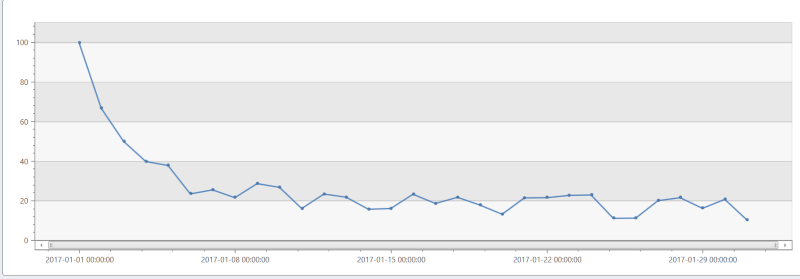

# activity_engagement plugin

Calculates activity engagement ratio based on ID column over a sliding timeline window.

activity_engagement plugin can be used for calculating DAU/WAU/MAU (daily/weekly/monthly activities).

```
T | evaluate activity_engagement(id, datetime_column, 1d, 30d)
```

**Syntax**

*T* `| evaluate` `activity_engagement(`*IdColumn*`,` *TimelineColumn*`,` [*Start*`,` *End*`,`] *InnerActivityWindow*`,` *OuterActivityWindow* [`,` *dim1*`,` *dim2*`,` ...]`)`

**Arguments**

* *T*: The input tabular expression.
* *IdColumn*: The name of the column with ID values that represent user activity. 
* *TimelineColumn*: The name of the column that represent timeline.
* *Start*: (optional) Scalar with value of the analysis start period.
* *End*: (optional) Scalar with value of the analysis end period.
* *InnerActivityWindow*: Scalar with value of the inner-scope analysis window period.
* *OuterActivityWindow*: Scalar with value of the outer-scope analysis window period.
* *dim1*, *dim2*, ...: (optional) list of the dimensions columns that slice the activity metrics calculation.

**Returns**

Returns a table that has (distinct count of ID values inside inner-scope window, distinct count of ID values inside outer-scope window, and the activity ratio)for each inner-scope window period and for each existing dimensions combination.

Output table schema is:

|TimelineColumn|dcount_activities_inner|dcount_activities_outer|activity_ratio|dim1|..|dim_n|
|---|---|---|---|--|--|--|--|--|--|
|type: as of *TimelineColumn*|long|long|double|..|..|..|


**Examples**

### DAU/WAU calculation

The following example calculates DAU/WAU (Daily Active Users / Weekly Active Users ratio) over a randomly generated data.

```kusto
// Generate random data of user activities
let _start = datetime(2017-01-01);
let _end = datetime(2017-01-31);
range _day from _start to _end  step 1d
| extend d = tolong((_day - _start)/1d)
| extend r = rand()+1
| extend _users=range(tolong(d*50*r), tolong(d*50*r+100*r-1), 1) 
| mv-expand id=_users to typeof(long) limit 1000000
// Calculate DAU/WAU ratio
| evaluate activity_engagement(['id'], _day, _start, _end, 1d, 7d)
| project _day, Dau_Wau=activity_ratio*100 
| render timechart 
```



### DAU/MAU calculation

The following example calculates DAU/WAU (Daily Active Users / Weekly Active Users ratio) over a randomly generated data.

```kusto
// Generate random data of user activities
let _start = datetime(2017-01-01);
let _end = datetime(2017-05-31);
range _day from _start to _end  step 1d
| extend d = tolong((_day - _start)/1d)
| extend r = rand()+1
| extend _users=range(tolong(d*50*r), tolong(d*50*r+100*r-1), 1) 
| mv-expand id=_users to typeof(long) limit 1000000
// Calculate DAU/MAU ratio
| evaluate activity_engagement(['id'], _day, _start, _end, 1d, 30d)
| project _day, Dau_Mau=activity_ratio*100 
| render timechart 
```


### DAU/MAU calculation with additional dimensions

The following example calculates DAU/WAU (Daily Active Users / Weekly Active Users ratio) over a randomly generated data with additional dimension (`mod3`).

```kusto
// Generate random data of user activities
let _start = datetime(2017-01-01);
let _end = datetime(2017-05-31);
range _day from _start to _end  step 1d
| extend d = tolong((_day - _start)/1d)
| extend r = rand()+1
| extend _users=range(tolong(d*50*r), tolong(d*50*r+100*r-1), 1) 
| mv-expand id=_users to typeof(long) limit 1000000
| extend mod3 = strcat("mod3=", id % 3)
// Calculate DAU/MAU ratio
| evaluate activity_engagement(['id'], _day, _start, _end, 1d, 30d, mod3)
| project _day, Dau_Mau=activity_ratio*100, mod3 
| render timechart 
```

