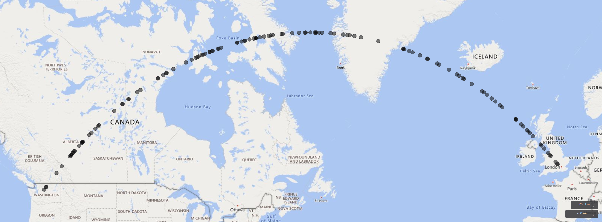

# geo_distance_2points()

Calculates the shortest distance between two geospatial coordinates on Earth.

**Syntax**

`geo_distance_2points(`*p1_longitude*`, `*p1_latitude*`, `*p2_longitude*`, `*p2_latitude*`)`

**Arguments**

* *p1_longitude*: First geospatial coordinate, longitude value in degrees. Valid value is a real number and in the range [-180, +180].
* *p1_latitude*: First geospatial coordinate, latitude value in degrees. Valid value is a real number and in the range [-90, +90].
* *p2_longitude*: Second geospatial coordinate, longitude value in degrees. Valid value is a real number and in the range [-180, +180].
* *p2_latitude*: Second geospatial coordinate, latitude value in degrees. Valid value is a real number and in the range [-90, +90].

**Returns**

The shortest distance, in meters, between two geographic locations on Earth. If the coordinates are invalid, the query will produce a null result.

> [!NOTE]
> * The geospatial coordinates are interpreted as represented by the [WGS-84](https://earth-info.nga.mil/GandG/update/index.php?action=home) coordinate reference system.
> * The [geodetic datum](https://en.wikipedia.org/wiki/Geodetic_datum) used to measure distance on Earth is a sphere.

**Examples**

The following example finds the shortest distance between Seattle and Los Angeles.


```kusto
print distance_in_meters = geo_distance_2points(-122.407628, 47.578557, -118.275287, 34.019056)
```

| distance_in_meters |
|--------------------|
| 1546754.35197381   |

Here is an approximation of shortest path from Seattle to London. The line consists of coordinates along the LineString and within 500 meters from it.

```kusto
range i from 1 to 1000000 step 1
| project lng = rand() * real(-122), lat = rand() * 90
| where lng between(real(-122) .. 0) and lat between(47 .. 90)
| where geo_distance_point_to_line(lng,lat,dynamic({"type":"LineString","coordinates":[[-122,47],[0,51]]})) < 500
| render scatterchart with (kind=map) // map rendering available in Kusto Explorer desktop
```

The following example finds all rows in which the shortest distance between two coordinates is between 1 and 11 meters.
```kusto
StormEvents
| extend distance_1_to_11m = geo_distance_2points(BeginLon, BeginLat, EndLon, EndLat)
| where distance_1_to_11m between (1 .. 11)
| project distance_1_to_11m
```

| distance_1_to_11m |
|-------------------|
| 10.5723100154958  |
| 7.92153588248414  |

The following example returns a null result because of the invalid coordinate input.
```kusto
print distance = geo_distance_2points(300,1,1,1)
```

| distance |
|----------|
|          |