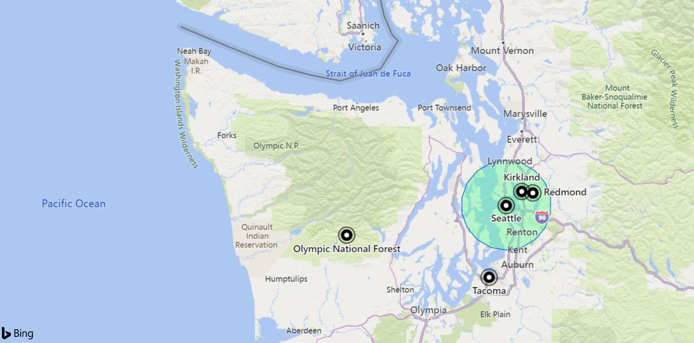

# geo_point_in_circle()

Calculates whether the geospatial coordinates are inside a circle on Earth.

**Syntax**

`geo_point_in_circle(`*p_longitude*`, `*p_latitude*`, `*pc_longitude*`, `*pc_latitude*`, `*c_radius*`)`

**Arguments**

* *p_longitude*: Geospatial coordinate longitude value in degrees. Valid value is a real number and in the range [-180, +180].
* *p_latitude*: Geospatial coordinate latitude value in degrees. Valid value is a real number and in the range [-90, +90].
* *pc_longitude*: Circle center geospatial coordinate longitude value in degrees. Valid value is a real number and in the range [-180, +180].
* *pc_latitude*: circle center geospatial coordinate latitude value in degrees. Valid value is a real number and in the range [-90, +90].
* *c_radius*: Circle radius in meters. Valid value must be positive.

**Returns**

Indicates whether the geospatial coordinates are inside a circle. If the coordinates or circle are invalid, the query will produce a null result.

> [!NOTE]
>* The geospatial coordinates are interpreted as represented by the [WGS-84](https://earth-info.nga.mil/GandG/update/index.php?action=home) coordinate reference system.
>* The [geodetic datum](https://en.wikipedia.org/wiki/Geodetic_datum) used to measure distance on Earth is a sphere.
>* Circle is a spherical cap on Earth. The radius of the cap is measured along the surface of the sphere.

**Examples**

The following query finds all the places in the area defined by a circle with a radius of 18 km whose center is at [-122.317404, 47.609119] coordinates.


```kusto
datatable(longitude:real, latitude:real, place:string)
[
    real(-122.317404), 47.609119, 'Seattle',                   // In circle 
    real(-123.497688), 47.458098, 'Olympic National Forest',   // In exterior of circle  
    real(-122.201741), 47.677084, 'Kirkland',                  // In circle
    real(-122.443663), 47.247092, 'Tacoma',                    // In exterior of circle
    real(-122.121975), 47.671345, 'Redmond',                   // In circle
]
| where geo_point_in_circle(longitude, latitude, -122.317404, 47.609119, 18000) > 0
| project place
```

|place|
|---|
|Seattle|
|Kirkland|
|Redmond|

The following example will return true.
```kusto
print in_circle = geo_point_in_circle(-122.143564, 47.535677, -122.100896, 47.527351, 3500)
```

|in_circle|
|---|
|1|

The following example will return false.
```kusto
print in_circle = geo_point_in_circle(-122.137575, 47.630683, -122.100896, 47.527351, 3500)
```

|in_circle|
|---|
|0|

The following example will return a null result because of the invalid coordinate input.
```kusto
print in_circle = geo_point_in_circle(200, 1, 1, 1, 1)
```

|in_circle|
|---|
||

The following example will return a  null result because of the invalid circle radius input.
```kusto
print in_circle = geo_point_in_circle(1, 1, 1, 1, -1)
```

|in_circle|
|---|
||