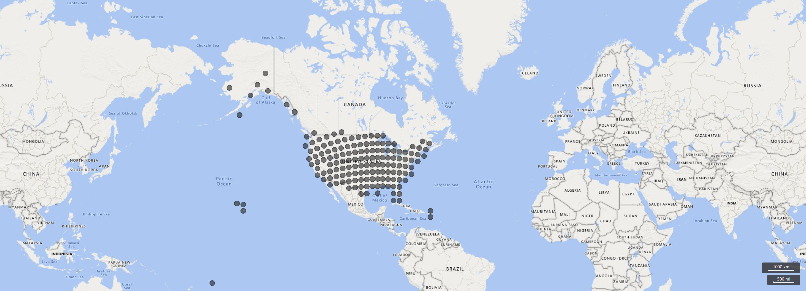

# geo_point_to_s2cell()

Calculates the S2 cell token string value for a geographic location.

For more information about S2 Cells, click [here](http://s2geometry.io/devguide/s2cell_hierarchy).

**Syntax**

`geo_point_to_s2cell(`*longitude*`, `*latitude*`, `*level*`)`

**Arguments**

* *longitude*: Longitude value of a geographic location. Longitude x will be considered valid if x is a real number and x is in range [-180, +180]. 
* *latitude*: Latitude value of a geographic location. Latitude y will be considered valid if y is a real number and y in in range [-90, +90]. 
* *level*: An optional `int` that defines the requested cell level. Supported values are in the range [0,30]. If unspecified, the default value `11` is used.

**Returns**

The S2 Cell Token string value of a given geographic location. If the coordinate or level are invalid, the query will produce an empty result.

**Notes**

* S2Cell can be useful geospatial clustering tool.
* S2Cell has 31 levels of hierarchy with area coverage ranging from 85,011,012.19km² at the highest level 0 to 00.44cm² at the lowest level 30.
* S2Cell has good preservness of the cell center during level increase from 0 to 30.
* S2Cell is a cell on a sphere surface and it's edges are geodesics.
* Invoking the [geo_s2cell_to_central_point()](geo-s2cell-to-central-point-function.md) function on a s2cell token string that was calculated on longitude x and latitude y won't necessairly return x and y.
* It's possible that two geographic locations are very close to each other but have different S2 Cell tokens.

**S2 Cell approximate area coverage per level value**

For every level, the size of the s2cell is similar but not exactly equal. Nearby cells size tend to be more equal.

|Level|Minimum random cell edge length (UK)|Maximum random cell edge length (US)|
|--|--|--|
|0|7842 km|7842 km|
|1|3921 km|5004 km|
|2|1825 km|2489 km|
|3|840 km|1310 km|
|4|432 km|636 km|
|5|210 km|315 km|
|6|108 km|156 km|
|7|54 km|78 km|
|8|27 km|39 km|
|9|14 km|20 km|
|10|7 km|10 km|
|11|3 km|5 km|
|12|1699 m|2 km|
|13|850 m|1225 m|
|14|425 m|613 m|
|15|212 m|306 m|
|16|106 m|153 m|
|17|53 m|77 m|
|18|27 m|38 m|
|19|13 m|19 m|
|20|7 m|10 m|
|21|3 m|5 m|
|22|166 cm|2 m|
|23|83 cm|120 cm|
|24|41 cm|60 cm|
|25|21 cm|30 cm|
|26|10 cm|15 cm|
|27|5 cm|7 cm|
|28|2 cm|4 cm|
|29|12 mm|18 mm|
|30|6 mm|9 mm|

The table source can be found [here](http://s2geometry.io/resources/s2cell_statistics).

See also [geo_point_to_geohash()](geo-point-to-geohash-function.md).

**Examples**

US storm events aggregated by s2cell.

```kusto
StormEvents
| project BeginLon, BeginLat
| summarize by hash=geo_point_to_s2cell(BeginLon, BeginLat, 5)
| project geo_s2cell_to_central_point(hash)
| render scatterchart with (kind=map) // map rendering available in Kusto Explorer desktop
```

```kusto
print s2cell = geo_point_to_s2cell(-80.195829, 25.802215, 8)
```

|s2cell|
|---|
|88d9b|

The following example finds groups of coordinates. Every pair of coordinates in the group reside in s2cell with maximum area of 1632.45 km².
```kusto
datatable(location_id:string, longitude:real, latitude:real)
[
  "A", 10.1234, 53,
  "B", 10.3579, 53,
  "C", 10.6842, 53,
]
| summarize count = count(),                                        // items per group count
            locations = make_list(location_id)                      // items in the group
            by s2cell = geo_point_to_s2cell(longitude, latitude, 8) // s2 cell of the group
```

|s2cell|count|locations|
|---|---|---|
|47b1d|2|["A","B"]|
|47ae3|1|["C"]|

The following example produces an empty result because of the invalid coordinate input.
```kusto
print s2cell = geo_point_to_s2cell(300,1,8)
```

|s2cell|
|---|
||

The following example produces an empty result because of the invalid level input.
```kusto
print s2cell = geo_point_to_s2cell(1,1,35)
```

|s2cell|
|---|
||

The following example produces an empty result because of the invalid level input.
```kusto
print s2cell = geo_point_to_s2cell(1,1,int(null))
```

|s2cell|
|---|
||