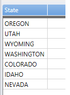
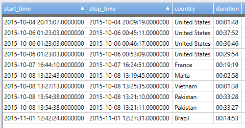
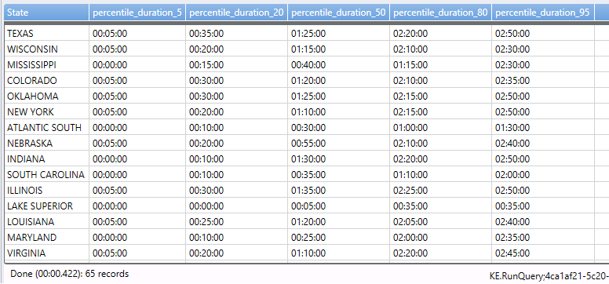

# Tutorial

The best way to learn about the Kusto query language is to look at some simple
queries to get the "feel" for the language. A database with some sample data
has been set up at [https://help.kusto.windows.net/Samples](https://help.kusto.windows.net/Samples),
and all the queries demonstrated below should run on that database. The `StormEvents`
table in this sample database provides some information about storms that happened
in the U.S.

<!--
  TODO: Provide link to reference data we used originally in StormEvents
-->

<!--
  TODO: A few samples below reference non-existent tables, such as Events and Logs.
        We need to add these tables.
-->

## Count rows

Our example database has a table called `StormEvents`.
To find out how big it is, we'll pipe its content into an operator that simply counts the rows:

* *Syntax:* A query is a data source (usually a table name), optionally
  followed by one or more pais of the pipe character and some tabular operator.

```kusto
StormEvents | count
```

Here's the result:

|Count|
|-----|
|59066|
	
[count operator](./countoperator.md).

## project: select a subset of columns

Use [project](./projectoperator.md) to pick out just the columns you
want. See example below that uses both [project](./projectoperator.md)
and [take](./takeoperator.md) operator.

## where: filtering by a Boolean expression

Let's see only the `flood`s in `California` during Feb-2007:

```kusto
StormEvents
| where StartTime > datetime(2007-02-01) and StartTime < datetime(2007-03-01)
| where EventType == 'Flood' and State == 'CALIFORNIA'
| project StartTime, EndTime , State , EventType , EpisodeNarrative
```

|StartTime|EndTime|State|EventType|EpisodeNarrative|
|---|---|---|---|---|
|2007-02-19 00:00:00.0000000|2007-02-19 08:00:00.0000000|CALIFORNIA|Flood|A frontal system moving across the Southern San Joaquin Valley brought brief periods of heavy rain to western Kern County in the early morning hours of the 19th. Minor flooding was reported across State Highway 166 near Taft.|

## take: show me n rows

Let's see some data - what's in a sample 5 rows?

```kusto
StormEvents
| take 5
| project  StartTime, EndTime, EventType, State, EventNarrative  
```

|StartTime|EndTime|EventType|State|EventNarrative|
|---|---|---|---|---|
|2007-09-18 20:00:00.0000000|2007-09-19 18:00:00.0000000|Heavy Rain|FLORIDA|As much as 9 inches of rain fell in a 24-hour period across parts of coastal Volusia County.|
|2007-09-20 21:57:00.0000000|2007-09-20 22:05:00.0000000|Tornado|FLORIDA|A tornado touched down in the Town of Eustis at the northern end of West Crooked Lake. The tornado quickly intensified to EF1 strength as it moved north northwest through Eustis. The track was just under two miles long and had a maximum width of 300 yards.  The tornado destroyed 7 homes. Twenty seven homes received major damage and 81 homes reported minor damage. There were no serious injuries and property damage was set at $6.2 million.|
|2007-09-29 08:11:00.0000000|2007-09-29 08:11:00.0000000|Waterspout|ATLANTIC SOUTH|A waterspout formed in the Atlantic southeast of Melbourne Beach and briefly moved toward shore.|
|2007-12-20 07:50:00.0000000|2007-12-20 07:53:00.0000000|Thunderstorm Wind|MISSISSIPPI|Numerous large trees were blown down with some down on power lines. Damage occurred in eastern Adams county.|
|2007-12-30 16:00:00.0000000|2007-12-30 16:05:00.0000000|Thunderstorm Wind|GEORGIA|The county dispatch reported several trees were blown down along Quincey Batten Loop near State Road 206. The cost of tree removal was estimated.|

But [take](./takeoperator.md) shows rows from the table in no particular order, so let's sort them.
* [limit](./takeoperator.md) is an alias 
for [take](./takeoperator.md) and will have the same effect.

## sort and top

* *Syntax:* Some operators have parameters introduced by keywords such as `by`.
* `desc` = descending order, `asc` = ascending.

Show me the first n rows, ordered by a particular column:

```kusto
StormEvents
| top 5 by StartTime desc
| project  StartTime, EndTime, EventType, State, EventNarrative  
```

|StartTime|EndTime|EventType|State|EventNarrative|
|---|---|---|---|---|
|2007-12-31 22:30:00.0000000|2007-12-31 23:59:00.0000000|Winter Storm|MICHIGAN|This heavy snow event continued into the early morning hours on New Year's Day.|
|2007-12-31 22:30:00.0000000|2007-12-31 23:59:00.0000000|Winter Storm|MICHIGAN|This heavy snow event continued into the early morning hours on New Year's Day.|
|2007-12-31 22:30:00.0000000|2007-12-31 23:59:00.0000000|Winter Storm|MICHIGAN|This heavy snow event continued into the early morning hours on New Year's Day.|
|2007-12-31 23:53:00.0000000|2007-12-31 23:53:00.0000000|High Wind|CALIFORNIA|North to northeast winds gusting to around 58 mph were reported in the mountains of Ventura county.|
|2007-12-31 23:53:00.0000000|2007-12-31 23:53:00.0000000|High Wind|CALIFORNIA|The Warm Springs RAWS sensor reported northerly winds gusting to 58 mph.|

Same can be achieved by using [sort](./sortoperator.md) and 
then [take](./takeoperator.md) operator

```kusto
StormEvents
| sort by StartTime desc
| take 5
| project  StartTime, EndLat, EventType, EventNarrative
```

## extend: compute derived columns

Create a new column by computing a value in every row:

```kusto
StormEvents
| limit 5
| extend Duration = EndTime - StartTime 
| project StartTime, EndTime, Duration, EventType, State
```

|StartTime|EndTime|Duration|EventType|State|
|---|---|---|---|---|
|2007-09-18 20:00:00.0000000|2007-09-19 18:00:00.0000000|22:00:00|Heavy Rain|FLORIDA|
|2007-09-20 21:57:00.0000000|2007-09-20 22:05:00.0000000|00:08:00|Tornado|FLORIDA|
|2007-09-29 08:11:00.0000000|2007-09-29 08:11:00.0000000|00:00:00|Waterspout|ATLANTIC SOUTH|
|2007-12-20 07:50:00.0000000|2007-12-20 07:53:00.0000000|00:03:00|Thunderstorm Wind|MISSISSIPPI|
|2007-12-30 16:00:00.0000000|2007-12-30 16:05:00.0000000|00:05:00|Thunderstorm Wind|GEORGIA|

It is possible to reuse column name and assign calculation result to the same column.
For example:

```kusto
print x=1
| extend x = x + 1, y = x
| extend x = x + 1
```

|x|y|
|---|---|
|3|1|

[Scalar expressions](./scalar-data-types/index.md) can include all the usual 
operators (`+`, `-`, `*`, `/`, `%`), and there's a range of useful functions.

## summarize: aggregate groups of rows

Count how many events come from each country:

```kusto
StormEvents
| summarize event_count = count() by State
```

[summarize](./summarizeoperator.md) groups together rows that have 
the same values in the `by` clause, and then uses 
the aggregation function (such as `count`) to combine each group into a single row. So in this case, 
there's a row for each state, and a column for the count of rows in that state.

There's a range of [aggregation functions](./summarizeoperator.md#list-of-aggregation-functions),
and you can use several of
them in one summarize operator to produce several computed columns. 
For example, we could get the count of storms in each state and also unique number of storms per state, 
then we could use [top](./topoperator.md) to get the most storm-affected states:

```kusto
StormEvents 
| summarize StormCount = count(), TypeOfStorms = dcount(EventType) by State
| top 5 by StormCount desc
```

|State|StormCount|TypeOfStorms|
|---|---|---|
|TEXAS|4701|27|
|KANSAS|3166|21|
|IOWA|2337|19|
|ILLINOIS|2022|23|
|MISSOURI|2016|20|

The result of a summarize has:

* each column named in `by`;
* a column for each computed expression;
* a row for each combination of `by` values.

## Summarize by scalar values

You can use scalar (numeric, time, or interval) values in the by clause, but you'll want to put the values into bins. 
The [bin()](./binfunction.md) function is useful for this:

```kusto
StormEvents
| where StartTime > datetime(2007-02-14) and StartTime < datetime(2007-02-21)
| summarize event_count = count() by bin(StartTime, 1d)
```

This reduces all the timestamps to intervals of 1 day:

|StartTime|event_count|
|---|---|
|2007-02-14 00:00:00.0000000|180|
|2007-02-15 00:00:00.0000000|66|
|2007-02-16 00:00:00.0000000|164|
|2007-02-17 00:00:00.0000000|103|
|2007-02-18 00:00:00.0000000|22|
|2007-02-19 00:00:00.0000000|52|
|2007-02-20 00:00:00.0000000|60|

The [bin()](./binfunction.md) is the same as
the [floor()](./floorfunction.md) function in many languages. It
simply reduces every value to the nearest multiple of the modulus that you supply, so
that [summarize](./summarizeoperator.md) can assign the rows to groups.

## Render: display a chart or table

Project two columns and use them as the x and y axis of a chart:

```kusto
StormEvents 
| summarize event_count=count(), mid = avg(BeginLat) by State 
| sort by mid
| where event_count > 1800
| project State, event_count
| render columnchart
```


Although we removed `mid` in the project operation, we still need it if we want the chart to display the countries in that order.

Strictly speaking, 'render' is a feature of the client rather than part of the query language. Still, it's integrated into the language and is very useful for envisioning your results.


## Timecharts

Going back to numeric bins, let's display a time series:

```kusto
StormEvents
| summarize event_count=count() by bin(StartTime, 1d)
| render timechart
```


## Multiple series

Use multiple values in a `summarize by` clause to create a separate row for each combination of values:

```kusto
StormEvents 
| where StartTime > datetime(2007-06-04) and StartTime < datetime(2007-06-10) 
| where Source in ("Source","Public","Emergency Manager","Trained Spotter","Law Enforcement")
| summarize count() by bin(StartTime, 10h), Source
```


Just add the render term to the above: `| render timechart`.


Notice that `render timechart` uses the first column as the x-axis, and then displays the other columns as separate lines.

## Daily average cycle

How does activity vary over the average day?

Count events by the time modulo one day, binned into hours:

```kusto
StormEvents
| extend hour = floor(StartTime % 1d , 1h)
| summarize event_count=count() by hour
| sort by hour asc
| render timechart
```


Currently, `render` doesn't label durations properly, but we could use `| render columnchart` instead:


## Compare multiple daily series

How does activity vary over the time of day in different states?

```kusto
StormEvents
| extend hour= floor( StartTime % 1d , 1h)
| where State in ("GULF OF MEXICO","MAINE","VIRGINIA","WISCONSIN","NORTH DAKOTA","NEW JERSEY","OREGON")
| summarize event_count=count() by hour, State
| render timechart
```


Divide by `1h` to turn the x-axis into hour number instead of a duration:

```kusto
StormEvents
| extend hour= floor( StartTime % 1d , 1h)/ 1h
| where State in ("GULF OF MEXICO","MAINE","VIRGINIA","WISCONSIN","NORTH DAKOTA","NEW JERSEY","OREGON")
| summarize event_count=count() by hour, State
| render columnchart
```


## join

How to find for two given EventTypes in what state both of them happened?

You can pull storm events with the first EventType and with the second EventType and then join the two sets on State.

```kusto
StormEvents
| where EventType == "Lightning"
| join (
    StormEvents 
    | where EventType == "Avalanche"
) on State  
| distinct State
```



Assume you have a data that includes events marking the start and end of each session, with a unique id for each session. 

How long does each user session last?

By using extend to provide separate aliases for the two timestamps, you can then compute the session duration.

```kusto
Events
| where eventName == "session_started"
| project start_time = timestamp, stop_time, country, session_id
| join ( Events
    | where eventName == "session_ended"
    | project stop_time = timestamp, session_id
    ) on session_id
| extend duration = stop_time - start_time
| project start_time, stop_time, country, duration
| take 10
```



It's good practice to use `project` to select just the columns we need before performing the join.
In the same clauses, we rename the timestamp column.


## Plot a distribution

How many storms are there of different lengths?

```kusto
StormEvents
| extend  duration = EndTime - StartTime
| where duration > 0s
| where duration < 3h
| summarize event_count = count()
    by bin(duration, 5m)
| sort by duration asc
| render timechart
```


Or use `| render columnchart`:


## Percentiles

What ranges of durations cover different percentages of storms?

Use the above query, but replace `render` with:

```kusto
| summarize percentiles(duration, 5, 20, 50, 80, 95)
```

In this case, we provided no `by` clause, so the result is a single row:


From which we can see that:

* 5% of storms have a duration of less than 5m;
* 50% of storms last less than 1h 25m;
* 5% of storms last at least 2h 50m.

To get a separate breakdown for each state, we just have to bring the state column separately through both summarize operators:

```kusto
StormEvents
| extend  duration = EndTime - StartTime
| where duration > 0s
| where duration < 3h
| summarize event_count = count()
    by bin(duration, 5m), State
| sort by duration asc
| summarize percentiles(duration, 5, 20, 50, 80, 95) by State
```



## Let: Assign a result to a variable

Use [let](./letstatement.md) to separate out the parts of the query expression in the 'join' example above. The results are unchanged:

```kusto
let LightningStorms = 
    StormEvents
    | where EventType == "Lightning";
let AvalancheStorms = 
    StormEvents
    | where EventType == "Avalanche";
LightningStorms 
| join (AvalancheStorms) on State
| distinct State
```

> Tip: In the Kusto client, don't put blank lines between the parts of this. Make sure to execute all of it.

## Combining data from several databases in a query

See [cross-database queries](./cross-cluster-or-database-queries.md) for detailed discussion

When you write a query of the style:

```kusto
Logs | where ...
```

The table named Logs has to be in your default database. If you want to access table from another database use the following syntax:

```kusto
database("db").Table
```

So if you have databases named *Diagnostics* and *Telemetry* and want to correlate some of their data, you might write (assuming *Diagnostics* is your default database)

```kusto
Logs | join database("Telemetry").Metrics on Request MachineId | ...
```
or if your default database is *Telemetry*

```kusto
union Requests, database("Diagnostics").Logs | ...
```
    
All of the above assumed that both databases reside in the cluster you are currently connected to. Suppose that *Telemetry* database belonged to another cluster named *TelemetryCluster.kusto.windows.net* then to access it you'll need
```kusto
Logs | join cluster("TelemetryCluster").database("Telemetry").Metrics on Request MachineId | ...
```
> Note: when the cluster is specified the database is mandatory