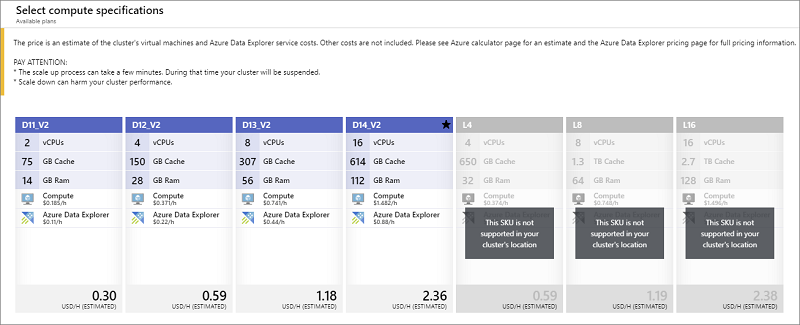

# Manage cluster scale-up to accommodate changing demand

Sizing a cluster appropriately is critical to the performance of Azure Data Explorer. But demand on a cluster can’t be predicted with 100% accuracy. A static cluster size can lead to under-utilization or over-utilization, neither of which is ideal. A better approach is to *scale* a cluster,adding and removing capacity and CPU with changing demand. There are two workflows for scaling, scale-up and scale-out. This article shows you how to manage cluster scale-up.

1. Navigate to your cluster, and under **Settings** select **Scale up**.

    You're given a list of available SKUs. For instance, in the figure below there's only one available SKU: D14_V2.

    

    D13_V2 is disabled since it is the current SKU of the cluster. L8 and L16 are disabled because they not available in the region where the cluster is located.

1. To change your SKU, select the SKU you want and press the **Select** button.

[!NOTE]
* The scale up process can take a few minutes. During that time, your cluster will be suspended.
* Scaling down can harm your cluster performance.

You've now performed a scale-up or scale-down operation for your Azure Data Explorer cluster. You can also do [cluster scale-out](manage-cluster-scale-out.md), also known as autoscale, to scale dynamically based on metrics that you specify.

If you need assistance with cluster scaling issues, open a support request in the [Azure portal](https://portal.azure.com/#blade/Microsoft_Azure_Support/HelpAndSupportBlade/overview).