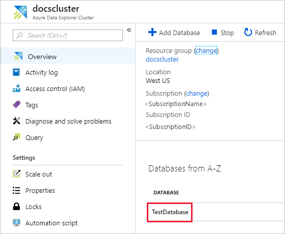
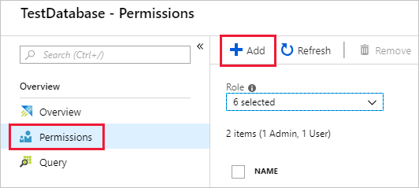

# Manage Azure Data Explorer database permissions

Azure Data Explorer enables you to control access to databases and tables, using a *role-based access control* model. Under this model, *principals* (users, groups, and apps) are mapped to *roles*. Principals can access resources according to the roles they're assigned. For a list of available roles, see [Role-based Authorization in Kusto](./kusto/management/access-control/role-based-authorization.md)

This article describes the available roles and how to assign principals to those roles using the Azure portal and Azure Data Explorer management commands.


## Manage permissions in the Azure portal

1. Sign in to the [Azure portal](https://portal.azure.com/).

1. Navigate to your Azure Data Explorer cluster.

1. In the **Overview** section, select the database where you want to manage permissions. For adding roles that affect more then one database (e.i. "All Databases" roles), skip this phase and go directly to the next

    

1. Select **Permissions** then **Add**.

    

1. Look up the principal, select it, then **Select**.

    :::image type="content" source="media/manage-database-permissions/new-principals.png" alt-text="Screenshot of the Azure portal New Principals page. A principal name and image are selected and highlighted. The Select button is also highlighted." border="false":::

## Manage permissions with management commands

1. Sign-in to [https://dataexplorer.azure.com](https://dataexplorer.azure.com), and add your cluster if it's not already available.

1. In the left pane, select the appropriate database.

1. Use the `.add` command to assign principals to roles: `.add database databasename rolename ('aaduser | aadgroup=user@domain.com')`. To add a user to the Database user role, run the following command, substituting your database name and user.

    ```Kusto
    .add database <TestDatabase> users ('aaduser=<user@contoso.com>')
    ```

    The output of the command shows the list of existing users and the roles they're assigned to in the database.
    
    For examples pertaining to Azure Active Directory and the Kusto authorization model, please see [Principles and Identity Providers](kusto/management/access-control/principals-and-identity-providers.md)

## Next steps

[Write queries](write-queries.md)
