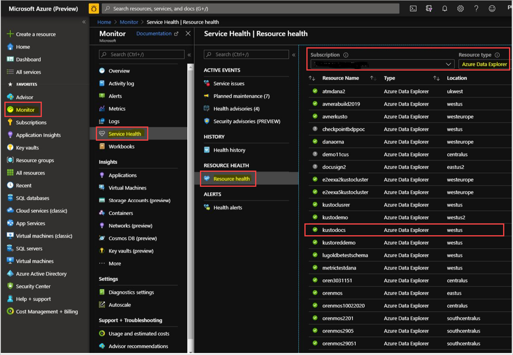
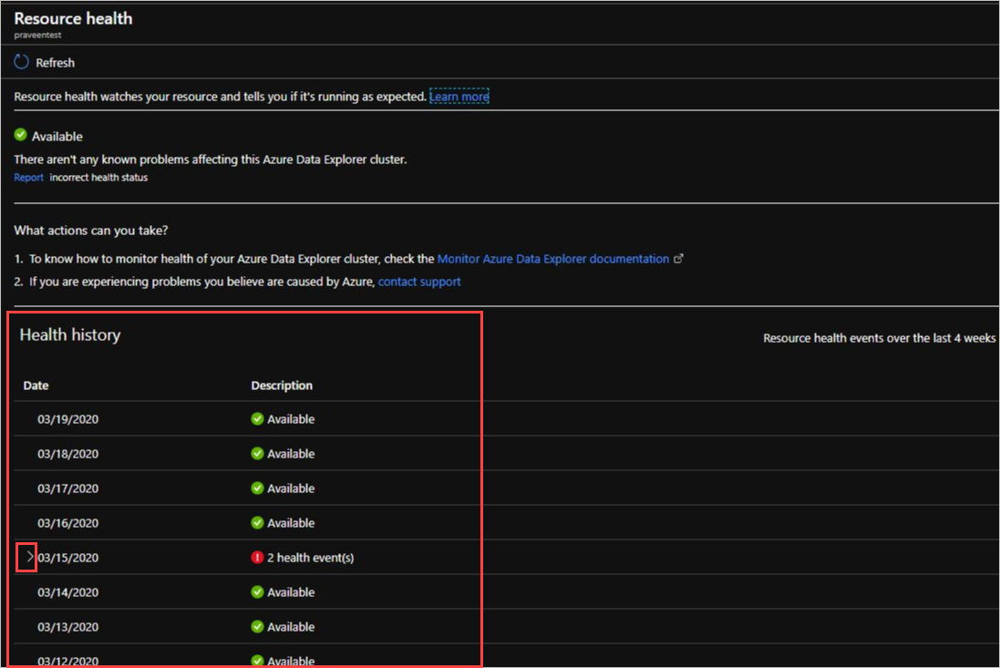

# Monitor Azure Data Explorer using Resource Health

[Resource Health](/azure/service-health/resource-health-overview) for Azure Data Explorer informs you of the health of your Azure Data Explorer resource and provides actionable recommendations to troubleshoot problems. Resource health is updated every 1-2 minutes and reports the current and past health of your resources. 

Resource Health determines the health of your Azure Data Explorer resource by examining various health status checks such as:
* Resource availability
* Query failures

## Access Resource Health reporting

1. In the [Azure portal](https://portal.azure.com/), select **Monitor** from list of services.
1. Select **Service Health** > **Resource health**.
1. In the **Subscription** dropdown, select your subscription and in the **Resource type** dropdown, select **Azure Data Explorer**.
1. The resulting table will list all the resources in the chosen subscription. Each resource will have a health state icon indicating the resource health.
1. Select your resource to view its [resource health status](#resource-health-status) and recommendations.

    

## Resource health status

The health of a resource is displayed with one of the following statuses, available, unavailable, and unknown

### Available

A health status of **Available** indicates that your Azure Data Explorer resource is healthy and doesn't have any issues.

### Unavailable

A health status of **Unavailable** indicates that there's an ongoing problem with your Azure Data Explorer resource that causes it to be unavailable for queries and ingestion. For example, nodes in your Azure Data Explorer resource may have rebooted unexpectedly. If your Azure Data Explorer resource remains in this state for an extended period of time, contact [support]().

### Unknown

A health status of **Unknown** indicates that **Resource Health** hasn't received information about this Azure Data Explorer resource for more than 10 minutes. This status isn't a definitive indication of the Azure Data Explorer resource health, but is an important data point in the troubleshooting process. If your Azure Data Explorer cluster is functioning as expected, the status will change to **Available** within a few minutes. The **Unknown** health status may suggest that an event in the platform is affecting the resource. 

> [!TIP]
> The Azure Data Explorer cluster resource health will be **Unknown** if it's in a stopped state.

## Historical information

In **Resource Health** pane > **Health history**, access up to four weeks of resource health status information. Select the arrow for additional information on the health event issues reported in this pane. 

## Next steps

* [Configuring Resource Health alerts](https://docs.microsoft.com/azure/service-health/resource-health-alert-arm-template-guide)
* [Tutorial: Ingest and query monitoring data in Azure Data Explorer](ingest-data-no-code.md)