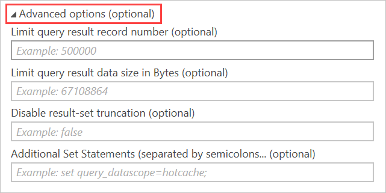
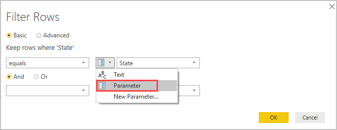

# Best practices for using Power BI to query and visualize Azure Data Explorer data

Azure Data Explorer is a fast and highly scalable data exploration service for log and telemetry data. [Power BI](/power-bi/) is a business analytics solution that lets you visualize your data and share the results across your organization. Azure Data Explorer provides three options for connecting to data in Power BI. Use the [built-in connector](power-bi-connector.md), [import a query from Azure Data Explorer into Power BI](power-bi-imported-query.md), or use a [SQL query](power-bi-sql-query.md). This article supplies you with tips for querying and visualizing your Azure Data Explorer data with Power BI. 

## Best practices for using Power BI

When working with terabytes of fresh raw data, follow these guidelines to keep Power BI dashboards and reports snappy and updated:

* **Travel light** - Bring only the data that you need for your reports to Power BI. For deep interactive analysis, use the [Azure Data Explorer Web UI](web-query-data.md) that is optimized for ad-hoc exploration with the Kusto Query Language.

* **Composite model** - Use [composite model](/power-bi/desktop-composite-models) to combine aggregated data for top-level dashboards with filtered operational raw data. You can clearly define when to use raw data and when to use an aggregated view. 

* **Import mode versus DirectQuery mode** - Use **Import** mode for interaction of smaller data sets. Use **DirectQuery** mode for large, frequently updated data sets. For example, create dimension tables using **Import** mode since they're small and don't change often. Set the refresh interval according to the expected rate of data updates. Create fact tables using **DirectQuery** mode since these tables are large and contain raw data. Use these tables to present filtered data using Power BI [drillthrough](/power-bi/desktop-drillthrough).

* **Parallelism** – Azure Data Explorer is a linearly scalable data platform, therefore, you can improve the performance of dashboard rendering by increasing the parallelism of the end-to-end flow as follows:

  * Increase the number of [concurrent connections in DirectQuery in Power BI](/power-bi/desktop-directquery-about#maximum-number-of-connections-option-for-directquery).

  * Use [weak consistency to improve parallelism](kusto/concepts/queryconsistency.md). This may have an impact on the freshness of the data.

* **Effective slicers** – Use [sync slicers](/power-bi/visuals/power-bi-visualization-slicers#sync-and-use-slicers-on-other-pages) to prevent reports from loading data before you're ready. After you structure the data set, place all visuals, and mark all the slicers, you can select the sync slicer to load only the data needed.

* **Use filters** - Use as many Power BI filters as possible to focus the Azure Data Explorer search on the relevant data shards.

* **Efficient visuals** – Select the most performant visuals for your data.


## Tips for using the Azure Data Explorer connector for Power BI to query data

The following section includes tips and tricks for using Kusto query language with Power BI. Use the [Azure Data Explorer connector for Power BI](power-bi-connector.md) to visualize data

### Complex queries in Power BI

Complex queries are more easily expressed in Kusto than in Power Query. They should be implemented as [Kusto functions](kusto/query/functions/index.md), and invoked in Power BI. This method is required when using **DirectQuery** with `let` statements in your Kusto query. Because Power BI joins two queries, and `let` statements can't be used with the `join` operator, syntax errors may occur. Therefore, save each portion of the join as a Kusto function and allow Power BI to join these two functions together.

### How to simulate a relative date-time operator

Power BI doesn't contain a *relative* date-time operator such as `ago()`.
To simulate `ago()`, use a combination of `DateTime.FixedLocalNow()` and `#duration` Power BI functions.

Instead of this query using the `ago()` operator:

```kusto
    StormEvents | where StartTime > (now()-5d)
    StormEvents | where StartTime > ago(5d)
``` 

Use the following equivalent query:

```m
let
    Source = AzureDataExplorer.Contents("help", "Samples", "StormEvents", []),
    #"Filtered Rows" = Table.SelectRows(Source, each [StartTime] > (DateTime.FixedLocalNow()-#duration(5,0,0,0)))
in
    #"Filtered Rows"
```

### Configuring Azure Data Explorer connector options in M Query

You can configure the options of the Azure Data Explorer connector from the Advanced Editor of PBI in the M query language. Using these options, you can control the generated query that's being sent to your Azure Data Explorer cluster.

```m
let
    Source = AzureDataExplorer.Contents("help", "Samples", "StormEvents", [<options>])
in
    Source
```

You can use any of the following options in your M query:

| Option | Sample | Description
|---|---|---
| MaxRows | `[MaxRows=300000]` | Adds the `truncationmaxrecords` set statement to your query. Overrides the default maximum number of records a query may return to the caller (truncation).
| MaxSize | `[MaxSize=4194304]` | Adds the `truncationmaxsize` set statement to your query. Overrides the default maximum data size a query is allowed to return to the caller (truncation).
| NoTruncate | `[NoTruncate=true]` | Adds the `notruncation` set statement to your query. Enables suppressing truncation of the query results returned to the caller.
| AdditionalSetStatements | `[AdditionalSetStatements="set query_datascope=hotcache"]` | Adds the provided set statements to your query. These statements are used to set query options for the duration of the query. Query options control how a query executes and returns results.
| CaseInsensitive | `[CaseInsensitive=true]` | Makes the connector generate queries that are case insensitive - queries will use the `=~` operator instead of the `==` operator when comparing values.
| Timeout | `[Timeout=#duration(0,10,0,0)]` | Configures both the client and server timeout of the query to the provided duration.

> [!NOTE]
> You can combine multiple options together to reach the desired behavior: `[NoTruncate=true, CaseInsensitive=true]`

### Reaching Kusto query limits

Kusto queries return, by default, up to 500,000 rows or 64 MB, as described in [query limits](kusto/concepts/querylimits.md). You can override these defaults by using **Advanced options** in the  **Azure Data Explorer (Kusto)** connection window:



These options issue [set statements](kusto/query/setstatement.md) with your query to change the default query limits:

* **Limit query result record number** generates a `set truncationmaxrecords`
* **Limit query result data size in Bytes** generates a `set truncationmaxsize`
* **Disable result-set truncation** generates a `set notruncation`

### Case sensitivity

By default, the connector generates queries that use the case sensitive `==` operator when comparing string values. If the data is case insensitive, this isn't the desired behavior. To change the generated query, use the `CaseInsensitive` connector option:

```m
let
    Source = AzureDataExplorer.Contents("help", "Samples", "StormEvents", [CaseInsensitive=true]),
    #"Filtered Rows" = Table.SelectRows(Source, each [State] == "aLaBama")
in
    #"Filtered Rows"
```

### Using query parameters

You can use [query parameters](kusto/query/queryparametersstatement.md) to modify your query dynamically. 

#### Using a query parameter in the connection details

Use a query parameter to filter information in the query and optimize query performance.
 
In **Edit Queries** window, **Home** > **Advanced Editor**

1. Find the following section of the query:

    ```m
    Source = AzureDataExplorer.Contents("<Cluster>", "<Database>", "<Query>", [])
    ```

   For example:

    ```m
    Source = AzureDataExplorer.Contents("Help", "Samples", "StormEvents | where State == 'ALABAMA' | take 100", [])
    ```

1. Replace the relevant part of the query with your parameter. Split the query into multiple parts, and concatenate them back using an ampersand (&), along with the parameter.

   For example, in the query above, we'll take the `State == 'ALABAMA'` part, and split it to: `State == '` and `'` and we'll place the `State` parameter between them:

    ```kusto
    "StormEvents | where State == '" & State & "' | take 100"
    ```

1. If your query contains quotation marks, encode them correctly. For example, the following query:

   ```kusto
   "StormEvents | where State == "ALABAMA" | take 100"
   ```

   will appear in the **Advanced Editor** as follows with two quotation marks:

   ```kusto
    "StormEvents | where State == ""ALABAMA"" | take 100"
   ```

   It should be replaced with the following query with three quotation marks:

   ```kusto
   "StormEvents | where State == """ & State & """ | take 100"
   ```

#### Use a query parameter in the query steps

You can use a query parameter in any query step that supports it. For example, filter the results based on the value of a parameter.



### Using Value.NativeQuery for unsupported ADX features

If you need to use a feature that's supported by Azure Data Explorer, but not available in Power BI, or just want to have more control over the executed query, you can use the [Value.NativeQuery()](https://docs.microsoft.com/powerquery-m/value-nativequery) method in M. This allows you to insert a KQL fragement inside the generated query.

For example, in order to use the `percentiles()` function in Azure Data Explorer, you can use the following:

```m
let
    StormEvents = AzureDataExplorer.Contents(DefaultCluster, DefaultDatabase){[Name = DefaultTable]}[Data],
    Percentiles = Value.NativeQuery(StormEvents, "| summarize percentiles(DamageProperty, 50, 90, 95) by State")
in
    Percentiles
```

### Don't use Power BI data refresh scheduler to issue control commands to Kusto

Power BI includes a data refresh scheduler that can periodically issue
queries against a data source. This mechanism shouldn't be used to schedule control commands to Kusto because Power BI assumes all queries are read-only.

### Power BI can send only short (&lt;2000 characters) queries to Kusto

If running a query in Power BI results in the following error:
 _"DataSource.Error: Web.Contents failed to get contents from..."_
the query is probably longer than 2000 characters. Power BI uses **PowerQuery** to query Kusto by issuing an HTTP GET request that encodes the query as part of the URI being retrieved. Therefore, Kusto queries issued by Power BI are limited to the maximum length of
a request URI (2000 characters, minus small offset). As a workaround, you can
define a [stored function](kusto/query/schema-entities/stored-functions.md) in Kusto,
and have Power BI use that function in the query.

## Next steps

[Visualize data using the Azure Data Explorer connector for Power BI](power-bi-connector.md)