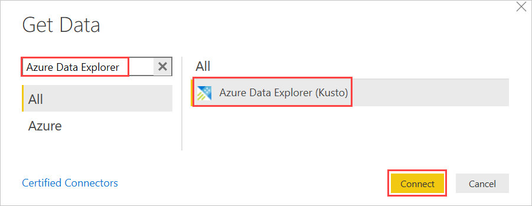
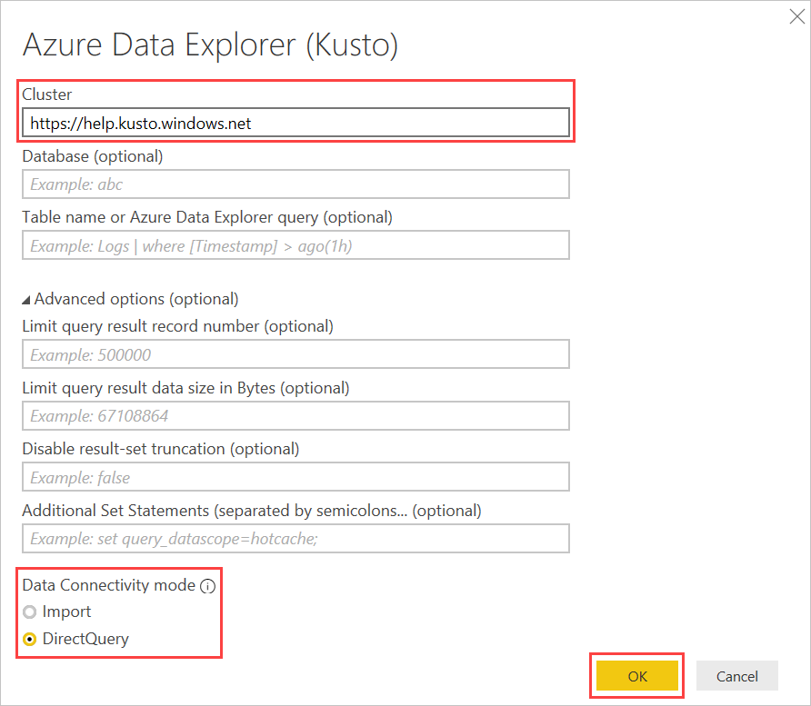
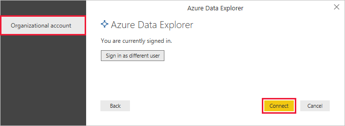
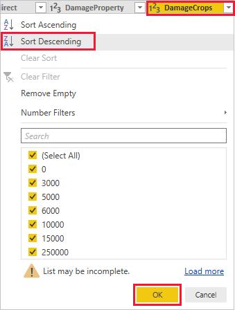
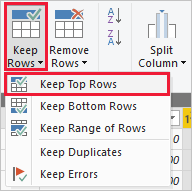

# Visualize data using the Azure Data Explorer connector for Power BI

Azure Data Explorer is a fast and highly scalable data exploration service for log and telemetry data. Power BI is a business analytics solution that lets you visualize your data and share the results across your organization. Azure Data Explorer provides three options for connecting to data in Power BI: use the built-in connector, import a query from Azure Data Explorer, or use a SQL query. This article shows you how to use the built-in connector to get data and visualize it in a Power BI report. Using the Azure Data Explorer native connector for creating Power BI dashboards is straightforward. The Power BI connector supports [Import and Direct Query connectivity modes](https://docs.microsoft.com/power-bi/desktop-directquery-about). You can build dashboards using **Import** or **DirectQuery** mode depending on the scenario, scale, and performance requirements. 

## Prerequisites

You need the following to complete this article:

* If you don't have an Azure subscription, create a [free Azure account](https://azure.microsoft.com/free/) before you begin.
* An organizational email account that is a member of Azure Active directory, so you can connect to the [Azure Data Explorer help cluster](https://dataexplorer.azure.com/clusters/help/databases/samples).
* [Power BI Desktop](https://powerbi.microsoft.com/get-started/) (select **DOWNLOAD FREE**)

## Get data from Azure Data Explorer

First, you connect to the Azure Data Explorer help cluster, then you bring in a subset of the data from the *StormEvents* table. [!INCLUDE [data-explorer-storm-events](includes/data-explorer-storm-events.md)]

1. In Power BI Desktop, on the **Home** tab, select **Get Data** then **More**.

    

1. Search for *Azure Data Explorer*, select **Azure Data Explorer** then **Connect**.

    

1. On the **Azure Data Explorer (Kusto)** screen, fill out the form with the following information.

    

    **Setting** | **Value** | **Field description**
    |---|---|---|
    | Cluster | *https://help.kusto.windows.net* | The URL for the help cluster. For other clusters, the URL is in the form *https://\<ClusterName\>.\<Region\>.kusto.windows.net*. |
    | Database | Leave blank | A database that is hosted on the cluster you're connecting to. We'll select this in a later step. |
    | Table name | Leave blank | One of the tables in the database, or a query like <code>StormEvents \| take 1000</code>. We'll select this in a later step. |
    | Advanced options | Leave blank | Options for your queries, such as result set size. |
    | Data connectivity mode | *DirectQuery* | Determines whether Power BI imports the data or connects directly to the data source. You can use either option with this connector. |
    | | | |
    
    > [!NOTE]
    > In **Import** mode, data is moved to Power BI. In **DirectQuery** mode, data is queried directly from your Azure Data Explorer cluster.
    >
    > Use **Import** mode when:
    > * Your data set is small.
    > * You don't need near real-time data. 
    > * Your data is already aggregated or you perform [aggregation in Kusto](/azure/kusto/query/summarizeoperator#list-of-aggregation-functions)    
    >
    > Use **DirectQuery** mode when:
    > * Your data set is very large. 
    > * You need near real-time data.   

1. If you don't already have a connection to the help cluster, sign in. Sign in with an organizational account, then select **Connect**.

    

1. On the **Navigator** screen, expand the **Samples** database, select **StormEvents** then **Edit**.

    

    The table opens in Power Query Editor, where you can edit rows and columns before importing the data.

1. In the Power Query Editor, select the arrow next to the **DamageCrops** column then **Sort descending**.

    

1. On the **Home** tab, select **Keep Rows** then **Keep Top Rows**. Enter a value of *1000* to bring in the top 1000 rows of the sorted table.

    

1. On the **Home** tab, select **Close & Apply**.

    

## Visualize data in a report

[!INCLUDE [data-explorer-power-bi-visualize-basic](includes/data-explorer-power-bi-visualize-basic.md)]

## Clean up resources

If you no longer need the report you created for this article, delete the Power BI Desktop (.pbix) file.

## Next steps

[Tips for using the Azure Data Explorer connector for Power BI to query data](power-bi-best-practices.md#tips-for-using-the-azure-data-explorer-connector-for-power-bi-to-query-data)
