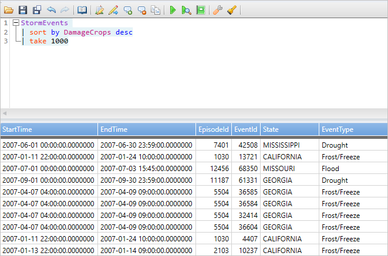
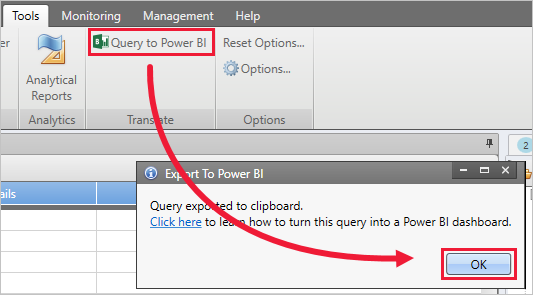
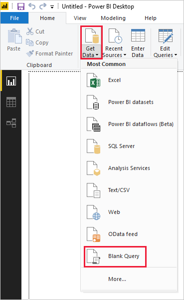
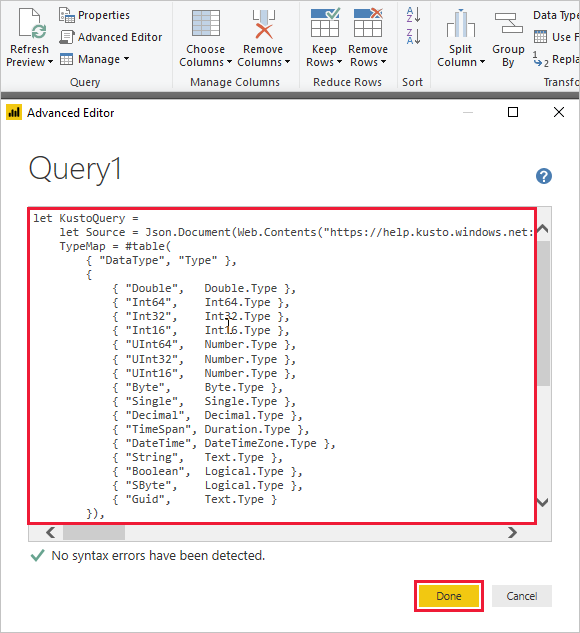
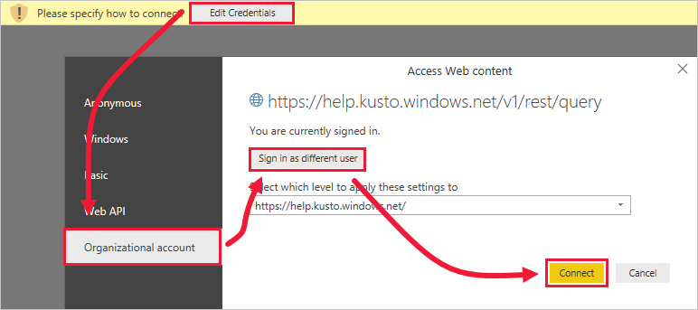

# Visualize data using a query imported into Power BI

Azure Data Explorer is a fast and highly scalable data exploration service for log and telemetry data. Power BI is a business analytics solution that lets you visualize your data and share the results across your organization.

Azure Data Explorer provides three options for connecting to data in Power BI: use the built-in connector, import a query from Azure Data Explorer, or use a SQL query. This article shows you how to import a query so that you can get data and visualize it in a Power BI report.

If you don't have an Azure subscription, create a [free Azure account](https://azure.microsoft.com/free/) before you begin.

## Prerequisites

You need the following to complete this article:

* An organizational email account that is a member of Azure Active directory, so you can connect to the [Azure Data Explorer help cluster](https://dataexplorer.azure.com/clusters/help/databases/samples).
* [Power BI Desktop](https://powerbi.microsoft.com/get-started/) (select **DOWNLOAD FREE**).
* [Azure Data Explorer desktop app](kusto/tools/kusto-explorer.md).

## Get data from Azure Data Explorer

First, you create a query in the Azure Data Explorer desktop app and export it for use in Power BI. Then, you connect to the Azure Data Explorer help cluster, and bring in a subset of the data from the *StormEvents* table. [!INCLUDE [data-explorer-storm-events](includes/data-explorer-storm-events.md)]

1. In a browser, go to [https://help.kusto.windows.net/](https://help.kusto.windows.net/) to launch the Azure Data Explorer desktop app.

1. In the desktop app, copy the following query into the upper-right query window then run it.

    ```Kusto
    StormEvents
    | sort by DamageCrops desc
    | take 1000
    ```

    The first few rows of the result set should look similar to the following image.

    

1. On the **Tools** tab, select **Query to Power BI** then **OK**.

    

1. In Power BI Desktop, on the **Home** tab, select **Get Data** then **Blank query**.

    

1. In the Power Query Editor, on the **Home** tab, select **Advanced editor**.

1. In the **Advanced editor** window, paste the query you exported then select **Done**.

    

1. In the main Power Query Editor window, select **Edit credentials**. Select **Organizational account**, sign in, then select **Connect**.

    

1. On the **Home** tab, select **Close & Apply**.

    

## Visualize data in a report

[!INCLUDE [data-explorer-power-bi-visualize-basic](includes/data-explorer-power-bi-visualize-basic.md)]

## Clean up resources

If you no longer need the report you created for this article, delete the Power BI Desktop (.pbix) file.

## Next steps

[Visualize data using the Azure Data Explorer connector for Power BI](power-bi-connector.md)