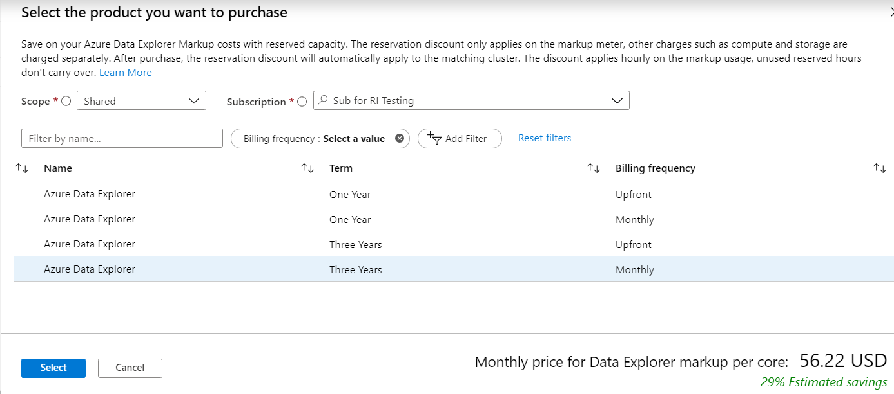

# Prepay for Azure Data Explorer markup units with Azure Data Explorer reserved capacity

Save money with Azure Data Explorer by prepaying for the markup units compared to pay-as-you-go prices. With Azure Data Explorer reserved capacity, you make a commitment for Azure Data Explorer use for a period of one or three years to get a significant discount on the Azure Data Explorer markup costs. To purchase Azure Data Explorer reserved capacity, you only need to specify the term, it will apply to all deployments of Azure Data Explorer in all regions.

By purchasing a reservation, you're pre-paying for the markup costs for a period of one or three years. As soon as you buy a reservation, the Azure Data Explorer markup charges that match the reservation attributes are no longer charged at the pay-as-you go rates. Azure Data Explorer clusters that are already running or ones that are newly deployed will automatically get the benefit. This reservation doesn't cover compute, networking, or storage charges associated with the clusters. Reserved capacity for these resources needs to be purchased separately. At the end of the reservation term, the billing benefit expires and the Azure Data Explorer markup units are billed at the pay-as-you go price. Reservations don't auto-renew. For pricing information, see the [Azure Data Explorer pricing page](https://azure.microsoft.com/pricing/details/data-explorer/).

You can buy Azure Data Explorer reserved capacity in the [Azure portal](https://portal.azure.com). To buy Azure Data Explorer reserved capacity:

* You must be the owner of at least one Enterprise or Pay-As-You-Go subscription.
* For Enterprise subscriptions, **Add Reserved Instances** must be enabled in the [EA portal](https://ea.azure.com). Alternatively, if that setting is disabled, you must be an EA Admin on the subscription.
* For the Cloud Solution Provider (CSP) program, only the admin agents or sales agents can purchase Azure Data Explorer reserved capacity.

For details on how enterprise customers and Pay-As-You-Go customers are charged for reservation purchases, see:
* [Understand Azure reservation usage for your Enterprise enrollment](/azure/cost-management-billing/reservations/understand-reserved-instance-usage-ea) 
* [Understand Azure reservation usage for your Pay-As-You-Go subscription](/azure/cost-management-billing/reservations/understand-reserved-instance-usage).

## Determine the right markup usage before purchase

The size of reservation should be based on the total number of Azure Data Explorer markup units used by the existing or soon-to-be-deployed Azure Data Explorer clusters. The number of markup units is equal to the number of Azure Data Explorer engine cluster cores in production (not including the dev/test SKU). 

## Buy Azure Data Explorer reserved capacity

1. Sign in to the [Azure portal](https://portal.azure.com).
1. Select **All services** > **Reservations** > **Purchase Now**. Select **Add**
1. In the **Select Product Type** pane, select **Azure Data Explorer** to purchase a new reservation for Azure Data Explorer markup units. 
1. Select **Buy**
1. Fill in the required fields. 

    

1. Review the cost of the Azure Data Explorer markup reserved capacity reservation in the **Costs** section.
1. Select **Purchase**.
1. Select **View this Reservation** to see the status of your purchase.

## Cancellations and exchanges

If you need to cancel your Azure Data Explorer reserved capacity reservation, there may be a 12% early termination fee. Refunds are based on the lowest price of your purchase price or the current price of the reservation. Refunds are limited to $50,000 per year. The refund you receive is the remaining pro-rated balance minus the 12% early termination fee. To request a cancellation, go to the reservation in the Azure portal and select **Refund** to create a support request.

If you need to change your Azure Data Explorer reserved capacity reservation to another term, you can exchange it for another reservation that is of equal or greater value. The term start date for the new reservation doesn't carry over from the exchanged reservation. The 1 or 3-year term starts from when you create the new reservation. To request an exchange, go to the reservation in the Azure portal, and select **Exchange** to create a support request.

For more information about how to exchange or refund reservations, see [Reservation exchanges and refunds](/azure/cost-management-billing/reservations/exchange-and-refund-azure-reservations).

## Manage your reserved capacity reservation

The Azure Data Explorer markup units reservation discount is applied automatically to the number of markup units that match the Azure Data Explorer reserved capacity reservation scope and attributes. 

> [!NOTE]
> * You can update the scope of the Azure Data Explorer reserved capacity reservation through the [Azure portal](https://portal.azure.com), PowerShell, CLI or through the API.
> * To learn how to manage the Azure Data Explorer reserved capacity reservation, see [manage Azure Data Explorer reserved capacity](/azure/cost-management-billing/reservations/understand-azure-data-explorer-reservation-charges).

## Next steps

To learn more about Azure Reservations, see the following articles:

* [What are Azure Reservations?](/azure/cost-management-billing/reservations/save-compute-costs-reservations)
* [Manage Azure Reservations](/azure/cost-management-billing/reservations/manage-reserved-vm-instance)
* [Understand Azure Reservations discount](/azure/cost-management-billing/reservations/understand-reservation-charges)
* [Understand reservation usage for your Pay-As-You-Go subscription](/azure/cost-management-billing/reservations/understand-reserved-instance-usage)
* [Understand reservation usage for your Enterprise enrollment](/azure/cost-management-billing/reservations/understand-reserved-instance-usage-ea)
* [Azure Reservations in Partner Center Cloud Solution Provider (CSP) program](/partner-center/azure-reservations)

## Need help? Contact us

If you have questions or need help, [create a support request](https://portal.azure.com/#blade/Microsoft_Azure_Support/HelpAndSupportBlade/newsupportrequest).