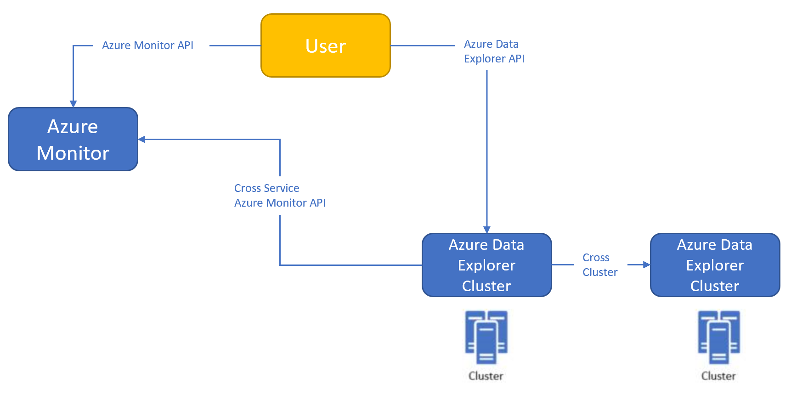
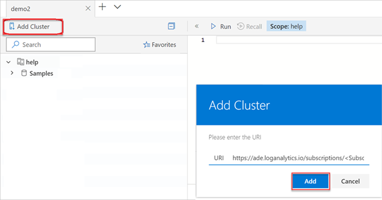
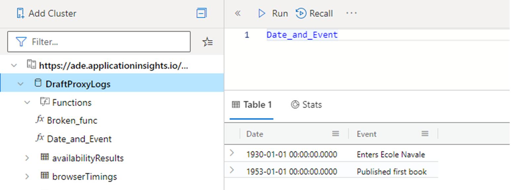

# Query data in Azure Monitor using Azure Data Explorer

The Azure Data Explorer supports cross-service queries between Azure Data Explorer, [Application Insights (AI)](/azure/azure-monitor/app/app-insights-overview), and [Log Analytics (LA)](/azure/azure-monitor/platform/data-platform-logs). You can query your Log Analytics or Application Insights workspace using Azure Data Explorer query tools and in a cross-service query. The article shows you how to create a cross-service query and add the Log Analytics or Application Insights workspace to the Azure Data Explorer Web UI.

The Azure Data Explorer cross-service queries flow:



## Add a Log Analytics/Application Insights workspace to Azure Data Explorer client tools

Add a Log Analytics or Application Insights workspace to Azure Data Explorer client tools to enable cross-service queries for your clusters.

1. Verify your Azure Data Explorer native cluster (such as *help* cluster) appears on the left menu before you connect to your Log Analytics or Application Insights cluster.

    

1. In the Azure Data Explorer UI (https://dataexplorer.azure.com/clusters), select **Add Cluster**.

1. In the **Add Cluster** window, add the URL of the LA or AI cluster.

    * For LA: `https://ade.loganalytics.io/subscriptions/<subscription-id>/resourcegroups/<resource-group-name>/providers/microsoft.operationalinsights/workspaces/<workspace-name>`
    * For AI: `https://ade.applicationinsights.io/subscriptions/<subscription-id>/resourcegroups/<resource-group-name>/providers/microsoft.insights/components/<ai-app-name>`

1. Select **Add**.

    

  >[!NOTE]
>* There are different endpoints for the following:
>* Azure Government- `adx.monitor.azure.us/`
>*  Azure China- `adx.monitor.azure.cn/`
>* If you add a connection to more than one Log Analytics/Application insights workspace, give each a different name. Otherwise they'll all have the same name in the left pane.

1. After the connection is established, your Log Analytics or Application Insights workspace will appear in the left pane with your native Azure Data Explorer cluster.

    

> [!NOTE]
> The number of Azure Monitor workspaces that can be mapped is limited to 100.

## Run queries

You can run the queries using client tools that support Kusto queries, such as: Kusto Explorer, Azure Data Explorer Web UI, Jupyter Kqlmagic, Flow, PowerQuery, PowerShell, Lens, REST API.

> [!NOTE]
> The cross-service query ability is used for data retrieval only. For more information, see [Function supportability](#function-supportability).

> [!TIP]
> * The database should have the same name as the resource specified in the cross-service query. Names are case sensitive.
> * In cross-service queries, make sure that the naming of Application Insights apps and Log Analytics workspaces is correct.
> * If names contain special characters, they are replaced by URL encoding in the cross-service query.
> * If names include characters that don't meet [KQL identifier name rules](kusto/query/schema-entities/entity-names.md), they are replaced by the dash **-** character.

### Direct query on your Log Analytics or Application Insights workspaces from Azure Data Explorer client tools

You can run queries on your Log Analytics or Application Insights workspaces from Azure Data Explorer client tools. 

1. Verify that your workspace is selected in the left pane.

1. Run the following query:

```kusto
Perf | take 10 // Demonstrate cross-service query on the Log Analytics workspace
```


### Cross query of your Log Analytics or Application Insights workspace and the Azure Data Explorer native cluster

When you run cross cluster service queries, verify your Azure Data Explorer native cluster is selected in the left pane. The following examples demonstrate combining Azure Data Explorer cluster tables (using `union`) with a Log Analytics workspace.

Run the following queries:

```kusto
union StormEvents, cluster('https://ade.loganalytics.io/subscriptions/<subscription-id>/resourcegroups/<resource-group-name>/providers/microsoft.operationalinsights/workspaces/<workspace-name>').database('<workspace-name>').Perf
| take 10
```

```kusto
let CL1 = 'https://ade.loganalytics.io/subscriptions/<subscription-id>/resourcegroups/<resource-group-name>/providers/microsoft.operationalinsights/workspaces/<workspace-name>';
union <ADX table>, cluster(CL1).database(<workspace-name>).<table name>
```

   [ ](media/query-monitor-data/cross-query.png#lightbox)

> [!TIP]
> Using the [`join` operator](kusto/query/joinoperator.md), instead of union, may require a [`hint`](kusto/query/joinoperator.md#join-hints) to run it on an Azure Data Explorer native cluster.

### Join data from an Azure Data Explorer cluster in one tenant with an Azure Monitor resource in another

Cross-tenant queries between the services aren't supported. You are signed in to a single tenant for running the query spanning both resources.

If the Azure Data Explorer resource is in Tenant 'A' and Log Analytics workspace is in Tenant 'B' use one of the following two methods:

1. Azure Data Explorer allows you to add roles for principals in different tenants. Add your user ID in Tenant 'B' as an authorized user on the Azure Data Explorer cluster. Validate the *['TrustedExternalTenant'](/powershell/module/az.kusto/update-azkustocluster)* property on the Azure Data Explorer cluster contains Tenant 'B'. Run the cross-query fully in Tenant 'B'.

2. Use [Lighthouse](/azure/lighthouse/) to project the Azure Monitor resource into Tenant 'A'.

### Connect to Azure Data Explorer clusters from different tenants

Kusto Explorer automatically signs you into the tenant to which the user account originally belongs. To access resources in other tenants with the same user account, the `tenantId` has to be explicitly specified in the connection string:
`Data Source=https://ade.applicationinsights.io/subscriptions/SubscriptionId/resourcegroups/ResourceGroupName;Initial Catalog=NetDefaultDB;AAD Federated Security=True;Authority ID=`**TenantId**

## Function supportability

The Azure Data Explorer cross-service queries support functions for both Application Insights and Log Analytics.
This capability enables cross-cluster queries to reference an Azure Monitor tabular function directly.
The following commands are supported with the cross-service query:

* `.show functions`
* `.show function {FunctionName}`
* `.show database {DatabaseName} schema as json`

The following image depicts an example of querying a tabular function from the Azure Data Explorer Web UI.
To use the function, run the name in the Query window.

  [ ](media/query-monitor-data/function-query.png#lightbox)

## Additional syntax examples

The following syntax options are available when calling the Application Insights or Log Analytics clusters:

|Syntax Description  |Application Insights  |Log Analytics  |
|----------------|---------|---------|
| Database within a cluster that contains only the defined resource in this subscription (**recommended for cross cluster queries**) |   cluster(`https://ade.loganalytics.io/subscriptions/<subscription-id>/resourcegroups/<resource-group-name>/providers/microsoft.insights/components/<ai-app-name>').database('<ai-app-name>`) | cluster(`https://ade.loganalytics.io/subscriptions/<subscription-id>/resourcegroups/<resource-group-name>/providers/microsoft.operationalinsights/workspaces/<workspace-name>').database('<workspace-name>`)     |
| Cluster that contains all apps/workspaces in this subscription    |     cluster(`https://ade.loganalytics.io/subscriptions/<subscription-id>`)    |    cluster(`https://ade.loganalytics.io/subscriptions/<subscription-id>`)     |
|Cluster that contains all apps/workspaces in the subscription and are members of this resource group    |   cluster(`https://ade.loganalytics.io/subscriptions/<subscription-id>/resourcegroups/<resource-group-name>`)      |    cluster(`https://ade.loganalytics.io/subscriptions/<subscription-id>/resourcegroups/<resource-group-name>`)      |
|Cluster that contains only the defined resource in this subscription      |    cluster(`https://ade.loganalytics.io/subscriptions/<subscription-id>/resourcegroups/<resource-group-name>/providers/microsoft.insights/components/<ai-app-name>`)    |  cluster(`https://ade.loganalytics.io/subscriptions/<subscription-id>/resourcegroups/<resource-group-name>/providers/microsoft.operationalinsights/workspaces/<workspace-name>`)     |
|For Endpoints in the UsGov      |    cluster(`https://adx.monitor.azure.us/subscriptions/<subscription-id>/resourcegroups/<resource-group-name>/providers/microsoft.operationalinsights/workspaces/<workspace-name>`)|
 |For Endpoints in the China 21Vianet      |    cluster(`https://adx.monitor.azure.us/subscriptions/<subscription-id>/resourcegroups/<resource-group-name>/providers/microsoft.operationalinsights/workspaces/<workspace-name>`) |   |

## Next steps
[Write queries](write-queries.md)