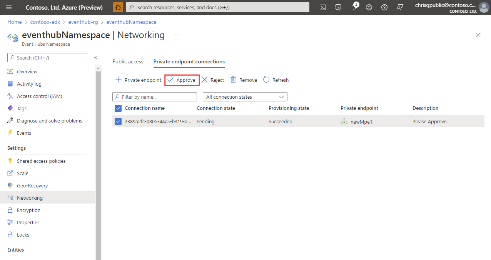

# Create a Managed Private Endpoints for Azure Data Explorer (public preview)

Managed Private Endpoints are necessary to connect to other Azure Platform services which are highly protected. They allow you to create a connection using a Private Endpoint.

## Prerequisites

* [Create an Azure Data Explorer Cluster](create-cluster-database-portal.md) that is not injected in a virtual network
* Create an [Azure Eventhub](/azure/event-hubs/event-hubs-about) or [Azure Storage](/azure/storage/blobs/storage-blobs-overview) service


## Create a Managed Private Endpoint using the API

### Prerequisites for an API based creation

* Install [choco](https://chocolatey.org/install)
* Install ARMCLIENT
   ```powerShell
   choco install armclient
   ```
*  Log in with ARMClient
   ```powerShell
   armclient login
   ```

### Create a Managed Private Endpoint to an Azure Event Hubs service

The REST API call to enable the managed private endpoint, in this case eventhub, is the following:
```powershell
#replace the <...> placeholders with the correct values
armclient PUT /subscriptions/<subscriptionIdADX>/resourceGroups/<resourceGroupNameADX>/providers/Microsoft.Kusto/clusters/<clusterName>/managedPrivateEndpoints/<newMpeName>?api-version=2022-02-01 @"
{
    'properties': {
        'privateLinkResourceId':'/subscriptions/<subscriptionIdEventHub>/resourceGroups/<resourceGroupNameEventHub>/providers/Microsoft.EventHub/namespaces/<EventHubNamespace>',
        'groupId':'namespace',
        'requestMessage':'Please Approve.'
    }
}
"@
```

Result:
```javascript
{
  "id": "/subscriptions/<subscriptionIdADX>/resourceGroups/<resourceGroupNameADX>/providers/Microsoft.Kusto/Clusters/<clusterName>/ManagedPrivateEndpoints/<newMpeName>",
  "name": "<clusterName>/<newMpeName>",
  "type": "Microsoft.Kusto/Clusters/ManagedPrivateEndpoints",
  "location": "DummyLocation",
  "properties": {
    "privateLinkResourceId": "/subscriptions/<subscriptionIdEventHub>/resourceGroups/<resourceGroupNameEventHub>/providers/Microsoft.EventHub/namespaces/<EventHubNamespace>",
    "groupId": "namespace",
    "requestMessage": "Please Approve.",
    "provisioningState": "Creating"
  }
}
```


### Create a Managed Private Endpoint to an Azure Storage account

The REST API call to enable the managed private endpoint, in this case storage, is the following:
```powershell
#replace the <...> placeholders with the correct values
armclient PUT /subscriptions/<subscriptionIdADX>/resourceGroups/<resourceGroupNameADX>/providers/Microsoft.Kusto/clusters/<clusterName>/managedPrivateEndpoints/<newMpeName>?api-version=2022-02-01 @"
{
    'properties': {
        'privateLinkResourceId':'/subscriptions/<subscriptionIdStorage>/resourceGroups/<resourceGroupNameStorage>/providers/Microsoft.Storage/storageAccounts/<storageAccountName>',
        'groupId':'blob',
        'requestMessage':'Please Approve.'
    }
}
"@
```

Result:
```javascript
{
  "id": "/subscriptions/<subscriptionIdADX>/resourceGroups/<resourceGroupNameADX>/providers/Microsoft.Kusto/Clusters/<clusterName>/ManagedPrivateEndpoints/<newMpeName>",
  "name": "<clusterName>/<newMpeName>",
  "type": "Microsoft.Kusto/Clusters/ManagedPrivateEndpoints",
  "location": "DummyLocation",
  "properties": {
    "privateLinkResourceId": "/subscriptions/<subscriptionIdStorage>/resourceGroups/<resourceGroupNameStorage>/providers/Microsoft.Storage/storageAccounts/<storageAccountName>",
    "groupId": "blob",
    "requestMessage": "Please Approve.",
    "provisioningState": "Creating"
  }
}
```

### How to check the progress

Once you executed the API call using ARMCLIENT you can verify the progress of the Managed Private Endpoint migration.

```powershell
#replace the <...> placeholders with the correct values
armclient GET /subscriptions/<subscriptionIdADX>/resourceGroups/<resourceGroupNameADX>/providers/Microsoft.Kusto/clusters/<clusterName>/managedPrivateEndpoints/<newMpeName>?api-version=2022-02-01
```

Result:
```javascript
{
  "id": "/subscriptions/<subscriptionIdADX>/resourceGroups/<resourceGroupNameADX>/providers/Microsoft.Kusto/Clusters/<clusterName>/ManagedPrivateEndpoints/<newMpeName>",
  "name": "<clusterName>/<newMpeName>",
  "type": "Microsoft.Kusto/Clusters/ManagedPrivateEndpoints",
  "location": "DummyLocation",
  "properties": {
    "privateLinkResourceId": "/subscriptions/02de0e00-8c52-405c-9088-1342de78293d/resourceGroups/henning-iot/providers/Microsoft.<service>/<...>/<name>",
    "groupId": "<groupId>",
    "requestMessage": "Please Approve.",
    "provisioningState": "Succeeded"
  },
  "systemData": {
    "createdBy": "<UserName>",
    "createdByType": "User",
    "createdAt": "2022-02-05T08:29:54.2912851Z",
    "lastModifiedBy": "chrisqpublic@contoso.com",
    "lastModifiedByType": "User",
    "lastModifiedAt": "2022-02-05T08:29:54.2912851Z"
  }
}
```

## Approve the Managed Private endpoint

Regardless if you created the Managed Private Endpoint using the portal or the API you need to approve its creation on the target resource. The following picture showes the approval if a Managed Private Endpoint to an Azure Event Hubs service.



After clicking on "Approve" the Managed Private Endpoint will be usable.


Now Azure Data Explorer can connect to the resource using a Private Endpoint connection.

## Next steps

* [Troubleshooting Private Endpoints in Azure Data Explorer](security-network-private-endpoint-troubleshoot.md)
