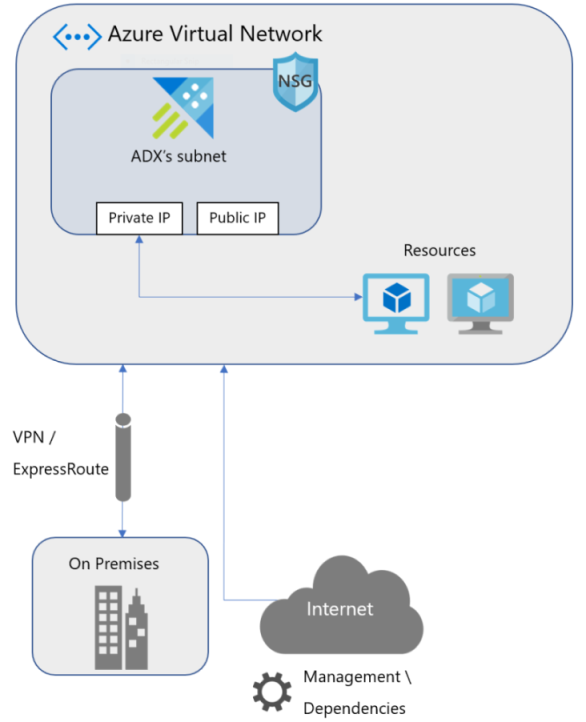

# Network security for Azure Data Explorer

Keeping your data secure in the cloud should be one of the most prioritized task of an IT department. Today, Azure Data Explorer is accessible through Internet-reachable URLs. Anyone with valid identity on the cluster can access it from any location. In some scenarios, it's necessary that Azure Data Explorer can only be accessed from the private virtual network. There are essentially two options to accomplish this connectivity:
1.	Virtual Network Injection 
2.	Private Endpoints

This document provides an overview of those two options.

## Virtual Network Injection

Virtual Network Injection allows you to directly deploy Azure Data Explorer into a Virtual Network. The service can be privately accessed from within the virtual network and over VPN/ER from on-premises. Injecting a cluster into a virtual network enables you to manage all of its traffic. This includes the traffic to access the cluster and all of its data ingestions or exports. Additionally you are responsible to allow Microsoft to access the cluster for management and health monitoring.

To achive a successful injection of Azure Data Explorer into a virtual network several requirements need to be in place

* You must delegate the subnet to Microsoft.Kusto/clusters to allow Microsoft to  enable the service to define its pre-conditions for deployment in the form of Network Intent Policies
* The subnet needs to be well scaled to support future growth of the Azure Data Explorer usage
* Two public IPs are needed in order to provide access for Microsoft to manage the cluster and ensure that its health is ok
* In case you are using an additional firewall applicance to secure your network you must allow Azure Data Explorer to connect to a set of Fully Qualified Domain Names (FQDNs) for outgoing traffic

## Private Endpoints (public preview)

A private endpoint is a network interface that uses private IP addresses from your virtual network. This network interface connects you privately and securely to Azure Data Explorer powered by Azure Private Link. By enabling a private endpoint, you're bringing the service into your virtual network.

Besides the need for a set of private IP addresses for the private endpoint there are no other requirements for a successful deployment.

Private endpoints are not supported for ADX cluster which have been injected into a virtual network.

## Recommendation

It's recommended to use a private endpoint based approach to connect privately to your Azure Data Explorer cluster. Maintaining FQDN lists in firewalls or deploying public IP addresses in a restricted environment lead to a high maintenance effort for a virtual network injection based deployment.

## Next steps

> [!div class="nextstepaction"]
> [Deploy Azure Data Explorer into your Virtual Network](vnet-deployment.md)
