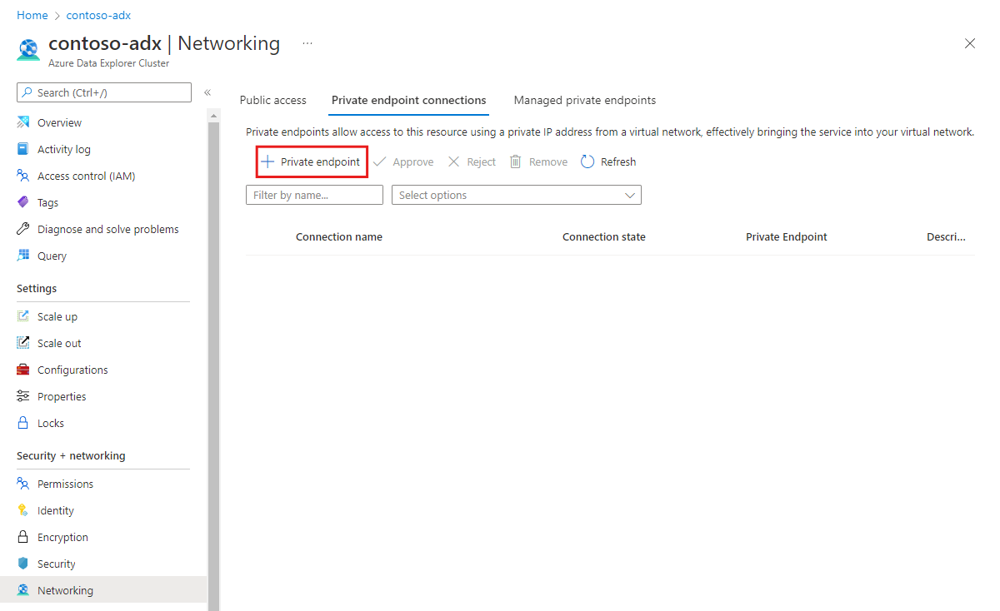
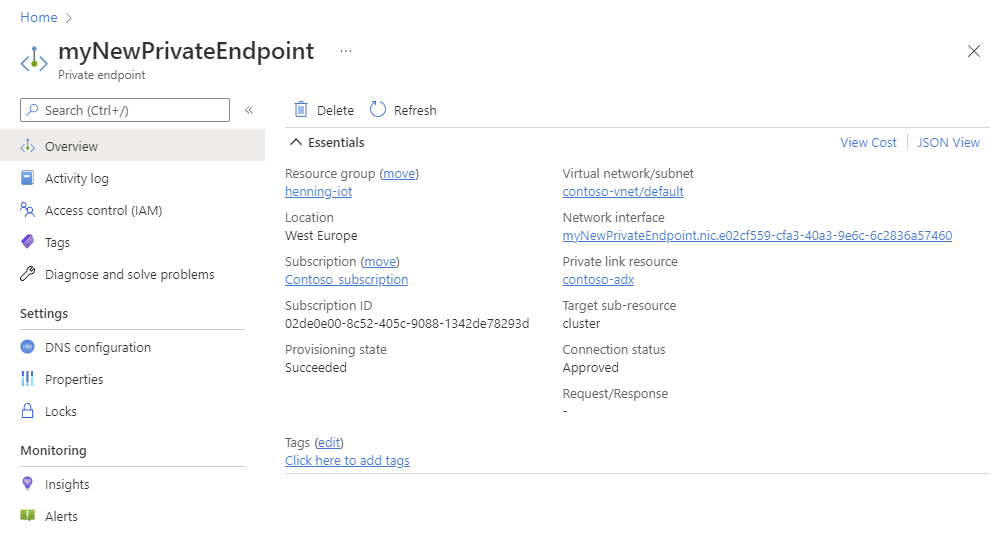

# Create a Private Endpoints for Azure Data Explorer (public preview)

Use a Private Endpoint to connect to your Azure Data Explorer cluster in your Azure Virtual Network.

Azure Private Endpoints use private IP addresses from your Azure Virtual Network to connect you privately to Azure Data Explorer. With this setup, network traffic between a client on your private network and the Azure Data Explorer cluster travels over the VNet and a Private Link on the Microsoft backbone network. This article shows you how to create Private Endpoint for your Azure Data Explorer cluster.

## Prerequisites

* An Azure subscription. Create a [free Azure account](https://azure.microsoft.com/free/).
* Sign in to the [Azure portal](https://portal.azure.com/).
* [Create an Azure Data Explorer Cluster](create-cluster-database-portal.md) that is not injected in a virtual network
* [Create a virtual network](/azure/virtual-network/quick-create-portal)

## Create a Private Endpoint

There are multiple ways of creating an Azure Private Endpoint for an Azure Data Explorer cluster.
* During the deployment of Azure Data Explorer in the portal
* By [creating a Private Endpoint](/azure/private-link/create-private-endpoint-portal) resource directly
* On an existing Azure Data Explorer cluster

This Howto focusses on creating an Azure Private Endpoint on an existing Azure Data Explorer cluster.

1. Navigate to the "Networking" section on the left and the "Private Endpoint" tab. Click on the marked button to create a new Azure Private Endpoint 

2. Define the Basics and click on "Next: Resource"

**Setting** | **Suggested value** | **Field description**
|---|---|---|
| Subscription | Your subscription | Select the Azure subscription that you want to use for your Azure Private Endpoint|
| Resource group | Your resource group | Use an existing resource group or create a new resource group. |
| Name | myNewPrivateEndpointForKusto | Choose a name that identifies your Private Endpoint in the resource group.|
| Region | *(Europe) West Europe* | Select the region that best meets your needs.
| | | |

3. Chose to "Connect to an Azure resource in my directory" and fill out the form. Once you are finished click on "Next: Virtual Network"

**Setting** | **Suggested value** | **Field description**
|---|---|---|
| Subscription | Your subscription | Select the Azure subscription that you want to use for your Azure Data Explorer. |
| Resource type | Your resource group | Select "Microsoft.Kusto/clusters |
| Resource | contoso-adx | Chose the Azure Data Explorer cluster which should be used as the destination for the new Azure Private Endpoint |
| Target sub-resource | "cluster" | There is no other option.
| | | |

Alternatively you can chose to "Connect to an Azure resource by resource ID or alias". This enables you to create an Azure Private Endpoint to an Azure Data Explorer in another Azure Tenant or if you don't have at least Reader access on the resource.

**Setting** | **Suggested value** | **Field description**
|---|---|---|
| ResourceId or alias | /subscriptions/... | It can be the resource ID or alias that someone has shared with you. The easiest way to get the resource ID is to navigate to the Azure Data Explorer in the Azure portal and copy the Resource ID from the Properties sections. |
| Tarrget sob-resource | "cluster" | There is no other option. |
| Request message | "Please approve" | The resource owner sees this message while managing private endpoint connection.
| | | |

4. On the Virtual Network configurationt tab select the Virtual Network and Subnet where you want to deploy the private endpoint. Integration with the private DNS zone is needed to resolve the engine and data management endpoints including storage accounts required for ingestion / export related features. Click on "Next: Tags" to proceed.

5. Configure the Tags and proceed by clicking on "Next: Review + create"

6. Review the configuration and click on "Create" to create the Azure Private Endpoint resource.

### Check the Result

Once the creation of the Azure Private Endpoint has been finished you will be able to access it in the Azure Portal.

You can see all Azure Private Endpoints which have been created for an Azure Data Explorer cluster by navigating to the resource in the portal and click on the "Networking" section on the left.

## Next steps

* [Troubleshooting Private Endpoints in Azure Data Explorer](security-network-private-endpoint-troubleshoot.md)
