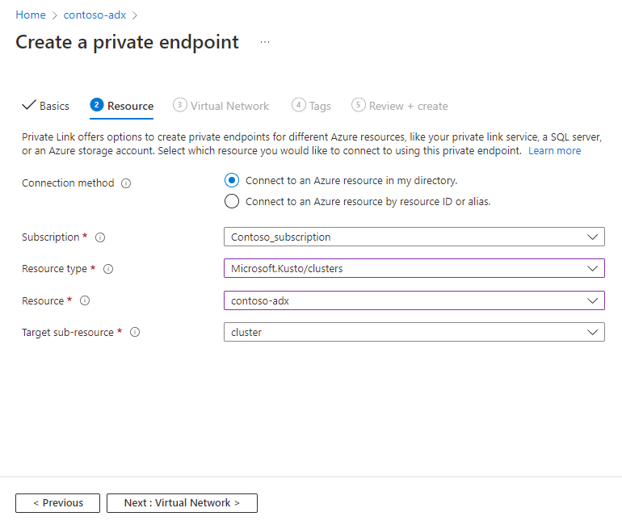
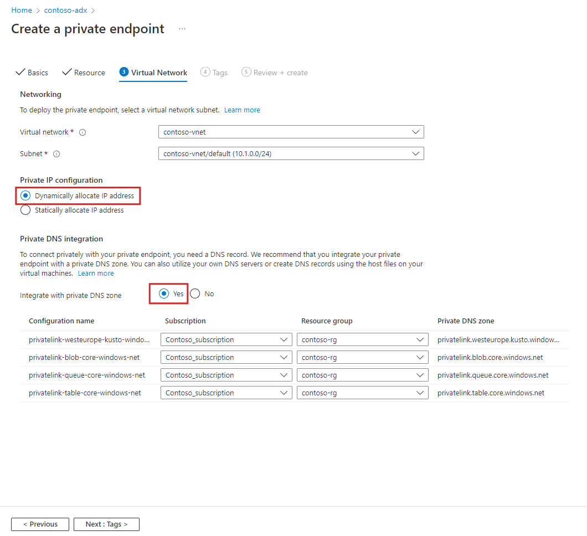

# Create a Private Endpoints for Azure Data Explorer (public preview)

Use a Private Endpoint to connect to your Azure Data Explorer cluster in your Azure Virtual Network.

Azure Private Endpoints use private IP addresses from your Azure Virtual Network to connect you privately to Azure Data Explorer. With this setup, network traffic between a client on your private network and the Azure Data Explorer cluster travels over the VNet and a Private Link on the Microsoft backbone network. This article shows you how to create Private Endpoint for your Azure Data Explorer cluster.

## Prerequisites

* [Create an Azure Data Explorer Cluster](create-cluster-database-portal.md) that is not injected in a virtual network
* [Create a virtual network](/azure/virtual-network/quick-create-portal)

## Create a Private Endpoint

## Next steps

* [Troubleshooting Private Endpoints in Azure Data Explorer](security-network-private-endpoint-troubleshoot.md)
