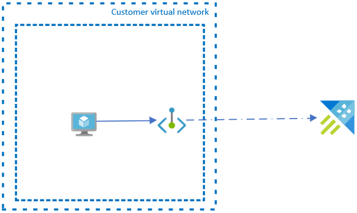
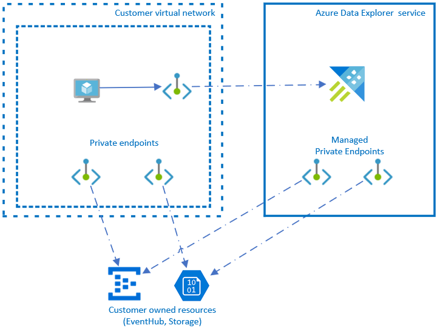

# Private Endpoints for Azure Data Explorer (public preview)

You can use [private endpoints](/azure/private-link/private-endpoint-overview) for your Azure Data Explorer cluster to allow clients on a virtual network (VNet) to securely access data over a [Private Link](/azure/private-link/private-link-overview). The private endpoint uses IP addresses from the VNet address space for your Azure Data Explorer service. Network traffic between the clients on the VNet and the ADX cluster traverses over the VNet and a private link on the Microsoft backbone network, eliminating exposure from the public internet.

Using private endpoints for your Azure Data Explorer cluster enables you to:
* Secure your ADX cluster by configuring the firewall to block all connections on the public endpoint for the ADX.
* Increase security for the virtual network (VNet), by enabling you to block exfiltration of data from the VNet.
* Securely connect to ADX clusters from on-premises networks that connect to the VNet using [VPN](/azure/vpn-gateway/vpn-gateway-about-vpngateways) or [ExpressRoutes](/azure/expressroute/expressroute-locations) with private-peering.

## Conceptual Overview

A private endpoint is a special network interface for an Azure service in your [Virtual Network](/azure/virtual-network/virtual-networks-overview) (VNet). When you create a private endpoint for your ADX cluster, it provides secure connectivity between clients on your VNet and your ADX. The private endpoint is assigned with IP addresses from the IP address range of your VNet. The connection between the private endpoint and the ADX uses a secure private link.

Applications in the VNet can connect to the ADX over the private endpoint seamlessly, using the same connection strings and authorization mechanisms that they would use otherwise.

When you create a private endpoint for ADX in your VNet, a consent request is sent for approval to the ADX owner. If the user requesting the creation of the private endpoint is also an owner of the ADX, this consent request is automatically approved.

ADX owners can manage consent requests and the private endpoints, through the 'Private endpoints' tab for the ADX in the Azure portal.

You can secure your ADX to only accept connections from your VNet, by configuring the ADX firewall to deny access through its public endpoint by default. You don't need a firewall rule to allow traffic from a VNet that has a private endpoint, since the ADX firewall only controls access through the public endpoint. Private endpoints instead rely on the consent flow for granting subnets access to the ADX.

## Connecting to a private endpoint

Clients on a VNet using the private endpoint should use the same connection string for the ADX, as clients connecting to the public endpoint. We rely upon DNS resolution to automatically route the connections from the VNet to the ADX over a private link.

Important: Use the same connection string to connect ADX using private endpoints, as you'd use otherwise. Don't connect to the ADX using its privatelink subdomain URL.

Azure Data Explorer creates a [private DNS zone](/azure/dns/private-dns-overview) attached to the VNet with the necessary updates for the private endpoints, by default. However, if you're using your own DNS server, you may need to make additional changes to your DNS configuration. 

ADX creates multiple customer visible FQDNs as part of the private endpoint deployment. Alongside the Query/Ingestion FQDN it comes with several FQDNs for blob / table / queue endpoints (needed for ingestion scenarios)

## Disable public access

To increase security, you also can disable the public access for the Azure Data Explorer Cluster. You can disable the public internet access manually in the portal.

## Managed private endpoints

With the help of a managed private endpoint, you will enable the ADX cluster to securely access your event hub via its private endpoint. When you create an ADX cluser, Azure will provision an ADX managed virtual network in the microsoft backbone infrastructure. This Vnet is isolated and hidden to you as you just consume ADX as a PaaS resource. You can create a managed private endpoint via the REST API to provision a private endpoint in the same virtual network where the root service resources of the ADX cluster reside in. This will enable the service to access event hub privately.

### Supported services

Azure Data Explorer supports creating Managed Private Endpoints to the following services:
* [Azure Event Hubs](/azure/event-hubs/event-hubs-about)
* [Azure Storage Account](/azure/storage/blobs/storage-blobs-overview)
* [Azure Data Explorer](data-explorer-overview.md)
* [Azure SQL](/azure/azure-sql/azure-sql-iaas-vs-paas-what-is-overview)
* [Azure Digital Twins](/azure/digital-twins/overview)
* [Azure Monitor](/azure/azure-monitor/overview)

## Limitations

* Private endpoints are not supported for virtual network injected Azure Data Explorer clusters

## Next steps

* [Create a Private Endpoints for Azure Data Explorer](security-network-private-endpoint-create.md)
* [Create a Managed Private Endpoints for Azure Data Explorer](security-network-managed-private-endpoint-create.md)
* [Howto restrict public access to Azure Data Explorer](security-network-restrict-public-access.md)
* [Howto restrict outbound access from Azure Data Explorer](security-network-restrict-outbound-access.md)
